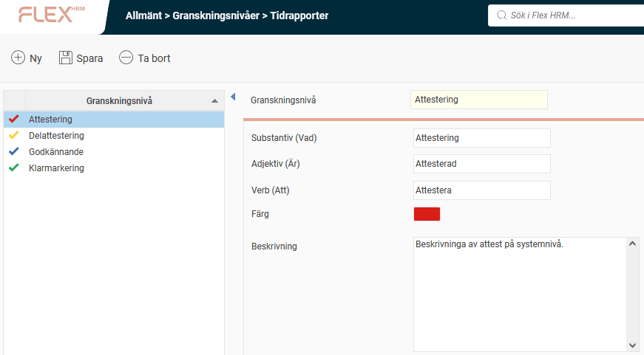
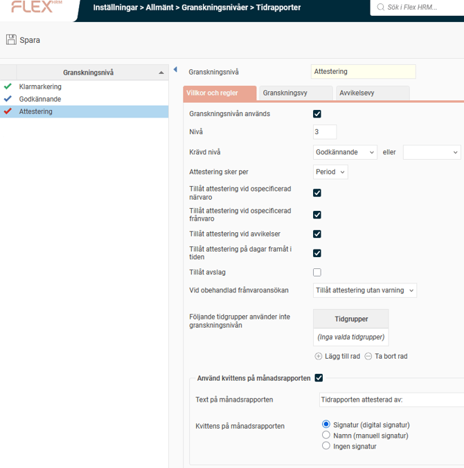

# ⚙️Granskningsnivåer - Hur fungerar granskningsnivåer i Flex HRM?

**Datum:** den 13 oktober 2025  
**Kategori:** Systemgemensamt  
**Underkategori:** Inställningar  
**Typ:** config  
**Svårighetsgrad:** intermediate  
**Tags:** Ingen  
**Bilder:** 2  
**URL:** https://knowledge.flexhrm.com/sv/granskningsniv%C3%A5er-

---

Artikeln ger dig information om granskningsnivåer i systemet och beskriver olika nivåer och anpassningar av flöden för t.ex. tidrapporter och reseräkningar.
Allmänt - Granskningsnivåer
Under
Administration > Allmänt > Granskningsnivåer
specificeras vilka granskningsnivåer som kan användas i systemet. Upplägg av en granskningsnivå medför alltså inte automatiskt att denna granskningsnivå kommer att användas för respektive företaget.
Följande undermenyer finns:
Reseräkningar (om Flex HRM Travel ingår i din licens)
Tidrapporter (om Flex HRM Time ingår i din licens)
Frånvaroansökningar (om Flex HRM Time ingår i din licens)
Lönerevision (om Flex HRM Employee ingår)
Nyanställningar (om Flex HRM Employee ingår)
Benämningarna kommer att få genomslag i olika menyer, fönster och utskrifter och måste anges i substantiv-, adjektiv- och verbform, då samtliga former används i programmets olika delar.

I listan till vänster visas de granskningsnivåer som finns upplagda i systemet. I vår exempelversion för granskning av tidrapporter har fyra granskningsnivåer lagts upp, men vi kommer endast att använda tre som exempel: Klarmarkering,
Godkännande och
Attestering
. Antalet nivåer som läggs upp och vilka benämningar som används för dessa är dock helt valfritt.
Till höger visas information om aktuell granskningsnivå.
Substantiv (Vad)
Här är anger du benämningen för själva granskningsnivån, exempelvis
Attestering.
Adjektiv (Är)
Här anger du adjektivformen för aktuell granskningsnivå, exempelvis
Attesterad
.
Verb (Att)
Här anger du verbformen för aktuell granskningsnivå, exempelvis
Attestera
.
Färg
Här anger du den färg som ska användas för aktuell granskningsnivå genom att klicka på färgrutan
.
Beskrivning
Här lägger du vid behov in en beskrivning av funktionen/användningsområdet för aktuell granskningsnivå.
Inställningar - Granskningsnivåer
Under
Administration > Inställningar > Allmänt > Granskningsnivåer
görs inställningar gällande de olika nivåer för granskning som ska användas i systemet utifrån respektive företags önskemål.
För varje granskningsnivå får du ange om den valda granskningsnivås ska användas eller inte i företaget, samt anger du här hur den ska använda för varje nivå - t.ex. om en viss nivå ska ha krav av en tidigare nivå eller inte. Du får också ange olika inställningar, beroende på vilken licens du har, för hur granskningsnivåerna ska fungera i det aktuella företaget.

