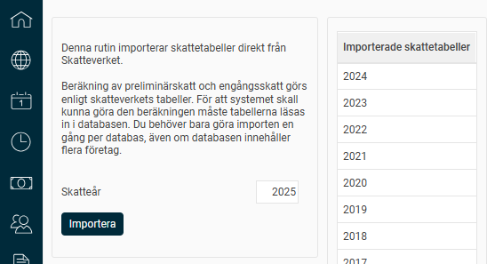

# ⚙️Hämta skattetabeller för det nya året vid årsskiftet

**Datum:** den 23 oktober 2025  
**Kategori:** Systemgemensamt  
**Underkategori:** Integration  
**Typ:** config  
**Svårighetsgrad:** intermediate  
**Tags:** Ingen  
**Bilder:** 1  
**URL:** https://knowledge.flexhrm.com/sv/h%C3%A4mta-skattetabeller-f%C3%B6r-det-nya-%C3%A5ret-vid-%C3%A5rsskiftet

---

Under
Administration > Systemregister > Importera skattetabeller
hämtar du in skattetabellerna för det nya året. Dessa behöver läsas in innan du öppnar den första lönekörningen för året.

Ange vilket skatteår du vill hämta skattetabellerna för och klicka sedan på Importera. Den inlästa skattetabellen kan sedan användas för alla företag i databasen. I listan till höger ser du vilka år som skattetabellerna är inlästa för.
För att hämta in aktuella skattetabeller på de anställda använder du rutinen för
FOS-förfrågan
.
