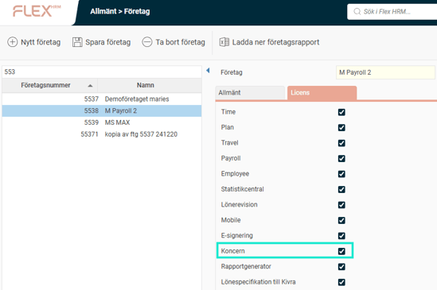
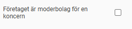
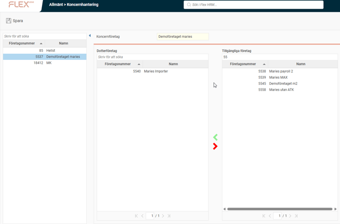

# ⚙️Hur aktiverar jag koncernhantering i Flex HRM?

**Datum:** den 3 december 2025  
**Kategori:** Systemgemensamt  
**Underkategori:** Inställningar  
**Typ:** config  
**Svårighetsgrad:** advanced  
**Tags:** Ingen  
**Bilder:** 3  
**URL:** https://knowledge.flexhrm.com/sv/hur-aktivera-jag-koncernhantering-i-flex-hrm

---

Artikeln beskriver hur du aktiverar koncernhantering i Flex HRM: licensinställningar, moderbolag och dotterbolagskoppling.
Koncernhatering
Koncernhantering i Flex HRM är en tilläggsmodul som låter dig hantera flera företag (moderbolag och dotterbolag) som en koncern i systemet.
Licensinställningar
För att kunna använda koncernhanteringen behöver du tilläggsmodulen.
Du ställer in vilka företag som ska använda koncernlicensen under
Administration > Allmänt > Företag
. På fliken
Licens
kan du kryssa ur licensen för
koncern
på de företag där du
inte
vill använda funktionen. De företag som måste ha kryssrutan för
koncern
ikryssad är koncernens moderbolag samt alla dotterbolag.

Steg 1: Ange moderbolag
Det första steget är att välja vilket företag som ska vara koncernens moderbolag. Det gör du under
Administration > Allmänt > Företag
genom att markera inställningen
Företaget är moderbolag för en koncern
.

Om du vill sätta upp flera koncerner i samma databas går det bra. Du kryssar då i den här inställningen på alla företag som är moderbolag för respektive koncern.
Steg 2: Koppla dotterbolag
Nästa steg är att definiera vilka dotterbolag som ingår i koncernen. Det gör du i vyn
Administration > Allmänt > Koncernhantering
.

I listan till vänster ser du de företag som är markerade som koncernmoderbolag. När du väljer ett företag i listan visas två listor till höger:
Dotterbolag som ingår i koncernen.
Övriga företag som inte ingår i koncernen.
Du lägger till eller tar bort dotterbolag i koncernen genom att flytta företag mellan listorna med de
gröna och röda pilarna
.
