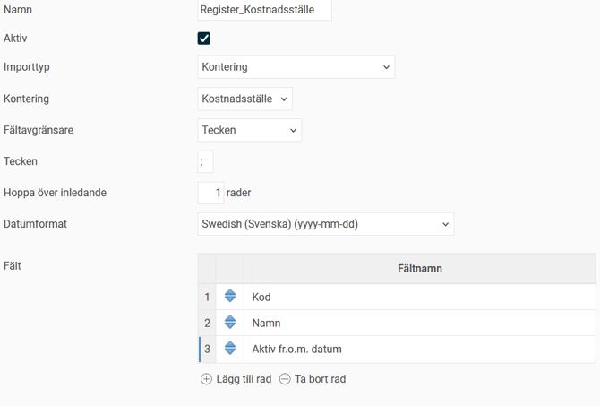
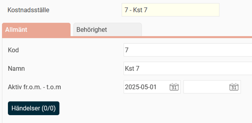
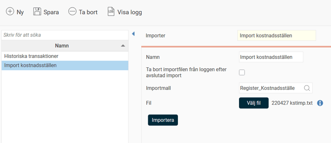
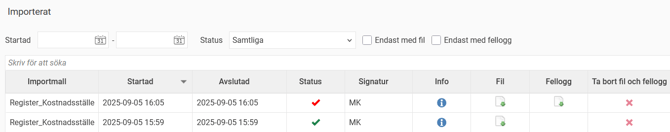
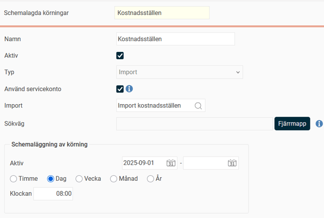

# ⚙️Hur arbetar man med filimporter i Flex HRM?

**Datum:** den 20 januari 2026  
**Kategori:** Systemgemensamt  
**Underkategori:** Register  
**Typ:** config  
**Svårighetsgrad:** intermediate  
**Tags:** användare, behörighet  
**Bilder:** 6  
**URL:** https://knowledge.flexhrm.com/sv/hur-arbetar-man-med-filimporter-i-flex-hrm

---

Information om att skapa importmallar, importera data, schemalägga importer.
Importtyper
Skapa en importmall
Importera data från fil
Schemalägga import
Importera data till Flex HRM
Genom att importera data med filer i formaten
.csv
,
.txt
eller
.tsv
kan du effektivt lägga in stora mängder information i Flex HRM. Denna artikel beskriver hur du skapar en importmall, importerar filer och schemalägger importer.
Importtyper
Flex HRM stöder flera importtyper. Vilka som är tillgängliga för dig beror på din licens. Till exempel krävs en licens för
HRM Travel
för att du ska kunna importera bilresor.
Här är de importtyper som kan göras:
Ackumulatorvärden
Anställda - Barnregister
Anställda - Fasta transaktioner
Anställda - Tabeller
Anställda/användare
Befattningsregister
Bilresa
Budget
Frånvaro
Kontering
Konteringskombinationer
Löneartsregister
Lönetransaktioner - Historik
Lönetransaktioner - Löpande import
Saldo
Schema
Tidrapport - Ersättning
Skapa en importmall
En importmall är nödvändig för att Flex HRM ska veta hur en importfil ska läsas. Mallen definierar vilken information som ska skrivas in i systemet och var. Om du till exempel importerar anställda måste du specificera vad i filen som är anställningsnummer, förnamn, efternamn och så vidare.

Så här skapar du en importmall:
Namn
: Ange ett namn för importmallen.
Aktiv
: Markera rutan för att aktivera mallen.
Importtyp
: Välj vilken typ av importmallen ska hantera. Om du väljer
Kontering
kan du i nästa steg välja vilken konteringsdimension som ska importeras.
Fältavgränsare
: Välj det tecken som avgränsar fälten i din fil.
Fasta fältlängder
: Programmet läser in poster i block med en angiven längd. Du måste då ange startposition och längd för varje fält.
Tabb
: Tabbtecken används som avgränsare.
Tecken
: Välj ett eget tecken.
Hoppa över inledande rader
: Om din fil har en rubrikrad eller liknande som inte ska importeras, fyll i antalet rader som ska hoppas över.
Datumformat
: Ange det datumformat som används i filen.
Lägg till fält:
I
f
ältlistan väljer du vilka fältnamn filen innehåller.
Klicka på
Lägg till rad
för varje fält du vill inkludera.
Klicka på förstoringsglaset för att få upp urval och beskrivningar av fält.
Justera ordningen genom att dra och släppa de blå pilarna.
Om du valt
Fasta fältlängder
anger du startpostition och längd.
Exempel
För att importera nya kostnadsställen kan vi skapa du en importmall som innehåller kod, namn och aktiv från och med-datum.
Vi väljer
semikolon
som fältavgränsare och datumformat
yyyy-mm-dd
.
Vi fyller i
1
i fältet
Hoppa över inledande rader
.

Filen ser ut så här:
5;Kst 5;2025-04-01
7;Kst 7;2025-05-01
Endast kostnadsställe
7
importeras, eftersom den första raden hoppas över.

Importera data från fil
Gå till
Bearbetningar > Servicerutiner > Import
.

Namn
: Du kan ange ett namn om du vill spara importen för att kunna schemalägga den eller köra den flera gånger.
Ta bort importfilen från loggen efter avslutad import
: Markera rutan om du vill att filen ska tas bort från loggen när importen är klar.
Importmall
: Välj den importmall du har skapat.
Fil
: Klicka på
Välj fil
för att ladda upp din importfil.
Klicka på
Importera
för att starta importen direkt. Du får ett meddelande när den är klar.
Visa logg
:
D
etaljer om importen, som när den startade och avslutades samt eventuella fel. Om något har gått fel, hittar du en fellogg som informerar om vilka rader som inte kunde importeras och varför.

Schemalägga import
Du kan schemalägga en sparad import så att den körs automatiskt vid en viss tidpunkt.
Gå till
Inställningar > Import/Export > Schemalagda körningar
.

Ange ett namn för den schemalagda körningen.
Välj vilken import du vill schemalägga.
Ställ in hur ofta och vid vilket klockslag importen ska köras.
Ställ in en fjärrmapp där importfilen ska hämtas.
Spara.
Vid den tidpunkt du har ställt in, till exempel varje dag kl. 08:00, kommer importen att köras.
Bra att veta om servicekonto
För att den schemalagda körningen inte ska vara beroende av en specifik användare, markera inställningen
Använd servicekonto
. Om du inte gör detta, kommer den användare som sparade körningen att stå som import-användare, vilket kan leda till problem om den användaren inaktiveras eller får ändrade behörigheter.
I vyn för Schemalagda körningar kan du alltid se vilken användare som skapade och senast ändrade en schemalagd körning.
