# Hur byter jag från Flex Lön till Flex HRM som master för personuppgifter?

**Datum:** den 30 september 2025  
**Kategori:** Systemgemensamt  
**Underkategori:** Integration  
**Typ:** howto  
**Svårighetsgrad:** advanced  
**Tags:** användare, integration, roll  
**Bilder:** 12  
**URL:** https://knowledge.flexhrm.com/sv/hur-byter-jag-fr%C3%A5n-att-ha-flex-l%C3%B6n-som-master-till-att-ha-flex-hrm-som-master

---

Denna artikel beskriver, med bl.a. checklista, hur du byter master för personuppgifter från Flex Lön till Flex HRM.
Checklista inför bytet
Register att kontrollera
Skapa en kontrollrapport i Flex Lön
Viktigt att veta när Flex HRM är master
Steg-för-steg: Så här byter du master
Flex HRM – Byt master för personuppgifter
I denna artikel beskriver vi hur du ändrar så att Flex HRM blir master för personuppgifter istället för Flex Lön. Processen innebär att du först säkerställer att all information från Flex Lön har förts över till Flex HRM, innan du byter vilket system som styr.
Observera!
Vi rekommenderar inte att du byter master om du använder lönekoder för timlön eller månadslön i Flex Lön. När flödet vänds kommer dessa lönekoder att tas bort. Detta är vanligt i byggbranschen om ni använder Bygglösen. Kontrollera därför detta innan du fortsätter.
I den här artikeln får du en genomgång av vad du behöver kontrollera, hur du genomför bytet och hur du säkerställer att allt fungerar som det ska.
Checklista inför bytet
Använd den här checklistan som ett stöd för att säkerställa att alla nödvändiga steg genomförs i rätt ordning.
Förberedelser
Kontrollera att registret
Personalkategori
i Flex HRM stämmer överens med registret i Flex Lön (matchning sker på kod).
Kontrollera att registret
Anställningsform
i Flex HRM stämmer överens med registret i Flex Lön.
Säkerställ att korrekta
e-postadresser
finns registrerade på de anställda i Flex Lön.
Kontrollera att fältet
Befattning
finns i både Flex HRM och Flex Lön.
Exportera
Clearing- och bankkontonummer
från Flex Lön och importera till Flex HRM. Du kan med fördel använ
da en rapport från rapportredigeraren.
Kontrollera att inställningen för
För- och efternamn
i Flex Lön matchar den i Flex HRM.
Säkerställ att
Personmallarna
i Flex Lön har samma namn och kod som Anställningsmallarna i Flex HRM.
Gå igenom vilka fält som kan påverkas av synkroniseringen mellan systemen.
Skapa eventuellt en uppgift i Flex HRM för att komma ihåg att manuellt fylla i
Avgångsorsak
i Flex Lön när en anställning avslutas.
Bestäm vilka
konteringar
som ska skickas från Flex HRM till Flex Lön och tänk på eventuell
konteringsfördelning
.
Om
nyanställningsflöden
är aktiverade i Flex HRM,
avaktivera dessa tillfälligt
under tiden du exporterar data från Flex Lön.
Överföring från Flex Lön
Säkerställ att kryssrutan
Använd Flex HRM webbservice
är markerad i Flex Lön och att en användare med namnet
FlexIntegrationHRM
finns och är aktiv i Flex HRM.
Testa att exportera EN anställd från Flex Lön till Flex HRM och kontrollera att resultatet ser korrekt ut.
Exportera ALLA anställda från Flex Lön till Flex HRM och kontrollera resultatet.
Avmarkera
Export av personuppgifter
i Flex Lön. Låt
Export av saldo
vara aktiv.
Kontrollera att antalet anställda är detsamma i båda systemen.
Aktivera Flex HRM som master
Gå till programlänken för
Flex API
i Flex HRM och välj
Samtliga anställningsuppgifter
under
Överför anställningsuppgifter
. Ställ eventuellt in ett urval om inte alla ska föras över.
Kontrollera att synkroniseringen fungerar genom att tillfälligt ändra en adress på en anställd i Flex HRM och se att ändringen slår igenom i Flex Lön.
Register att kontrollera
Följande register synkroniseras mellan Flex HRM och Flex Lön. Det är därför viktigt att de stämmer överens för att integrationen ska fungera korrekt.
Personalkategori
Se till att registren för personalkategori är identiska i båda systemen.
Kontroll i Flex HRM:
Gå till
Inställningar
>
Personalkategorier
.
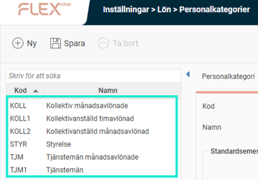
Kontroll i Flex Lön:
Gå till
Inställningar
>
Personalkategorier
.
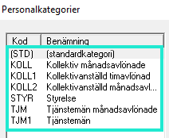
Om en personalkategori från Flex HRM saknas i Flex Lön kommer den anställde att kopplas till standardkategorin (STD) i Flex Lön.
Anställningsform
Se till att registren för anställningsform är identiska i båda systemen.
Kontroll i Flex HRM:
Gå till
Inställningar
>
Allmänt
>
Anställningsformer
.
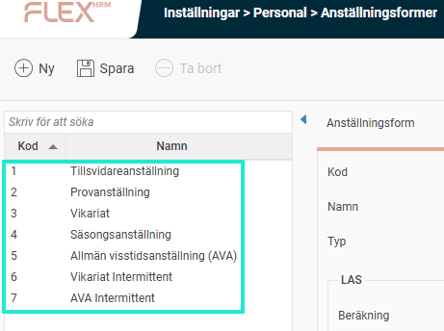
Kontroll i Flex Lön:
Gå till
Inställningar
>
Anställningsformer
.
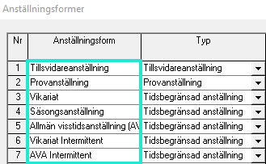
Om en anställningsform som används i Flex HRM inte finns i Flex Lön, kommer den visserligen att skapas, men inställningar som rör LAS/AVA kommer att saknas.
E-post
Kontrollera att e-postadresser finns registrerade på de anställda i Flex Lön. Om en adress bara finns i Flex HRM kommer den att skrivas över och försvinna vid den sista exporten från Flex Lön. Säkerställ också att adresserna har korrekt format (med @ och .) för att undvika att exporten misslyckas.
För- och efternamn
Kontrollera inställningen för namn i Flex Lön under
Inställningar
>
Styruppgifter
> fliken
Allmänt
. Fältet får inte vara inställt på
Odefinierad
.
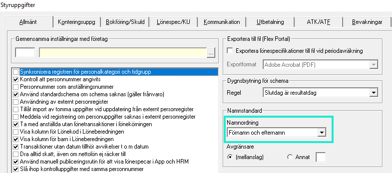
Personmallar och Anställningsmallar
Anställningsmallen i Flex HRM matchas mot personmallen i Flex Lön via mallens kod/nummer. Kontrollera att dessa stämmer överens. Uppgifter som skickas från Flex HRM har företräde framför mallens inställningar i Flex Lön.
Skapa en kontrollrapport i Flex Lön
Du kan skapa en rapport i rapportredigeraren i Flex Lön för att kontrollera uppgifter som anställningsnummer, namn, bankkonto, befattning och e-post och personalkategori.
Gå till menyn
Arbeta med > Rapportredigeraren
.
Ange ett ledigt nummer och ge rapporten ett namn.
Klistra in rapportkoden nedan i kodfältet och klicka på
Spara
.
Rapportkoden:
fdr023.anstnr AS anstnr,
fdr023.namn AS namn,
fdr023.bank AS bank,
fdr023l.bankkto_lon AS bankkto_lon,
fdr023l.befattning AS befattning,
fdr023.email AS email,
fdr023.email_privat AS email_privat,
fdr023l.perskatlon AS perskatlon
FROM fdr023
LEFT JOIN fdr023l ON fdr023.ftgnr=fdr023l.ftgnr AND fdr023.anstnr=fdr023l.anstnr
WHERE #fdr023.anstnr#anstnr$OPT+TXT@ANST#A10# AND (fdr023.ftgnr = '¤FTG¤')
ORDER BY fdr023.anstnr, fdr023.namn, fdr023.bank
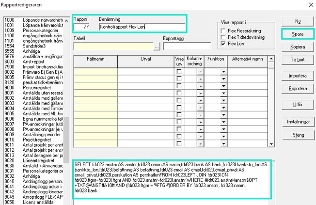
Klicka på
Utför
för att ta ut rapporten som du kan använda för dina kontroller.
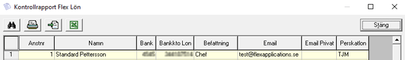
Viktigt att veta när Flex HRM är master
Avgångsorsak
Avgångsorsak måst
e anges manuellt i Flex Lön. För att inte glömma detta kan du skapa en uppgift i Flex HRM som påminner dig när en anställning avslutas.
Sysselsättningsgrad
En sysselsättningsgrad i Flex HRM måste alltid ha ett startdatum, eftersom den informationen krävs vid överföringen till Flex Lön.
Konteringar
Det är möjligt att skicka hemkonteringar från Flex HRM till Flex Lön. Tänk dock på att Flex Lön kan hantera fördelning av konteringar (exempelvis 25 % på ett kostnadsställe och 75 % på ett annat), vilket Flex HRM inte kan. Om du aktiverar överföring av konteringar från Flex HRM kommer de att skriva över eventuella fördelningar i Flex Lön.
Notera också att Flex HRM har datumstyrning på konteringar, vilket Flex Lön saknar. En framtida konteringsändring i Flex HRM kommer alltså inte att slå igenom i Flex Lön direkt. Detta kan lösas genom att schemalägga en nattlig export som uppdaterar med aktuellt värde.
Byta anställningsnummer
Om du behöver byta anställningsnummer på en anställd är det viktigt att du följer stegen nedan för att undvika dubbletter.
Byt först i Flex Lön
Börja med att ändra anställningsnumret i Flex Lön.
Ändra sedan i Flex HRM
När ändringen är gjord i Flex Lön kan du ändra till samma anställningsnummer i Flex HRM. Nu matchar numren och systemen kan kommunicera korrekt.
Steg-för-steg: Så här byter du master
Här följer den praktiska rutinen för att synkronisera uppgifterna och byta masterdatasystem.
1. Exportera anställda från Flex Lön till Flex HRM
Först måste alla anställda, även avslutade, exporteras från Flex Lön. Detta för att Flex HRM ska få information om samtliga upptagna anställningsnummer och inte riskera att skriva över befintliga anställningar senare.
Kontrollera i Flex Lön under
Inställningar
>
Styruppgifter
>
Kommunikation
>
Anslutningar
att kryssrutan
Använd FLEX HRM webbservice
är markerad.
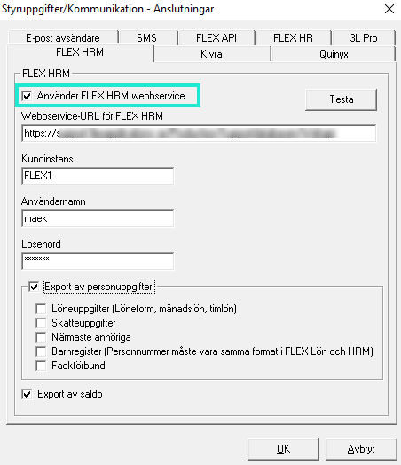
Börja med att exportera en enda anställd för att testa att allt fungerar som förväntat.
Exportera därefter
alla
anställda från Flex Lön till Flex HRM.
Observera att den anställningsmall i Flex HRM som är markerad som
Standardmall
kommer att användas vid exporten. Om du har anställda i Flex Lön som inte finns i HRM och som ska kopplas till en specifik mall, behöver du göra exporten i flera omgångar. Du gör då ett urval och byter standardmall i Flex HRM mellan varje export.
2. Avaktivera Flex Lön som master
När alla anställda är exporterade och du har kontrollerat att uppgifterna stämmer i Flex HRM, gör du följande:
Gå till Flex Lön och avmarkera
Export av personuppgifter
.
Se till att
Export av saldon
fortfarande är markerad.
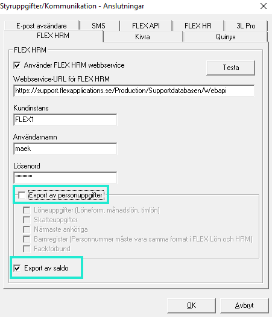
Kontrollera att antalet anställda nu är detsamma i båda systemen. I Flex HRM ser du antalet under
Personal
och vyn
Lista
.
3. Aktivera Flex HRM som master
Nu är det dags att göra Flex HRM till master för personuppgifter.
I Flex HRM, gå till
Inställningar
>
Allmänt
>
Programlänkar
.
Ange uppgifterna för programlänken
Flex API
.
Vid
Överför anställningsuppgifter
, välj
Samtliga anställningsuppgifter
.
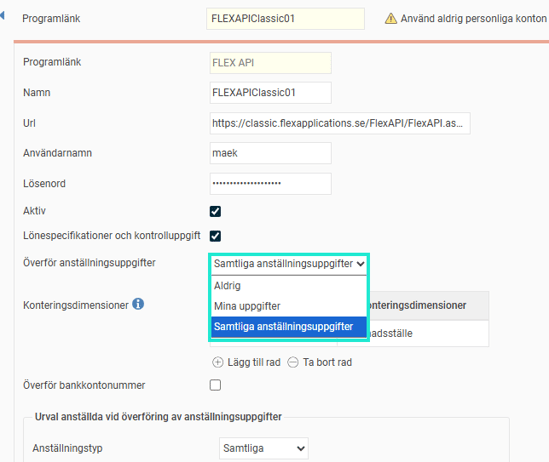
Om du inte vill att alla anställda ska föras över till Flex Lön kan du göra ett urval, till exempel baserat på anställningstyp.
4. Kontrollera funktionen
För att säkerställa att allt fungerar, gör en teständring.
Ändra tillfälligt adressen på en anställd i Flex HRM och spara.
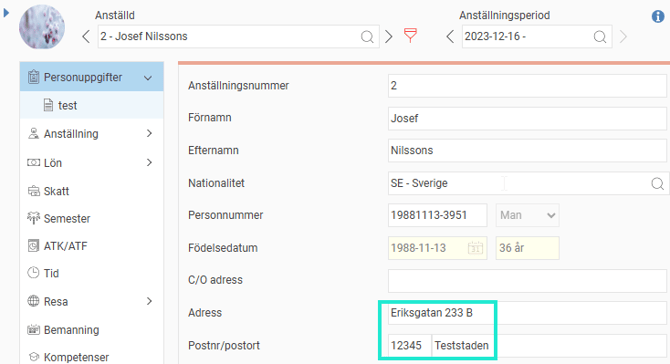
Verifiera att den nya adressen syns korrekt i Flex Lön.
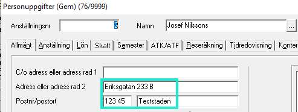
När du har genomfört dessa steg är processen klar och Flex HRM är nu master för personuppgifter.
