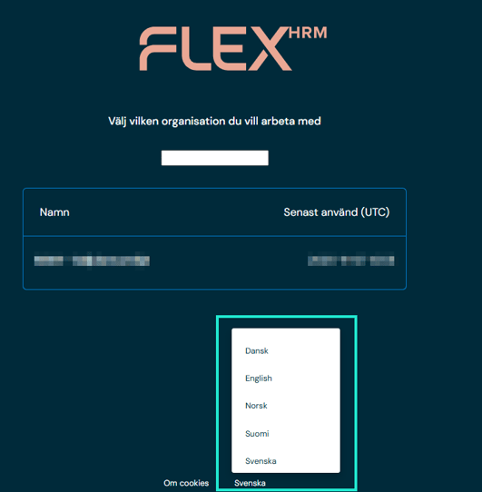
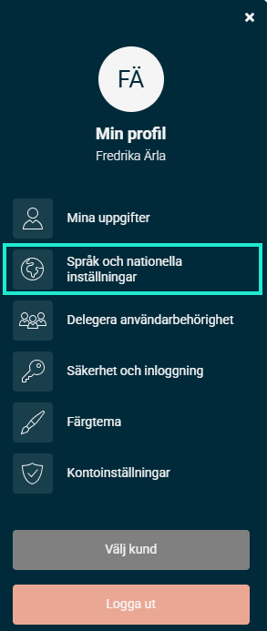
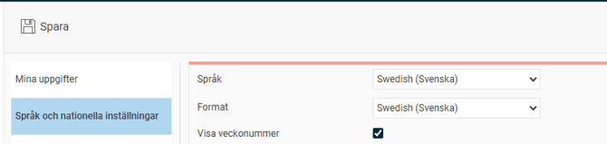

# Hur byter jag språk i Flex HRM?

**Datum:** den 11 maj 2026  
**Kategori:** Systemgemensamt  
**Underkategori:** Inställningar  
**Typ:** howto  
**Svårighetsgrad:** beginner  
**Tags:** Ingen  
**Bilder:** 3  
**URL:** https://knowledge.flexhrm.com/sv/byt-sprak-flex-hrm-0

---

Denna artikel beskriver hur du byter språk.
När du ska logga in i Flex HRM kan du välja språk vid inloggning. Längst ned ser du valt språk:

Du kan byta språk inne i Flex HRM via
Min profil - Språk och nationella inställningar
.

Välj önskat
språk
och
spara
din inställning.

