# ⚙️Hur fungerar ändringsloggen i Flex HRM?

**Datum:** den 6 november 2025  
**Kategori:** Systemgemensamt  
**Underkategori:** Användare & Behörighet  
**Typ:** config  
**Svårighetsgrad:** intermediate  
**Tags:** användare, behörighet, roll  
**Bilder:** 12  
**URL:** https://knowledge.flexhrm.com/sv/loggning-flex-hrm-0-0

---

Visa ändringsloggen
I Flex HRM kan du logga (spåra) ändringar som görs i många av systemets register. I loggen sparas information om tidpunkten för ändringen, vem som gjorde den, det gamla värdet och det nya värdet.
Du hittar loggen genom att gå till
Allmänt > Loggning > Logg
.
Du ser då följande vy:
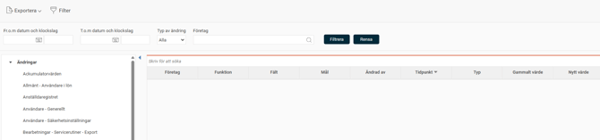
Till vänster ser du en lista över alla aktiva loggar. Listan visar också avstängda loggar som fortfarande har kvar gamla loggposter.
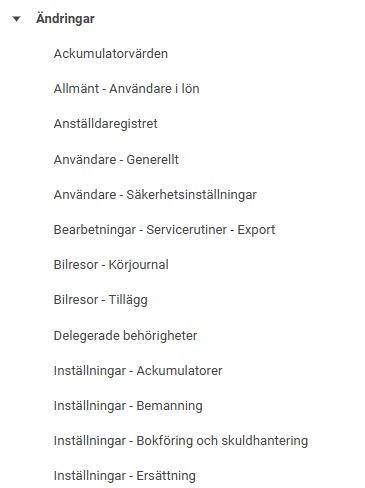
⚙️Du ställer in vilka register som ska loggas under
Administration > Allmänt > Loggning > Logginställningar
.
När du markerar en rad i listan till vänster (exempelvis "Anställdaregistret"), visas alla loggposter för den i listan till höger. Här ser du alla loggade ändringar per fält.
Om du exempelvis har ändrat adress, telefonnummer och e-postadress på en anställd, visas det som tre separata rader i loggen (en rad för varje fält som ändrats).
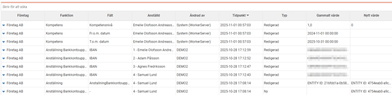
Söka och filtrera i loggen
Ovanför listan till höger finns ett sökfält. Där kan du söka på all information som visas i listan. Det är användbart om du exempelvis letar efter ändringar som gäller en specifik anställd eller som är gjorda av en specifik användare.
Det finns också ett filter där du kan söka på tidpunkt och typ av ändring.
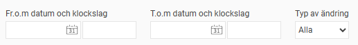
Som default-inställning sätts filtret på det företag du är inloggad i. Du kan ändra på filtret för företag vid behov för att se flera/andra företag.
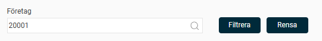
Om du markerar en rad i listan (till höger) ser du detaljerad information om just den ändringen i fältet under listan. Där ser du bland annat det gamla och det nya värdet.
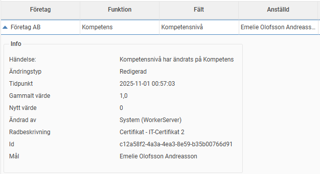
Här visas också tekniska ID-nummer som kan hjälpa en utvecklare vid felsökning och liknande.
Förklaring av kolumnerna
I listan med loggposter ser du följande kolumner:
Företag:
Visar vilket företag ändringen gäller.
Funktion:
Visar vilken del (underfunktion) av registret som ändringen gäller. Om loggen exempelvis gäller anställdaregistret, kan funktionen vara "anställningsperiod", "schema" eller "sysselsättningsgrad". Detta förtydligar vad fältet hör till. (Om fältet är "från och med-datum" talar funktionen om vad datumet avser).
Fält:
Visar vilket specifikt fält som har ändrats.
Mål:
Visar vad ändringen gäller. I anställdaregistret är målet en anställd, i löneartsregistret är målet en löneart, och så vidare.
Ändrad av:
Visar vilken användare som gjorde ändringen.
Tidpunkt:
Visar när ändringen gjordes.
Typ:
Visar typen av ändring (om ett nytt värde lagts till, ett befintligt ändrats eller ett värde tagits bort).
Gammalt värde, Nytt värde:
Visar värdet före respektive efter ändringen.
Exportera loggen
Du kan exportera de loggrader som visas (baserat på ditt urval) genom att klicka på
Exportera
i verktygsfältet. Du kan välja mellan formaten .csv och .xlsx.
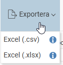
Viktigt att tänka på – Behörighet
En användare med behörighet att se loggarna kan se
alla
loggade uppgifter i hela databasen. Det inkluderar även ändrade personuppgifter för alla anställda (om du loggar detta). Det är därför mycket viktigt att du noggrant begränsar vilka användare som ska ha denna behörighet.
Du ställer in behörigheten för loggen på användarens
roll
. Där kan du ställa in två olika nivåer:
Behörighet att se loggen:
Ger användaren rätt att se loggen.
Behörighet att se loggrader på systemnivå:
Detta är en utökad behörighet. Den innebär att användaren kan se loggen även för företag som hen normalt inte har behörighet till.
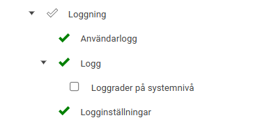
Integrerade egna loggar
Du kan även se när en ändring är gjord och av vilken användare på flera ställen i systemet. Till exempel kan du se ändringar i egna loggar i vyerna anställdaregistret, tidrapporter och löneberedning.
Här nedan ser du några exempel:
I
anställdaregistret
ser du vem som har ändrat på fältet månadslön längst till höger.
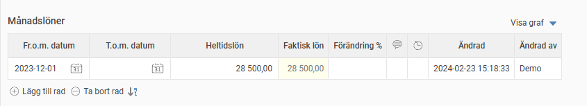
I
tidrapporten
hittar du en logg på stämplingar/registrerad tid under
Mer - Logg.
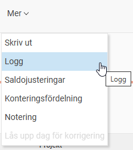
Du kan även se en logg för vem som granskat tidrapporten.
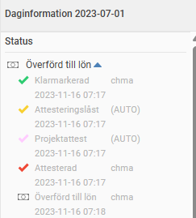
I löneberedningen kan vi se ändringar på en lönetransaktion.

Relaterade artiklar
Hur ställer jag in vilka ändringsloggar som ska vara aktiva i Flex HRM?
