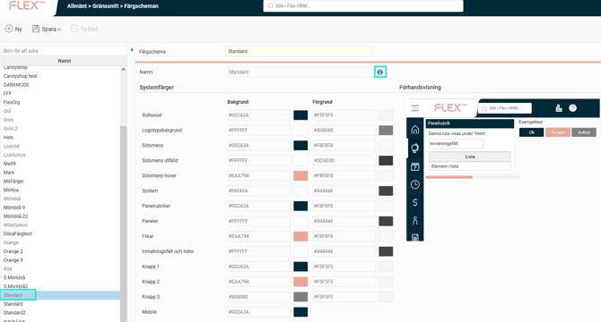
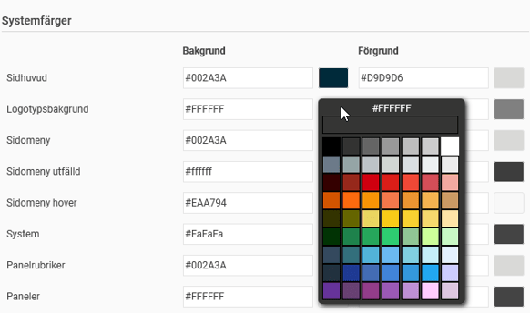
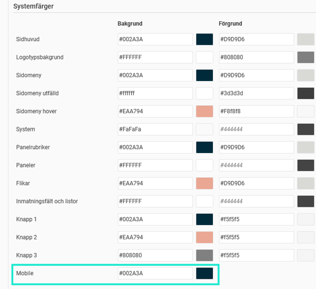

# ⚙️Hur fungerar färgscheman i Flex HRM?

**Datum:** den 23 oktober 2025  
**Kategori:** Systemgemensamt  
**Underkategori:** Mobil  
**Typ:** config  
**Svårighetsgrad:** intermediate  
**Tags:** mobil  
**Bilder:** 4  
**URL:** https://knowledge.flexhrm.com/sv/hur-fungerar-f%C3%A4rgscheman-i-flex-hrm

---

Lär dig skapa och anpassa färgscheman i Flex HRM. Matcha företagets grafiska profil genom att ändra färger på menyer, paneler och i HRM Mobile.
Gränssnitt – Färgscheman
Med den här funktionen kan du som är systemadministratör skapa egna färgscheman för att anpassa utseendet i Flex HRM. Det gör att du kan anpassa programmet så att det matchar ditt företags grafiska profil. Du kan också ge användarna möjlighet att själva välja bland de färgscheman du har skapat.
För att ställa in vilket färgschema som ska vara standard i systemet, eller för ett specifikt företag, går du till
Administration > Allmänt > Gränssnitt > Teman
. Där kan du också bestämma vilka alternativa scheman som användarna får välja mellan.
Hitta och hantera färgscheman
Du hittar funktionen under
Allmänt > Gränssnitt > Färgscheman
.
I vyn som öppnas ser du en lista med befintliga färgscheman till vänster. Vissa av dessa är standard i systemet och kan inte ändras. Du känner igen dem på att de visas i kursiv stil och har en informationssymbol bredvid namnet.

Skapa ett nytt färgschema
Du kan skapa ett nytt färgschema på två sätt:
Klicka på knappen
Ny
för att börja från grunden.
Välj ett befintligt schema i listan och klicka på
Spara som
för att skapa en kopia att utgå från.
Systemfärger
Här väljer du bakgrunds- och förgrundsfärg för allmänna delar i systemet, som menyer, paneler och andra element. Du väljer färg genom att antingen tycka på färgrutan till höger om varje fält och välja från färgtabletten eller, om du har den exakta färgkoden (hexadecimal kod), kan du också skriva in den direkt i textfältet..

Delsystemspecifika huvudfärger
Du kan även välja en avvikande huvudfärg för HRM Mobile. Om ditt företag vill använda en annan huvudfärg för
HRM Mobile
kan du ställa in det här.

Förhandsgranskning
Till höger på sidan finns en förhandsgranskning där du hela tiden kan se resultatet av dina färgval.

Relaterade artiklar:
Hur kan jag använda teman i Flex HRM?
