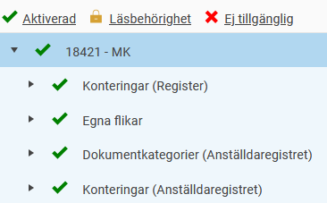
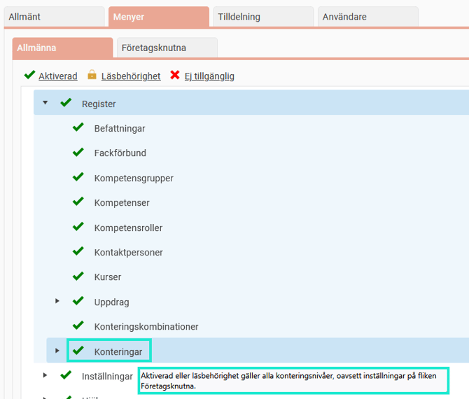
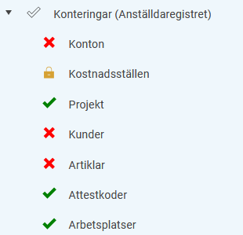
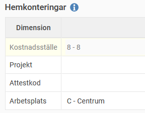

# ⚙️Hur fungerar företagsknuten behörighet?

**Datum:** den 22 september 2025  
**Kategori:** Systemgemensamt  
**Underkategori:** Register  
**Typ:** config  
**Svårighetsgrad:** intermediate  
**Tags:** användare, behörighet, roll  
**Bilder:** 4  
**URL:** https://knowledge.flexhrm.com/sv/hur-fungerar-f%C3%B6retagsknuten-beh%C3%B6righet

---

Vissa register kan behörighetsstyras per företag.
F
öretagsknuten behörighet används för register som kan se olika ut mellan olika företag, som till exempel konteringsdimensioner. Eftersom uppsättningen av dessa register kan variera mycket mellan olika företag kan de inte styras på detaljnivå i det generella behörighetsträdet.
I stället har du en egen flik i rollinställningarna där du per företag kan ställa in behörighet till:
Konteringsregister.
Egna flikar.
Dokumentkategorier i anställdaregistret.
Konteringar i anställdaregistret.

Konteringar (Register)
Om du vill styra behörigheten till konteringsregister per företag och enskilt register ska du sätta ett
rött kryss
för noden
Konteringar
i det generella behörighetsträdet.
Om du vill att en användare ska ha samma behörighet för alla företag kan du i stället använda
grön bock
(se och redigera) eller
hänglås
(läsbehörighet) i det generella behörighetsträdet. Denna behörighet gäller då i alla företag.

Med grön bock eller hänglås ser du alltså alla konteringsregister i alla företag, medan ett rött kryss ger dig möjlighet att behörighetsstyra vilka register du ska se i respektive företag.
Egna flikar
Företagsknuten behörighet till
Egna flikar
beskrivs i denna artikel:
Hur skapar jag Egna flikar och fält i HRM Employee?
Dokumentkategorier (Anställdaregistret)
Företagsknuten behörighet till dokumentkategorier (anställdaregistret) beskrivs i denna artikel:
Hur fungerar Dokumentkategorier i HRM Employee?
Konteringar (Anställdaregistret)
I det generella behörighetsträdet finns noden
Konteringar
för anställdaregistret.
Ett
rött kryss
gör att fliken
Konteringar
inte syns alls.
Med en
grön bock
kan du ställa in behörigheten till enskilda hemkonteringar, per företag, på fliken för företagsknuten behörighet.
Läsbehörighet (hänglås) får genomslag om den företagsknutna behörigheten inte har ett
rött kryss
.
Inställningen
Visa alla konteringar
i det generella behörighetsträdet gör att alla hemkonteringar visas, oavsett vad som är inställt för den företagsknutna behörigheten.
På bilden nedan har vi valt att i den företagsknutna behörigheten ge full behörighet till hemprojekt, hemattestkod och hemarbetsplats. Till hemkostnadsställe har vi satt läsbehörighet. Hemkonto, hemkund och hemartikel ska inte visas alls.

Relaterat
Vad är en roll?
Hur fungerar Dokumentkategorier i HRM Employee?
Hur skapar jag Egna flikar och fält i HRM Employee?
