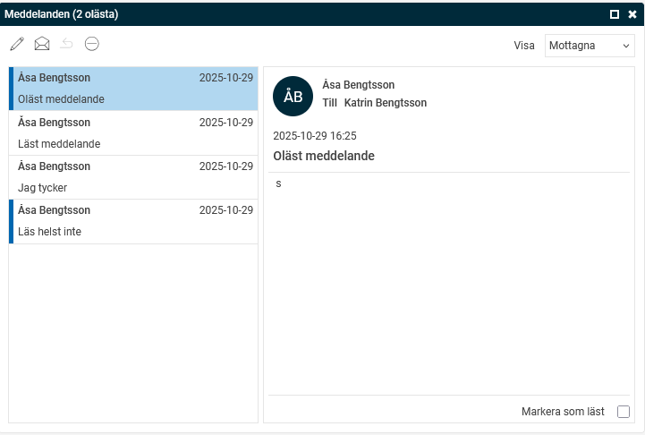
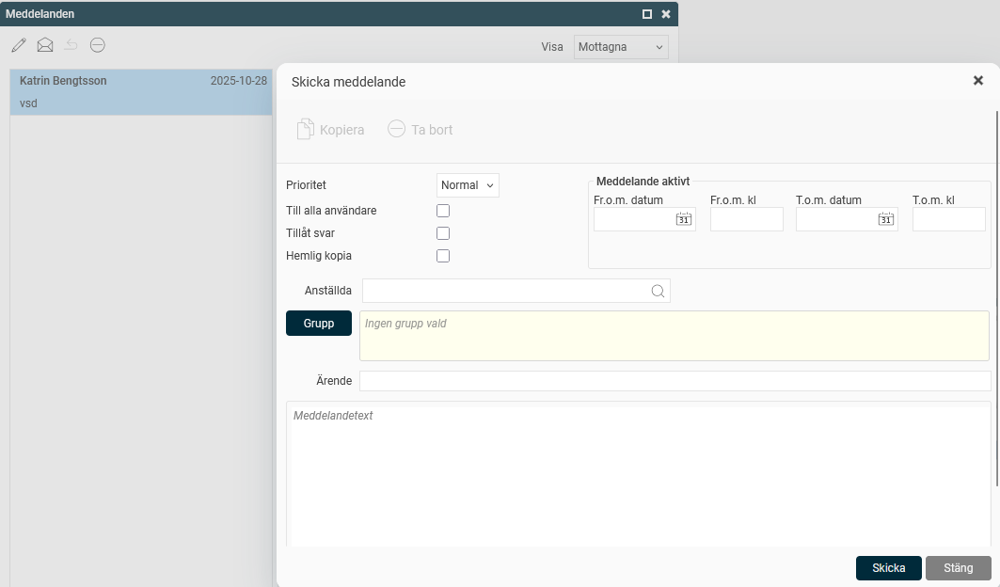
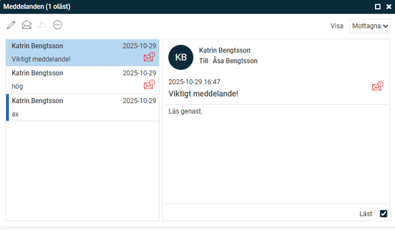

# Hur fungerar Meddelanden i Flex HRM?

**Datum:** den 29 oktober 2025  
**Kategori:** Systemgemensamt  
**Underkategori:** Användare & Behörighet  
**Typ:** howto  
**Svårighetsgrad:** intermediate  
**Tags:** användare, behörighet, mobil, roll  
**Bilder:** 3  
**URL:** https://knowledge.flexhrm.com/sv/hur-fungerar-meddelanden-i-flex-hrm

---

På startsidan i Flex HRM finns en panel där du kan skicka meddelanden till enskilda anställda eller till hela grupper. Du kan ha behörighet att både skicka och ta emot meddelanden, eller bara att ta emot dem.
Du hanterar meddelanden på startsidan i Flex HRM och i vyn
Meddelanden
i HRM Mobile.
Filtrera meddelanden
Du kan filtrera meddelandepanelen för att se:
Mottagna meddelanden (lästa och olästa)
Lästa meddelanden
Olästa meddelanden
Skickade meddelanden
Schemalagda meddelanden (visas som schemalagda tills de skickas)
Läsa meddelanden
När du filtrerar på mottagna meddelanden markeras olästa meddelanden med en rand i vänsterkanten.

Du kan öppna ett meddelande på tre sätt:
Dubbelklicka
på meddelandet. Det öppnas då i ett nytt fönster och markeras automatiskt som läst.
Markera meddelandet och klicka på kuvertikonen. Det öppnas då i ett nytt fönster och markeras automatiskt som läst.
Klicka en gång
på meddelandet. Det visas då i en panel till höger.
För att markera ett meddelande som läst när det visas till höger, bockar du i
Markera som läst
. Texten ändras då till
Läst
. Du kan bocka ur rutan igen om du vill att meddelandet ska markeras som oläst.
Skicka meddelanden
Om du har behörighet att skicka meddelanden ser du en
pennikon
för att skapa nya meddelanden i panelen. Klicka på ikonen för att öppna fönstret där du skriver ditt meddelande.

När du skapar meddelandet finns flera inställningar att göra:
Prioritet
Du kan välja mellan
Normal
eller
Hög
prioritet. Meddelanden med hög prioritet visas automatiskt i ett popup-fönster hos mottagarna, i Flex HRM och i HRM Mobile,och markeras med en röd ikon i panelen på startsidan.

Till alla användare
Om du har behörighet att skicka meddelanden till alla användare i Flex HRM kan du bocka i rutan för att välja detta. När du väljer detta inaktiveras valen för att skicka till anställda eller grupper.
Tillåt svar
Här väljer du om mottagarna ska kunna svara på meddelandet. Om svar tillåts kan även användare som annars inte har behörighet att skicka meddelanden svara.
Hemlig kopia
Används om du inte vill att mottagarna ska se vilka andra som har fått samma meddelande. Om du inte väljer hemlig kopia kan mottagarna se en lista över alla som har fått meddelandet.
Meddelande aktivt
Denna funktion visas bara för de användare som har behörighet att skicka schemalagda meddelanden. Här kan du ange ett
från och med-datum
och klockslag samt ett
till och med-datum
och klockslag som meddelandet ska visas. Meddelandet skickas då till de valda mottagarna på det valda från och med-datumet och raderas automatiskt på till och med-datumet. Detta är användbart för att till exempel undvika att användare som återvänder från tjänstledighet får gamla meddelanden.
Anställda/Grupp
Här väljer du meddelandets mottagare. Du kan välja:
Enskilda
anställda
.
Alla anställda
i ett företag.
Användare med en viss
roll
.
Användare med en viss
kontering
som hemkontering.
Ta bort meddelanden
För att radera ett meddelande, välj meddelandet och klicka på ikonen för
Ta bort.
Om du som har skickat meddelandet raderar ett skickat meddelande, tas det också bort för alla mottagare.
Relaterade artiklar
Hur fungerar meddelanden i HRM Mobile?
