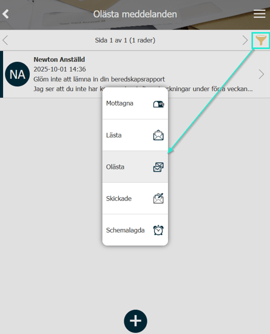
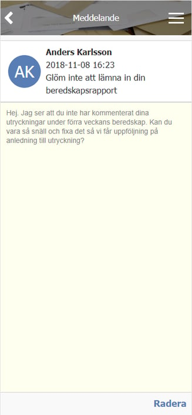
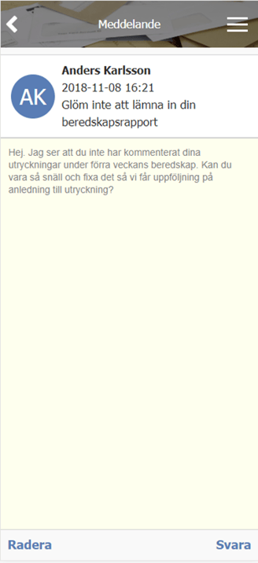
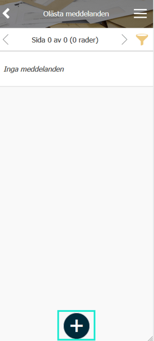
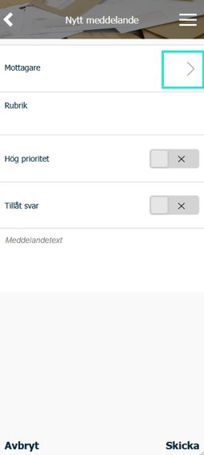
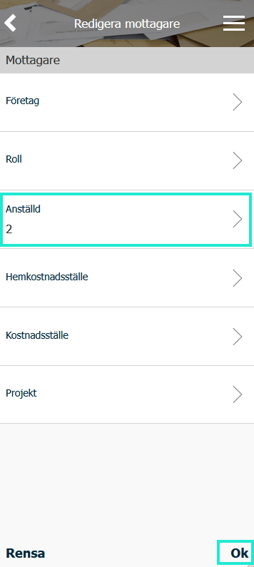
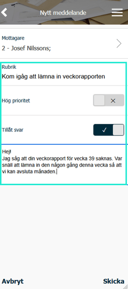
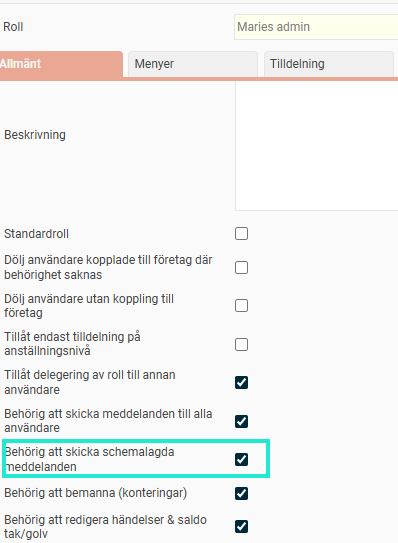
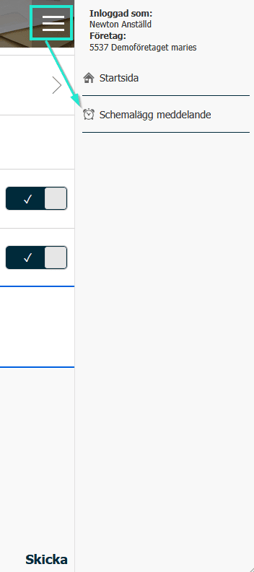

# Hur fungerar meddelanden i HRM Mobile?

**Datum:** den 29 oktober 2025  
**Kategori:** Systemgemensamt  
**Underkategori:** Användare & Behörighet  
**Typ:** howto  
**Svårighetsgrad:** intermediate  
**Tags:** användare, behörighet, mobil, roll  
**Bilder:** 12  
**URL:** https://knowledge.flexhrm.com/sv/meddelande-notiser-och-p%C3%A5minnelser-hur-fungerar-meddelanden-och-notiser-i-flex-hrm-mobile

---

Denna artikel beskriver hur HRM Mobile har en inbyggd meddelandefunktion för kommunikation mellan användare och hur du skickar ett meddelande.
Meddelanden

Meddelandefunktionen som finns genom HRM Mobile är en systembunden funktion, dvs. du kan bara skicka och svara på meddelanden från andra användare av Flex HRM. Denna funktion ska inte blandas ihop med de automatiska påminnelser som systemet skickar ut; detta är meddelande från användare till andra användare.
Om det finns olästa meddelanden indikeras det med en siffra i en cirkel ovanför brevsymbolen.

Du får också en notis när det finns meddelanden.

I nedanstående exempel är det olästa meddelandet markerad med en fet rad till vänster. Vill du titta på alla mottagna, lästa eller skickade meddelanden görs detta med hjälp av filtreringsfunktionen ("tratt"-symbolen).

Vissa meddelanden är bara information och går inte att svara på utan kan bara tas bort.
Om avsändaren tillåter dig att svara ser det istället ut så här:

Skicka egna meddelanden från Flex HRM Mobile
För att skicka ett meddelande via Flex HRM Mobile går du först in via
Meddelanden
och väljer
plus-symbolen
.

I nästa steg får du ange mottagare, vilket du gör genom att klicka på fältet
Mottagare
.

Du väljer
Lägg till mottagare
och får sedan göra urval på mottagare och sedan trycker du på
Ok
.

Du väljer
Ok
igen för att bekräfta mottagaren och du kan sedan fortsätta med att ange rubrik för meddelandet, om det ska ha en hög prioritet eller inte, samt skriva in det meddelande du vill skicka.

Meddelande kan nu skickas till angiven användare genom att klicka på
Skicka
.
Schemalagda meddelanden
Om du är behörig till att skicka schemalagda meddelanden, kan du schemalägga ett meddelande du vill skicka. För att få den behörigheten, behöver den aktiveras på rollen. Detta gör du genom att på rollen som din användare tillhör markera B
ehörig att skicka schemalagda meddelanden
.

Efter det kan man i  i Flex HRM Mobile välja att schemalägga ett meddelande. Detta gör du, när du i Flex HRM Mobile har angett mottagare och fyllt i all information du vill få med i meddelandet, via menyknappen (knappen med tre streck i Mobile). Den ger dig möjligheten att schemalägga meddelandet.

