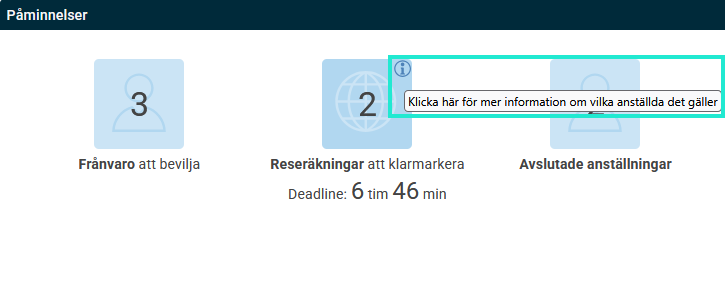
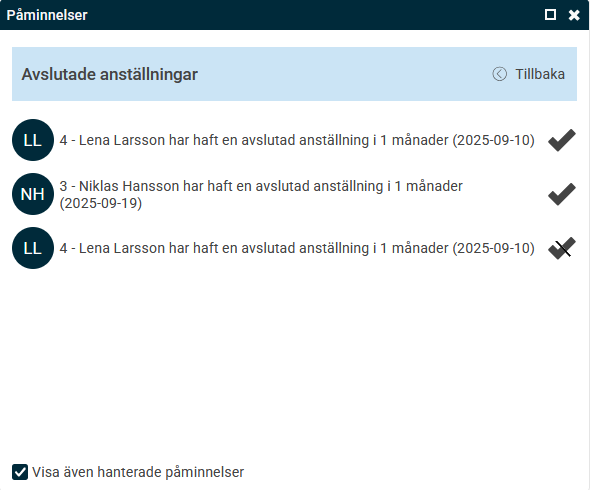
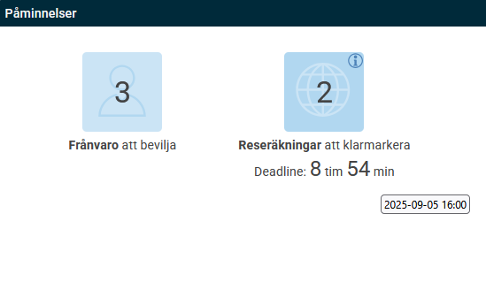

# Hur fungerar Påminnelser på startsidan?

**Datum:** den 5 september 2025  
**Kategori:** Systemgemensamt  
**Underkategori:** Mobil  
**Typ:** howto  
**Svårighetsgrad:** intermediate  
**Tags:** Ingen  
**Bilder:** 3  
**URL:** https://knowledge.flexhrm.com/sv/hur-fungerar-p%C3%A5minnelser-p%C3%A5-startsidan

---

På startsidan i Flex HRM finns en panel som heter
Påminnelser
. Här visas olika typer av notiser, som till exempel:
Påminnelser om att granska tidrapporter, reseräkningar och frånvaro
Födelsedagar
Medarbetarsamtal
Vilka påminnelser som visas beror på hur ni har konfigurerat systemet.
Hantera påminnelser
Du kan klicka på en påminnelse för att se detaljer. Vissa uppgifter, som att godkänna frånvaro, kan du hantera direkt i panelen. Andra, som att attestera reseräkningar, kan du klicka på för att ta dig vidare till den vy där du kan utföra uppgiften.
För påminnelser med en informationsikon i hörnet: Klicka på
i
för att se detaljer, klicka på påminnelsen för att komma till vyn.

Markera som hanterad
Vissa påminnelser behöver inte hanteras i systemet utan är bara en upplysning. Om du vill att en sådan påminnelse ska sluta visas kan du markera den som hanterad. Klicka på bocken längst ut till höger om påminnelsen för att dölja den.

Påminnelser med deadline
Påminnelser som är kopplade till en deadline, som till exempel
Klarmarkering av tidrapport
, visar hur lång tid det är kvar till deadline. Om du håller muspekaren över notisen kan du se den exakta tiden för när deadline går ut.

