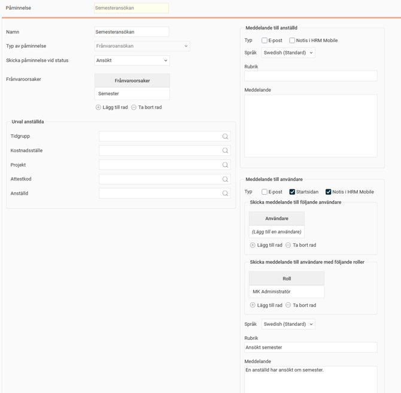
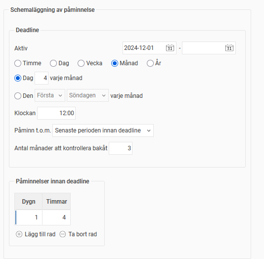

# ⚙️Hur fungerar Påminnelser?

**Datum:** den 29 september 2025  
**Kategori:** Systemgemensamt  
**Underkategori:** Mobil  
**Typ:** config  
**Svårighetsgrad:** intermediate  
**Tags:** användare, mobil, roll  
**Bilder:** 2  
**URL:** https://knowledge.flexhrm.com/sv/p%C3%A5minnelser-hur-anv%C3%A4nder-man-sig-av-p%C3%A5minnelser

---

Detta är en generell artikel gällande påminnelser. Se enskilda artiklar för fördjupning i specifika påminnelser.
Påminnelser
I HRM kan du skapa anpassade påminnelser för olika händelser som frånvaro, granskningar och deadlines.
Olika påminnelser kan anpassas och användas på olika sätt. I bildexemplet nedan visas påminnelsen för frånvaroansökan där du kan välja frånvaroorsak och vid vilken frånvarostatus påminnelse ska skickas. Du kan även göra urval på anställda baserat på hemkontering och tidgrupp.

Välj om meddelandet ska gå ut till anställd, användare eller till användare med en viss roll. Meddelande till anställd kan t.ex. användas för påminnelse om klarmarkering av tidrapport. Anställd innebär då att meddelandet skickas till användaren som är kopplad till den anställd som tidrapporten gäller.
Ange hur påminnelsen ska skickas. Det kan vara via e-post, notis i HRM Mobile och/eller till startsidan i HRM.
För e-post och notis behöver rubrik och meddelande anges. Använder ni HRM på olika språk kan ni ange rubrik och meddelande per språk. Mottagarens språkinställning i HRM kommer att avgöra påminnelsens språk.
Vissa påminnelser använder en inställning för
deadline
, t.ex. att tidrapporter ska vara klarmarkerade senast dag 4 varje månad kl 12:00. Påminnelser skickas inte vid deadline, utan vid tidpunkten som ställs in under
Påminnelser innan deadline.
Väljer man att ställa in
påminnelser innan deadline som
nedan, Dygn 1 och Timmar 4, kommer påminnelsen att skickas 1 dygn och 4 timmar innan deadline, alltså dag 3 kl 08:00.

