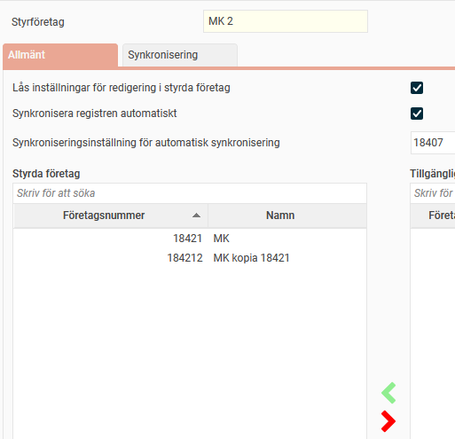
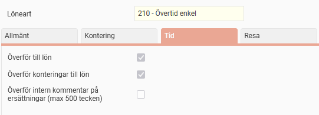
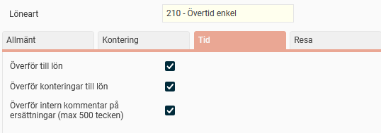
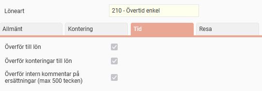
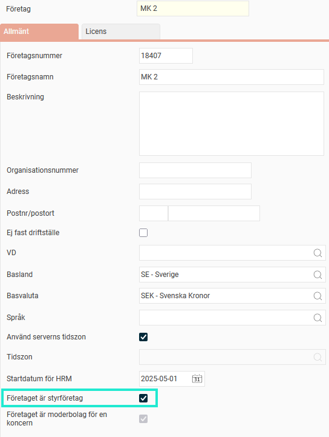
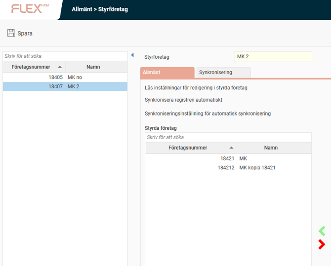
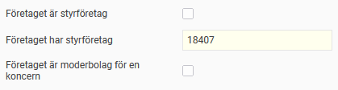
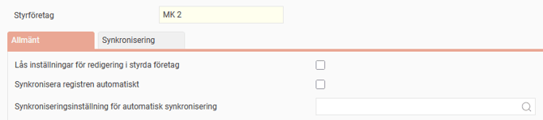
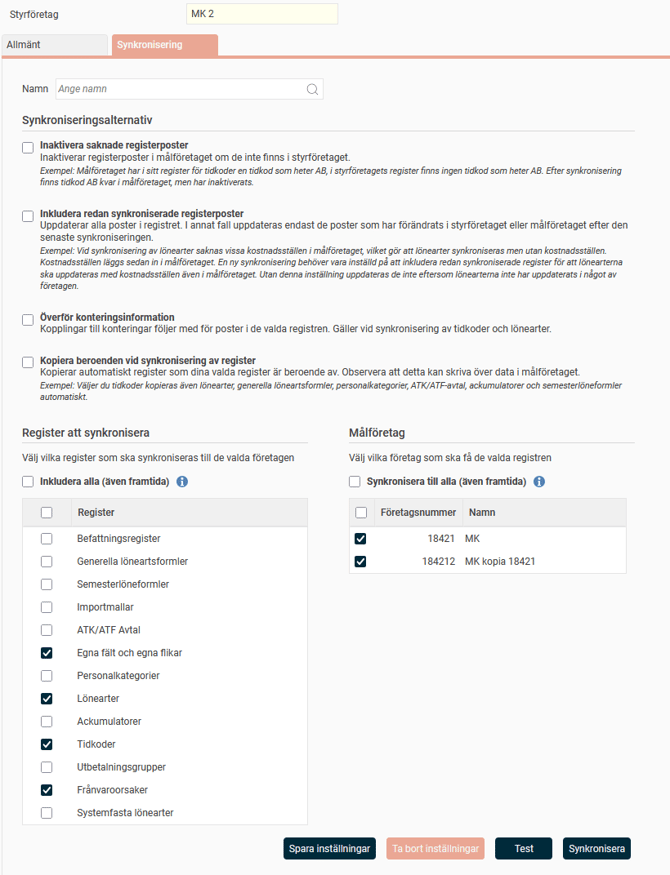
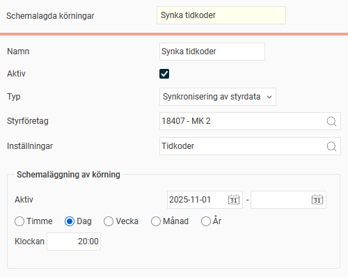

# ⚙️Hur fungerar styrföretag?

**Datum:** den 10 november 2025  
**Kategori:** Systemgemensamt  
**Underkategori:** Användare & Behörighet  
**Typ:** config  
**Svårighetsgrad:** intermediate  
**Tags:** användare, behörighet, roll  
**Bilder:** 13  
**URL:** https://knowledge.flexhrm.com/sv/hur-fungerar-styrf%C3%B6retag

---

Med styrföretag kan du kan göra ändringar i ett bolag, och få genomslag i flera.
Vilka register kan synkroniseras?
Så här ställer du in ett styrföretag
Regler för synkronisering
Synkronisera inställningar manuellt
Spara synkroniseringsinställningar
Synkroniseringsalternativ
Schemalägg synkronisering
Logg
Styrföretag kan användas för att
förenkla din administration
och säkerställa en
enhetlig konfiguration
mellan flera bolag i Flex HRM. Du utser ett företag till styrföretag och använder sedan dess inställningar i andra bolag (målföretag). Det innebär att du kan göra ändringar i ett bolag, och få genomslag i flera.
Exempel
Företag 18407, 18421 och 184212 ska i vissa fall ha likadana inställningar i Flex HRM. Vi sätter 18407 som styrföretag över de andra två företagen för att slippa göra inställningar på tre ställen varje gång något ska ändras.
Vi skapar en synkronisering av registren
Egna fält och egna flikar
,
Lönearter
,
Tidkoder
och
Frånvaroorsaker
.
Övriga register kan ha olika inställningar i de olika företagen, därför väljer vi att inte synka dessa utan kommer att hantera dem i varje företag för sig.

För att inte riskera att inställningarna kan diffa mellan företagen ställer vi in att de register som synkas inte kan redigeras i målföretagen, och att en synkning ska ske automatiskt varje gång vi ändrar på något av registren i företag 18407.

I målföretagen kan vi nu endast se inställningar för
Egna fält och egna flikar
,
Lönearter
,
Tidkoder
och
Frånvaroorsaker
, men inte ändra något.

Ändrar vi något i dessa register i företag 18407 får det genast genomslag i de andra företagen.

Observera
Innan du utför en synkronisering:
Gå igenom
synkroniseringsalternativen
, så att alla inställningar är som du vill ha dem.
Gör gärna ett
test
först, för att se hur resultatet blir.
En synkronisering kan inte backas.
Vilka register kan synkroniseras?
Följande register kan synkroniseras från styrföretaget till dina målföretag:
Befattningsregister
Generella löneartsformler
Semesterlöneformler
Importmallar
ATK/ATF Avtal
Egna fält och egna flikar
Personalkategorier
Lönearter
Ackumulatorer
Tidkoder
Utbetalningsgrupper
Frånvaroorsaker
Systemfasta lönearter
Så här ställer du in ett styrföretag
Välj vilket företag som ska vara styrföretag
Gå till
Allmänt > Företag
.
Bocka i
Företaget är styrföretag
för det företag du vill använda.

Välj vilka företag som ska styras (målföretag)
Gå till
Allmänt > Styrföretag
.
Ange vilket/vilka företag som ska vara målföretag.
Du kan också ta bort styrningen här. Om du tar bort styrningen behåller företaget sina nuvarande inställningar och påverkas inte längre av styrföretaget.

Ett företag som styrs har en upplysning om detta under
Allmänt > Företag
.

Regler för synkronisering
Du kan ställa in regler för hur synkroniseringen mellan styr- och målföretag ska ske under
Allmänt > Styrföretag,
fliken
Allmänt
.

Lås inställningar för redigering i styrda företag
Du
kan
välja
att de inställningar som ska synkroniseras ska vara
låsta i alla styrda företag
. Detta hindrar att inställningarna ändras manuellt i målföretagen och säkerställer att de alltid är synkroniserade med styrföretaget.
Exempel:
Om inställningen är låst visas till exempel tidkodsinställningarna i det styrda företaget, men du kan inte ändra dem. Alla ändringar måste göras i styrföretaget.
Synkronisera registren automatiskt
Om du bockar i denna ruta görs en
automatisk synkronisering
till alla styrda företag så fort du sparar en inställning i styrföretaget. Alternativ är att du synkroniserar manuellt eller schemalägger synkningen.
Synkroniseringsinställning för automatisk synkronisering
Om d
u väljer automatisk synkronisering måste du också ange vilka inställningar och vilka företag som ska synkroniseras. Du skapar dessa synkroniseringsinställningar under den intilliggande fliken
Synkronisering
.
Synkronisera inställningar manuellt
Under fliken
Synkronisering
kan du utföra manuell synkning av inställningar. Du kan också spara inställningar här för att använda vid automatisk eller schemalagd synkronisering.
Observera
Innan du utför en synkronisering:
Gå igenom
synkroniseringsalternativen
, så att alla inställningar är som du vill ha dem.
Gör gärna ett
test
först, för att se hur resultatet blir.
Gör en manuell synkronisering
Gå till
Allmänt > Styrföretag
.
Välj företag och fliken
Synkronisering
.
Välj det/de register du vill synkronisera.
Välj de företag du vill synkronisera till.
Gör dina val under
synkroniseringsalternativ
.
Klicka på
Synkronisera
.

Du får notiser som bekräftar synkningen och meddelar när den är klar. Klicka på
Visa logg
för att se information om synkningen och eventuella felmeddelanden.
Testa synkroniseringen
Om du vill kontrollera resultatet innan du genomför synkroniseringen, klickar du på knappen
Test
istället för
Synkronisera
. När testsynkroniseringen är klar får du en temporär testlogg där du kan kontrollera vilka eventuella fel och varningar som kommer att uppstå om du väljer att synkronisera.
Spara synkroniseringsinställningar
För att kunna schemalägga synkronisering eller ställa in automatisk synkning, måste du spara dina inställningar.

Ange ett namn för inställningen.
Gör dina val för
synkroniseringsalternativ
.
Gör dina inställningar för register och företag. Markerar du valen för
Alla
kommer det att få genomslag även för målföretag som läggs till i framtiden, och för nya register, om möjligheten att synkronisera fler register läggs till i systemet.
Klicka på
Spara inställningar
.
Inställningen blir då valbar för schemaläggning och automatisk synkning.
Synkroniseringsalternativ
Förutom val av register och företag finns fyra ytterligare inställningar för hur synkningen ska ske.

Inaktivera saknade registerposter:
Vid synkning överförs alla poster från styrföretaget. Om du bockar i den här rutan kommer registerposter som finns i målföretaget men inte i styrföretaget att behållas, men de blir
inaktiva
. Om du inte bockar i rutan behålls posterna och de förblir aktiva.
Inkludera redan synkroniserade registerposter:
Uppdaterar
alla poster
i det valda registret. Annars uppdateras endast de poster som har ändrats i styr- eller målföretaget sedan den senaste synkroniseringen.
Exempel:
Vid synkronisering av lönearter saknas vissa kostnadsställen i målföretaget, vilket gör att lönearter synkroniseras men utan kostnadsställen. Kostnadsställen läggs sedan in i målföretaget. En ny synkronisering behöver vara inställd på att inkludera redan synkroniserade register för att lönearterna ska uppdateras med kostnadsställen även i målföretaget. Utan denna inställning uppdateras de inte eftersom lönearterna inte har uppdaterats i något av företagen.
Överför konteringsinformation:
Kopplingar till konteringar följer med för poster i de valda registren. Detta gäller vid synkronisering av tidkoder och lönearter.
Kopiera beroenden vid synkronisering av register
(kräver behörighet
Implementationsstöd Payroll
)
:
Kopierar automatiskt register som dina valda register är beroende av.
Observera att detta kan skriva över data i målföretaget.
Exempel:
Om du väljer tidkoder kopieras även lönearter, generella löneartsformler, personalkategorier, ATK/ATF-avtal, ackumulatorer och semesterlöneformler automatiskt.
Schemalägg synkronisering
Du kan schemalägga synkronisering av styrdata så att det körs varje timme, dag, vecka, månad eller år.
Gå till
Allmänt > Schemalagda körningar
.
Välj
Synkronisering av styrdata
.
Välj ett styrföretag.
Välj en sparad inställning för synkning.
Ange intervall. I exemplet på bilden har vi valt att synkronisera enligt inställning
Tidkoder
varje dag kl 20:00.

Logg
Loggen visar vilka synkningar som har gjorts och eventuella fel eller varningar.
Gå till
Allmänt > Styrföretag
.
Välj ett företag.
Gå till fliken
Synkronisering.
Klicka på
Visa logg.
Loggen kan visas i ett popup-fönster eller laddas ner som en fil.
Loggen visar manuella, automatiska och schemalagda synkningar, men den visar inte om synkningen varit manuell, automatisk eller schemalagd. Vid automatisk synkning visas den användare som sparade inställningen för automatisk synkning, inte den användare som utlöste synkningen genom en förändring i styrföretaget.
