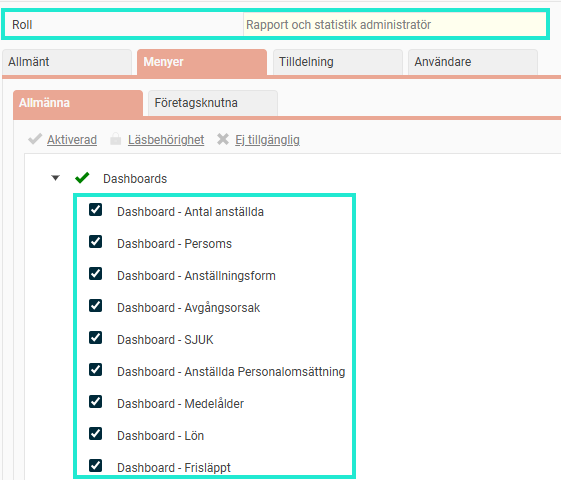
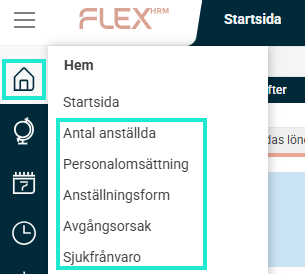
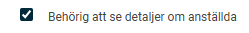

# ⚙️Hur går jag tillväga för att presentera Dashboards på Startsidan (Hem)?

**Datum:** den 29 september 2025  
**Kategori:** Systemgemensamt  
**Underkategori:** Användare & Behörighet  
**Typ:** config  
**Svårighetsgrad:** intermediate  
**Tags:** användare, behörighet, mobil, roll  
**Bilder:** 3  
**URL:** https://knowledge.flexhrm.com/sv/hur-g%C3%A5r-jag-tillv%C3%A4ga-f%C3%B6r-att-presentera-dashboards-p%C3%A5-startsidan-hem

---

Ge roller behörighet till dashboards. Lär dig aktivera funktionen för att se detaljerad information om anställda i graferna.
Ge en användarroll behörighet till en dashboard
För att en användare ska kunna se en dashboard  på startsidan i Flex HRM, behöver du först ge den aktuella användarrollen behörighet.
Aktivera en dashboard för en roll
Gå till
Administration > Användare > Behörigheter > Roller
.
Välj den roll det gäller och gå till noden
Hem
.
Ange vilken eller vilka dashboards som rollen ska ha tillgång till.

När behörigheten är tilldelad kommer användaren att se dashboarden som en ny flik på startsidan.

Tänk på att det går att ställa in, per Dashboard i Flex HRM, vilka anställda en användare, utifrån sin roll, ska ha behörighet till. Läs mer om detta  i artikeln "
Dashboard - Vad är en Dashboard?
".
Se detaljerad information om anställda
I en dashboard kan du klicka på graferna för att se mer detaljerad information om vilka anställda som döljer sig bakom ett visst värde. Om du till exempel klickar på en stapel som visar tio anställda med en specifik avgångsorsak, får du se vilka dessa tio personer är.
För att en användare ska kunna klicka i graferna och se detaljerad information, behöver du aktivera en specifik behörighet. Gå till
Användare > Behörigheter > Roller
och markera inställningen
Behörig att se detaljer om anställda
för den aktuella rollen.

Observera att funktionen för att se detaljerad information genom att klicka i graferna är endast tillgänglig i HRM, inte i HRM Mobile.
Relaterade artiklar:
Dashboard - Vad är en Dashboard?
Paneler i Dashboard- Hur fungerar de gemensamma inställningarna för paneler i Dashboard?
