# Hur gör man för att registrera nyanställd och användare manuellt?

**Datum:** den 17 oktober 2025  
**Kategori:** Systemgemensamt  
**Underkategori:** Användare & Behörighet  
**Typ:** howto  
**Svårighetsgrad:** advanced  
**Tags:** användare, behörighet, roll  
**Bilder:** 12  
**URL:** https://knowledge.flexhrm.com/sv/hur-g%C3%B6r-man-f%C3%B6r-att-registrera-nyanst%C3%A4lld-och-anv%C3%A4ndare-manuellt

---

Instruktion för hur en nyanställd registreras manuellt i HRM samt hur en användare kopplas för inloggning till systemet.
Registrera anställd manuellt
Registrera användare manuellt
Registrera nyanställd manuellt
Nedan beskrivs hur du manuellt registrerad en nyanställd i HRM. Det finns stöd i systemet för nyanställning (Employee) och även mallar som kan användas för att förenkla processen (
Nyanställningsprocess i HRM Employee
), men dessa används inte i detta exempel.
Personal - Anställda
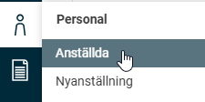
Klicka på
Ny
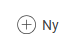
I det fönster som dyker upp anger du anställningsnummer, namn, anställningsdatum samt andra uppgifter som är relevant att registrera i systemet.
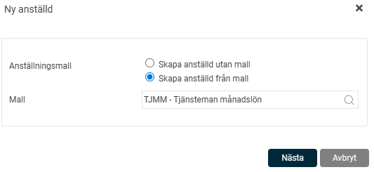
Du kan även välja att skapa den anställde utifrån en
anställningsmall.
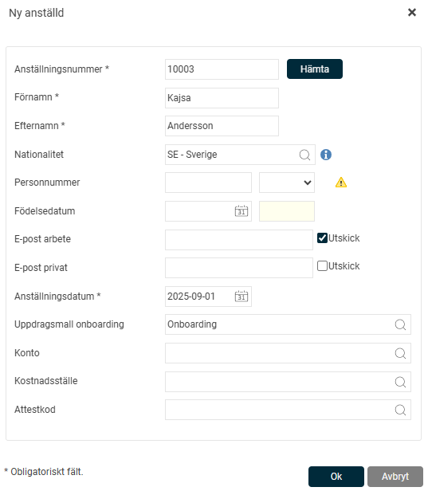
Klicka på
OK
.
Den anställde har nu skapats upp. I
Anställda
hittar du nu den anställde och kan komplettera med fler uppgifter, som personuppgifter, anställningsdata och lön.
OBS!
Nedan finns några av menyerna kort beskrivet, det kan finnas fler uppgifter som ska registreras och har du flera HRM moduler kan du ha fler menyer som du ska gå igenom.
Anställning
Under menyn
Anställning
anger du bland annat sysselsättningsgrad, tidgrupp och schema för den anställde.
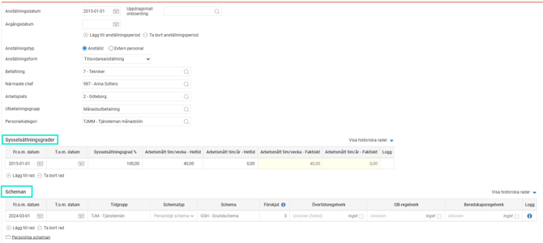
Sysselsättningsgrad
används som exempel för att få information om hur den anställde är schemalagd utifrån sin sysselsättningsgrad.
Schema
innehåller information om vilken tidgrupp den anställde tillhör samt vilket schema som den anställde har. Det går att välja mellan publikt schema som är ett fördefinierat schema eller välja att skapa ett eget personligt schema för den anställde.
Lön
Under menyn
Lön
anges uppgifter om den anställdes lön, så som månadslön, bankuppgifter m.m.
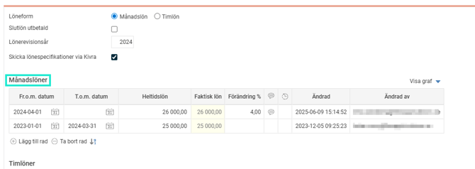
Resa
Under menyn
Resa
anges specifika inställningar som rör reseräkningen. Du kan ställa in avvikande inställningar för till exempel traktamentsregelverk och/eller restid.
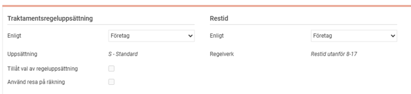
Du kan under
Bilar
ange vilken typ av bil den anställde har. Som standard har den anställde en privatbil, men du kan här ange om den anställde som exempel har en tjänstebil.
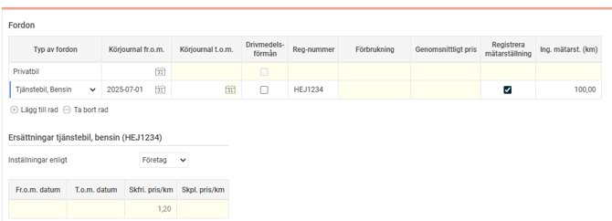
Användare
För att kunna logga in eller stämpla tid i HRM måste varje anställd ha en kopplad användare. Användaren har ett unikt användar-ID. För att en användare ska kunna logga in måste hen också vara kopplad till Visma Connect med hjälp av en e-postadress.
För att manuellt skapa en användare och koppla till en anställd går du till
Användare
.
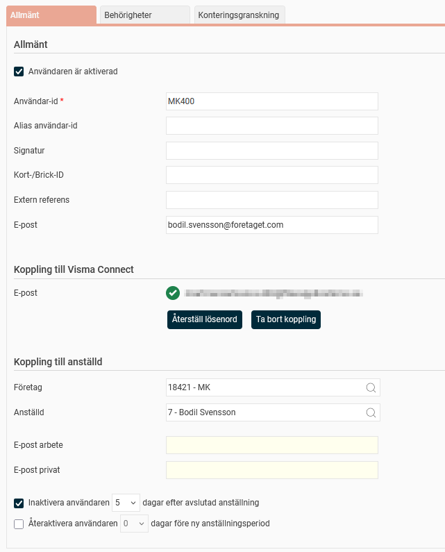
Under fliken
Behörigheter
anges vad användaren ska ha för behörighet i systemet. Ska den anställde endast rapportera sin egen tidrapport/reseräkning så räcker det med att spara. Då kommer systemet ge behörighet till den roll som är angiven som standardroll i HRM. I detta exempel
Medarbetare
.
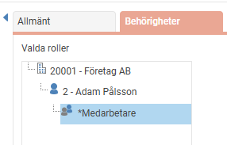
Ska den anställde tilldelas ytterligare behörighet görs det genom att ange för vilket företag/kontering, anställd/anställda och vilken roll.
Exempel nedan visar tillägg av rollen
Attesterande chef
för Attestkod
PROD
.
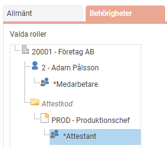
För att ge attesträtt till en
attestkod
följer du nedan steg.
Ange för
aktuellt företag
den attestkod där attesträtt ska ges
Ange rollen som ska gälla. I detta exempel
Attestant
Klicka på
Lägg till
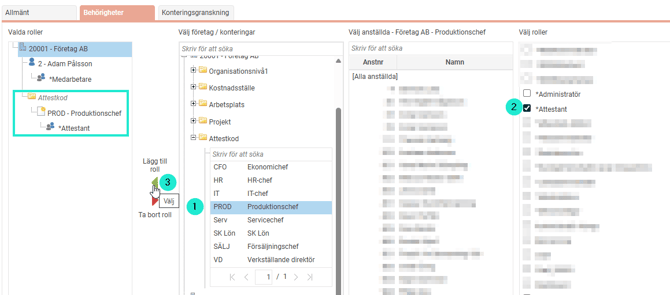
Glöm inte att
spara
.
Relaterade artiklar
Vad är en användare?
