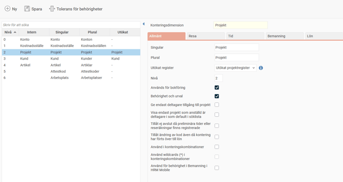
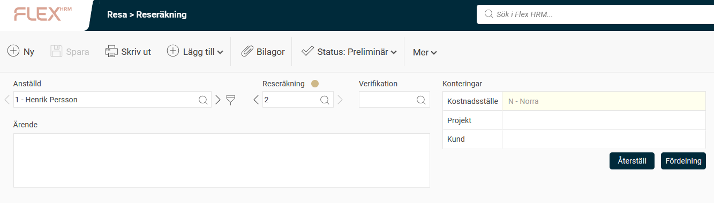
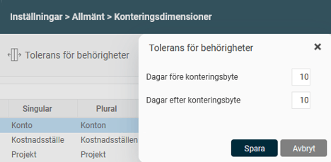

# ⚙️Hur hanterar man konteringsdimensioner i Flex HRM?

**Datum:** den 19 september 2025  
**Kategori:** Systemgemensamt  
**Underkategori:** Register  
**Typ:** config  
**Svårighetsgrad:** advanced  
**Tags:** användare, behörighet, mobil, roll  
**Bilder:** 3  
**URL:** https://knowledge.flexhrm.com/sv/hur-hanterar-man-konteringsdimensioner-i-systemet

---

Konteringar används för att kategorisera information för bland annat bokföring och statistik samt för behörighetsstyrning. 
I denna artikel går vi igenom inställningarna som kan göras i vyn för konteringsdimensioner.
Artikeln informerar om inställningarna som kan göras i vyn för konteringsdimensioner.
Vill du läsa om inställningar i registren rekommenderar vi dessa artiklar:
Vad är ett konteringsregister?
Vad är ett projektregister?
Vad är ett kundregister?
Inställningar för konteringsdimensioner, fliken Allmänt
Inställningar för Tid
Inställningar för Resa
Inställningar för Bemanning
Inställningar för Lön
Tolerans för behörigheter
Konteringsdimensioner används för att kategorisera information i Flex HRM. Det kan till exempel handla om data för bokföring och statistik eller för att styra behörigheter i systemet.
Varje konteringsdimension har ett register som du bland annat kan använda för att:
Dela in anställda i grupper av hemkonteringar.
Märka upp tidrader.
Märka upp poster i reseräkningar.
Märka upp poster i löneberedningen.
Inställningar för konteringsdimensioner
Du skapar och anpassar konteringsdimensioner under
Inställningar > Allmänt > Konteringsdimensioner
. Vissa nivåer, som
Konto
,
Kostnadsställe
,
Projekt
,
Kund
och
Artikel
, finns från start. Dessa kan du inte ta bort, men du kan ändra deras namn.

Under fliken
Allmänt
hittar du följande inställningar:
Singular/Plural
: Här anger du benämningen.
Utökat register
: Ett register kan ha en utökad nivå för projekt eller kund. Mer information finns i
Vad är ett kundregister?
och
Vad är ett projektregister?
Nivå
: Välj önskad sorteringsordning för respektive konteringsdimension.
Används för bokföring
: Denna inställning är endast tillgänglig om din licens inkluderar HRM Travel eller HRM Payroll. Markera rutan för att dimensionen ska visas på bokföringsordrar.
Behörighet och urval
: Styr om du ska kunna ange behörighet för dimensionen under
Administration > Användare/Behörigheter > Behörigheter
och om du ska kunna göra urval på den.
Använd för närmaste chef
: Markera denna ruta på den dimension som du vill använda för funktionen närmaste chef. Mer information finns i
Så här fungerar Närmaste chef i HRM Employee
.
Använd för arbetsplats
: Styr vilket register som är arbetsplats i AGI. Används av HRM Payroll. Mer information finns i
Hur gör jag inställningar för arbetsplats, tjänsteställe, till arbetsgivardeklarationen (AGI) i HRM Payroll?
Använd för län och kommunkod
: Styr vilket register som är län och kommunkod. Används i viss lönestatistik i HRM Payroll.
Organisatorisk enhet
: Markera denna ruta om dimensionen utgör en organisatorisk enhet. Den används sedan för organisationsschemat och organisationsöversikten.
Tillåt ändring av kod även då kontering har förts över till lön
: När denna inställning är inaktiv kan du inte ändra koden för en kontering som ingår i en reseräkning eller tidrapport som har överförts till lön.
Använd i konteringskombinationer
: Denna funktion styr hur konteringar kan kombineras vid registrering. Om du till exempel vill att vissa kostnadsställen endast ska kunna användas med vissa projekt, markerar du denna ruta för
Kostnadsställe
och
Projekt
.
Använd wildcards (*) i konteringskombinationer
: Styr om du kan använda till exempel
400*
, i registret för konteringskombinationer för att peka ut alla projekt som börjar på 400. Användning av wildcards kan påverka systemets prestanda.
Använd för behörighet i Bemanning i HRM Mobile
: Det går att vara behörig att se scheman för anställda som tillhör samma hemkontering som en själv. Här anger du vilken/vilka hemkonteringar som ska vara lika för att man ska få se scheman. Om du bockar i den på två konteringsdimensioner behöver båda vara samma för att ge behörighet.
Använd för LAS-beräkning på arbetsdagar
: Används om du behöver ett register för olika anställningsformer för LAS-beräkning.
Inställningar för utökat projektregister
Om du använder ett utökat projektregister finns även följande inställningar på fliken
Allmänt
:
Ge endast deltagare tillgång till projekt
: Anställda kan då endast använda projekt som de är deltagare i, eller där alla anställda är deltagare, i sina tidrapporter och reseräkningar.
Visa endast projekt som anställd är deltagare i som default i söklista
: För att göra det enklare för anställda att hitta ”sina” projekt kan du använda denna inställning. Då ser hen bara sina egna projekt som standard, men har möjlighet att välja att visa alla.
Lägg automatiskt till deltagare vid val i söklista
: Visas endast om inställningen ovan är markerad. Om en anställd väljer att visa alla projekt och använder ett som hen inte var deltagare i från början, läggs hen till som deltagare automatiskt.
Tillåt ej avslut då preliminära tider eller reseräkningar finns registrerade
: Markera denna ruta för att förhindra att projekt som ingår i preliminära reseräkningar eller tidrapporter avslutas.
Inställningar för Resa
Fliken
Resa
visas om du har licens för HRM Travel och innehåller dessa inställningar:
Regel
: Styr hur konteringsdimensionen ska hanteras i reseräkningar. Välj mellan:
Kan anges
: Fältet är valfritt att fylla i.
Måste anges
: Reseräkningen kan inte granskas utan att fältet fylls i.
Låst
: Fältet kan inte ändras.
Bilden nedan visar en reseräknings huvudkontering där kostnadsställe har regel
Låst
, medan projekt och kund är inställda på
Kan anges
eller
Måste anges
.

Visa i reseräkningens huvuduppgifter
: Dimensionen visas överst i inmatningsbilden för reseräkningar.
Visa vid registrering av transaktioner
: Dimensionen visas när resor och utlägg registreras.
Lägg ut hem om blank från
: Om inget annat anges, läggs kontering ut från
anställdaregistret
, fliken
Kontering
.
Lägg ut kontering från Projekt
: Styr om konteringar som är kopplade till projekt i projektregistret ska fyllas i automatiskt när ett projekt väljs i reseräkningen.
Procentuell fördelning
: Styr om du ska kunna fördela reseräkningar/utlägg/resor procentuellt, till exempel 50 procent på kostnadsställe A och 50 procent på kostnadsställe B. Om procentuell fördelning används, visas knappen
Fördelning
i reseräkningens konteringsfördelning.
Inställningar för Tid
Fliken
Tid
visas om du har licens för HRM Time och innehåller dessa inställningar:
Regel
: Styr hur dimensionen ska hanteras i tidrapporter. Välj mellan:
Kan anges
: Fältet är valfritt att fylla i.
Måste anges
: Tidrapporten kan inte granskas utan att fältet fylls i.
Låst
: Fältet kan inte ändras.
Lägg ut hemkontering om blank
: Styr om dimensionen ska läggas ut från
anställdaregistret
, fliken
Kontering
om fältet lämnas tomt i tidrapporten.
Lägg ut kontering från Projekt
: Styr om konteringar som är kopplade till projekt i projektregistret ska fyllas i automatiskt när ett projekt väljs i tidrapporten.
Använd avvikande tidkoder
: Gör det möjligt att ange en tidkod på en kontering, En inställning för tidkod kommer då att läggas till i konteringsregistret. När du registrerar tid med konteringen, fylls den avvikande tidkoden i automatiskt.
Konteringsbyte via plats i HRM Mobile
: Använd GPS-positionering i HRM Mobile för att stämpla på rätt kontering automatiskt. Mer information finns i
Stämpla i HRM Mobile med hjälp av plats
.
Använd vid frånvaro
: Gör det möjligt för anställda att ange en kontering vid frånvaroansökan. Detta kan användas för att styra frånvaroattestering till rätt projektledare, eller för att konteringen ska hamna på rätt projekt i tidrapporten för uppföljning. Denna inställning kan markeras för flera konteringsdimensioner.
Använd vid tillfällig utlåning
: Används när en anställd tillfälligt lånas ut till en annan avdelning men behåller samma chef. Du väljer vilka konteringsdimensioner som ska kunna användas för tillfällig utlåning. Via en ikon i tidrapporten kan du sedan ange tidsintervallet och den tillfälliga konteringen. Den tillfälliga konteringen läggs då ut på tidraderna, om inget annat anges.
Inställningar för utökat projektregister
På fliken
Tid
finns också följande inställningar för utökat projektregister:
Blanka kopplade konteringar när projekt ändras
: Om du väljer ett projekt som automatiskt fyller i andra konteringar, som kund, kan du markera denna inställning för att se till att dessa konteringar tas bort om projektet tas bort från en tidrad.
Tillåt registrering av tid på projekt innan startdatum och efter slutdatum
: Markera denna ruta för att möjliggöra tidrapportering på ett projekt även utanför dess start- och slutdatum i projektregistret.
Inställningar för Bemanning
Om du använder HRM Plan kan du bemanna på en konteringsdimension. Här styr du vilken konteringsdimension som används för bemanning.
Inställningar för Lön
Använd i löneberedningen
: Markera denna ruta om dimensionen ska kunna väljas i löneberedningen.
Regel
: Styr hur dimensionen ska hanteras i löneberedningen.
Kan anges
.
Måste anges
.
Låst
.
Lägg ut kontering från Projekt
: Styr om konteringar som är kopplade till projekt i projektregistret ska fyllas i automatiskt när ett projekt väljs.
Tolerans för behörigheter
När en anställd byter hemkontering kan det vara bra att låta behörigheterna överlappa under en period. Detta gör att både den gamla och den nya chefen kan hantera den anställdes tidrapporter och reseräkningar under bytet. Detta ställer du in under
Inställningar > Allmänt > Konteringsdimensioner
i fältet
Tolerans för behörigheter
. Där kan du ange hur många dagar före och efter ett byte den nya och gamla chefen ska kunna se den anställde.

Relaterade artiklar
Vad är ett konteringsregister?
Vad är ett projektregister?
Vad är ett kundregister?
Så här fungerar Närmaste chef i HRM Employee
Hur gör jag inställningar för arbetsplats, tjänsteställe, till arbetsgivardeklarationen (AGI) i HRM Payroll?
Stämpla i HRM Mobile med hjälp av plats
Hur ställer vi in konteringskombinationer?
