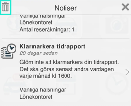
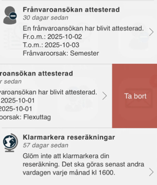
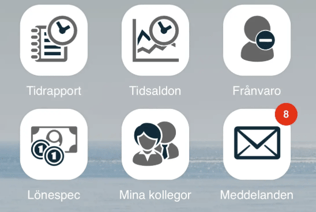

# Hur hanteras notiser i HRM Mobile?

**Datum:** den 29 augusti 2025  
**Kategori:** Systemgemensamt  
**Underkategori:** Mobil  
**Typ:** howto  
**Svårighetsgrad:** intermediate  
**Tags:** mobil  
**Bilder:** 4  
**URL:** https://knowledge.flexhrm.com/sv/hur-hanteras-notiser-i-hrm-mobile

---

Hantera notiser och påminnelser i HRM Mobile
I HRM Mobile får du notiser som påminner dig om olika uppgifter, till exempel att du ska attestera en reseräkning eller klarmarkera din tidrapport. Du kan också få notiser när du har fått ett nytt meddelande i systemet.
Notiserna visas överst i HRM Mobile med en klocksymbol. Siffran på klockan visar antalet notiser.
Finns inga notiser visar klockan ingen siffra.

Visa och agera på dina notiser
När du klickar på klocksymbolen visas en lista över alla notiser som du inte har hanterat.
Vissa notiser har en pil längst till höger. Om du klickar på en sådan notis tas du direkt till rätt vy där du kan slutföra uppgiften.
Notiser utan en pil är sådant som inte kan hanteras direkt i HRM Mobile, till exempel en påminnelse om ett medarbetarsamtal.
Tömma notislistan
För att tömma alla notiser samtidigt, klicka på soptunnan längst upp till vänster.

För att ta bort en notis: dra den till vänster, klicka på
Ta bort.

Observera
Menyingångar i HRM Mobile kan också ha en röd cirkel med en siffra i. Denna siffra är inte kopplad till påminnelsefunktionen i HRM, och kommer inte att påverkas när du raderar en notis. Siffran 8 på ikonen för
Meddelanden
visar att det finns åtta olästa meddelanden, siffran 5 på ikonen för att
Attestera tidrapporter
visar att det finns fem ännu ej attesterade tidrapporter osv.

