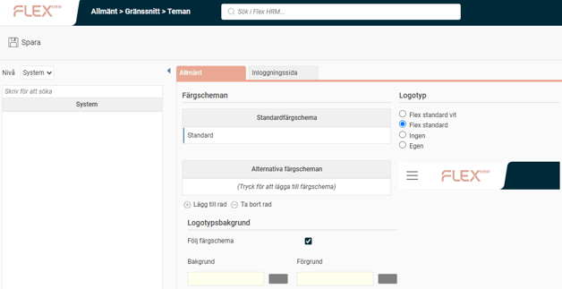
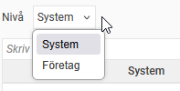
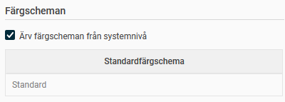
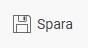
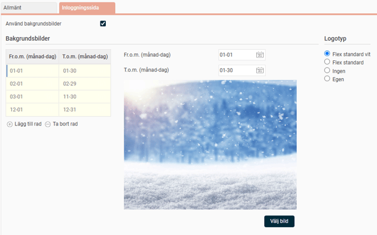

# ⚙️Hur kan jag använda teman i Flex HRM?

**Datum:** den 23 oktober 2025  
**Kategori:** Systemgemensamt  
**Underkategori:** Inställningar  
**Typ:** config  
**Svårighetsgrad:** intermediate  
**Tags:** Ingen  
**Bilder:** 5  
**URL:** https://knowledge.flexhrm.com/sv/hur-kan-jag-anv%C3%A4nda-teman-i-flex-hrm

---

Anpassa utseendet i Flex HRM. Lär dig hur du enkelt byter färgschema, lägger till en egen logotyp och anpassar inloggningssidan.
Anpassa utseendet i Flex HRM med teman
Med funktionen för teman kan du anpassa det visuella utseendet i Flex HRM. Du kan bland annat byta färgschema, lägga in en egen företagslogotyp och anpassa inloggningssidan.
Du hittar inställningarna under
Allmänt > Gränssnitt – Teman
.

Nivå
Här väljer du om inställningarna ska gälla för hela systemet eller för ett specifikt företag. Välj mellan alternativen
System
och
Företag
.

Allmänna inställningar för teman
Under fliken
Allmänt
gör du de grundläggande inställningarna för systemets eller det valda företagets utseende.
Färgscheman
Här bestämmer du vilket färgschema som ska användas.
Ärv färgscheman från systemnivå:
Om du markerar den här rutan kommer företaget att använda samma färgschema som är inställt för hela systemet. Denna inställning visas bara när du har valt nivån
Företag
.

Välj ett eget färgschema:
Om du inte ärver färgschema kan du istället välja ett standardfärgschema och lägga till alternativa scheman. Om du lägger till alternativa färgscheman kan användarna själva välja mellan dem under
Min profil
. Klicka på
förstoringsglaset
för att se en lista över tillgängliga färgscheman.
För mer information om hur du skapar och redigerar färgscheman, se manualen för [KLARLÄGG: Korrekt namn på manual/avsnitt].
Logotyp
Här kan du välja vilken logotyp som ska visas i det övre vänstra hörnet i Flex HRM.
De två översta alternativen i listan är Flex Applications standardlogotyp, antingen med vit eller rosa text.
Ärv logotyp från systemnivå:
Om du markerar den här rutan kommer företaget att använda samma logotyp som är inställd för hela systemet. Denna inställning visas bara när du har valt nivån
Företag
.
Egen logotyp:
För att använda en egen logotyp markerar du alternativet
Egen
och klickar på
Välj bild
. Då öppnas Utforskaren där du kan leta upp och välja bildfilen.  Spara genom att klicka på
sparaknappen.

Observera
att bildens storlek inte får överstiga 300 x 60 pixlar.
Logotypsbakgrund
Du kan välja en fast bakgrundsfärg för logotypen. Det är användbart om du låter användarna byta färgtema men vill vara säker på att logotypen alltid visas korrekt. Det gör det också möjligt att använda samma färgtema i flera företag men ha olika bakgrundsfärg på logotypen för att skilja dem åt.
Markera
Följ färgschema
eller välj en specifik bakgrunds- och förgrundsfärg genom att klicka i fälten och välja färg från färgpaletten.
Anpassa inloggningssidan
Under fliken
Inloggningssida
kan du anpassa utseendet på sidan där användarna loggar in. Den här fliken är bara tillgänglig på nivån
System
.

Bakgrundsbilder
För att visa bakgrundsbilder på inloggningssidan markerar du rutan
Använd bakgrundsbilder
. Du kan schemalägga olika bilder för olika perioder, till exempel för att matcha årstiderna.
Klicka på
Välj bild
för att se vilka bilder som finns tillgängliga.
För att förhandsgranska en bild för ett visst datumintervall klickar du på det aktuella intervallet i listan.
Relaterade artiklar:
Hur fungerar färgscheman i Flex HRM?
