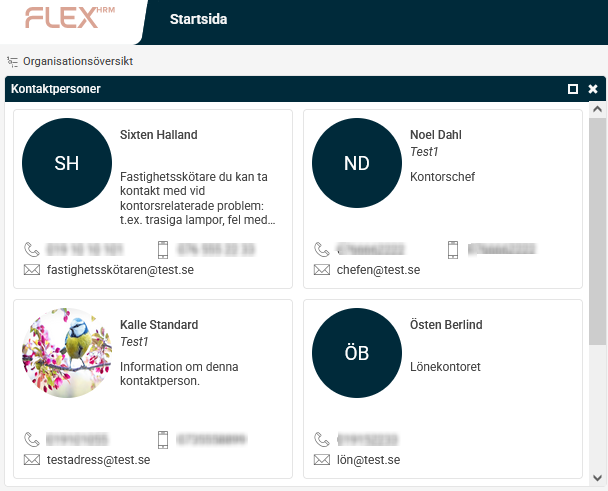

# ⚙️Hur kan jag lägga in kontaktpersoner i Flex HRM?

**Datum:** den 24 oktober 2025  
**Kategori:** Systemgemensamt  
**Underkategori:** Användare & Behörighet  
**Typ:** config  
**Svårighetsgrad:** intermediate  
**Tags:** mobil, roll  
**Bilder:** 2  
**URL:** https://knowledge.flexhrm.com/sv/hur-kan-jag-l%C3%A4gga-in-kontaktpersoner-i-flex-hem

---

Den här artikeln beskriver hur du kan lägga in kontaktpersoner i Flex HRM på företagsnivå eller på systemnivå.
Hantera kontaktpersoner
I Flex HRM kan du visa viktiga kontaktpersoner i en panel på startsidan. Det gör det enkelt för anställda att se vem de ska kontakta i olika ärenden.
Du kan hantera kontaktpersonerAdministration > på två nivåer:
Företagsnivå:
Kontakterna visas endast för det aktuella företaget. Du hanterar dem under
Administration >
Register > Kontaktpersoner
.
Systemnivå:
Kontakterna kan visas för alla eller valda företag i er installation. Du hanterar dem under
Administration > Systemregister > Kontaktpersoner
.
Så visas kontaktpersoner på startsidan
I panelen på startsidan kan du visa följande information om kontaktpersonerna:
Bild (om bild saknas visas personens initialer)
Namn och befattning
Telefon- och mobilnummer
E-postadress
En valfri text för att förtydliga personens roll
Antalet kontaktpersoner som visas är valfritt.

Lägg till och redigera kontaktpersoner
Gå till
Administration >
Register > Kontaktpersoner
för att hantera kontaktpersoner för företaget.
Till vänster ser du en lista över befintliga kontaktpersoner. Till höger lägger du till nya och hanterar deras uppgifter. Kontaktpersoner som är tillagda på
systemnivå
visas också i listan, men med kursiv stil.
Du kan också välja i vilken ordning kontaktpersonerna visas i panelen på startsidan genom att sätta
ordningsnummer
på dem.

Välj typ av kontaktperson
Du kan antingen hämta en anställd från Flex HRM eller lägga till en kontaktperson manuellt.
Anställd i Flex HRM
Om du väljer en anställd hämtar systemet automatiskt uppgifter som namn och kontaktinformation från personregistret. Endast fältet
Information
fyller du i manuellt. Uppgifterna uppdateras automatiskt om de ändras i personregistret.
Extern kontaktperson
Om du lägger till en kontaktperson som inte är anställd fyller du i alla fält manuellt samt får uppdatera dem manuellt om uppgifterna ändras i framtiden.
