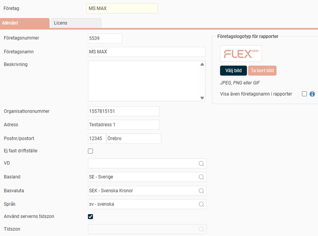
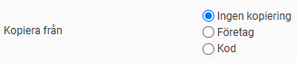
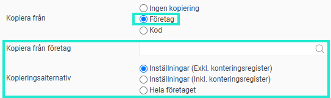
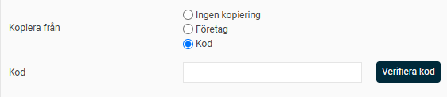
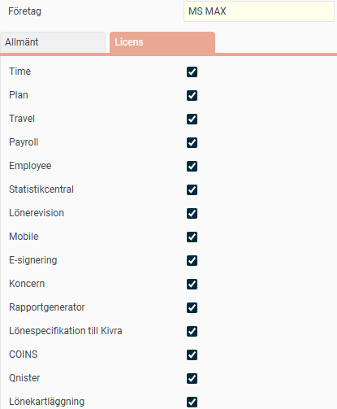

# ⚙️Hur kan jag skapa ett nytt företag eller kopiera ett företag?

**Datum:** den 9 december 2025  
**Kategori:** Systemgemensamt  
**Underkategori:** Användare & Behörighet  
**Typ:** config  
**Svårighetsgrad:** advanced  
**Tags:** användare, behörighet, mobil, roll  
**Bilder:** 6  
**URL:** https://knowledge.flexhrm.com/sv/hur-kan-jag-skapa-ett-nytt-f%C3%B6retag-eller-kopiera-ett-f%C3%B6retag

---

Lär dig skapa ett nytt företag i Flex HRM. Vi går igenom hur du skapar nytt eller kopierar inställningar från ett befintligt företag.
Företagsinställningar
Skapa nytt företag
Ladda ned företagsrapport
Licens
Gå till
Allmänt
>
Företag
. Du ser då den här vyn:

Företagsinställningar
Företagsnummer
Ange det företagsnummer (ett till 99999) som ska identifiera det nya företaget.
Företagsnamn
Ange namnet på det nya företaget.
Beskrivning
Här kan du lägga in en valfri beskrivande text om företaget.
Organisationsnummer
Företagets organisationsnummer.
Basland
Företagets basland (används för import av valutakurser).
Basvaluta
Företagets basvaluta.
Språk
Ange vilket språk programmet ska visa för företaget. Du kan klicka på
förstoringsglaset
för att se tillgängliga språk.
Tidszon
Ange vilken tidszon som ska gälla för stämplingar i företaget. Standard är att HRM Time hämtar tiden från servern där systemet är installerat. Du kan välja en annan tidszon i urvalsmenyn. Alla stämplingar i företaget kommer då att följa tiden i den valda tidszonen.
När du stämplar i HRM Mobile utgår klockan från serverns tid, men justerar den baserat på skillnaden mellan serverns tidszon och telefonens tidszon. Både Närvarotablån (i Flex HRM och Timeclock) och
Mina kollegor
(i HRM Mobile) tar hänsyn till vilken tidszon en anställd har stämplat i när de visar aktuell status.
Avvikelse vid stämpling i annan tidszon
Du kan också få en avvikelse i tidrapporten om en anställd stämplar i en annan tidszon än företagets. För att aktivera detta, markera inställningen
Stämpling i avvikande tidzon
. Du hittar inställningen för avvikelser på följande platser:
Företag:
Administration
>
Inställningar
>
Tid och Bemanning
>
Tidrapporter
Tidgrupp:
Administration
>
Inställningar
>
Tid och Bemanning
>
Tidgrupper
> fliken
Tid
Anställd:
Personal
> fliken
Tid
Startdatum för Flex HRM
Ange startdatumet för er licens av Flex HRM.
Företaget är styrföretag
Det finns en funktion för styrföretag i Flex HRM. Den gör det möjligt att kopiera inställningar från ett företag till ett eller flera andra företag. Detta är användbart om du har många företag med liknande inställningar och behöver ändra något. Just nu går det att kopiera tidkoder och lönearter till styrda företag.
För att använda funktionen måste du ange vilket eller vilka företag som ska vara styrföretag. Det gör du genom att markera inställningen
Företaget är styrföretag
. Du kan ha ett eller flera styrföretag, och varje styrföretag kan styra ett eller flera företag. Ett styrt företag kan inte vara styrföretag.
Du hanterar sedan styrda företag och kopiering av inställningar under
Administration
>
Allmänt
>
Styrföretag
.
Företaget är moderbolag för en koncern
För att använda koncernhantering behöver d
u ha en licens som innehåller modulen.
Läs mer om hur du aktiverar
koncernföretag i Flex HRM
.
Företagslogotyp för rapporter
Du kan välja att skriva ut en företagslogotyp på alla rapporter i Flex HRM. Logotypen skrivs ut längst upp till vänster och ersätter då företagsnamnet på rapporten. Klicka på
Välj bild
för att ladda upp en fil.
Notera att detta endast påverkar rapporter. Logotypen som visas uppe i vänstra hörnet i systemet väljer du istället under temainställningarna.
Visa även företagsnamn i rapporter
Om du har valt en bild för företagslogotyp kan du även lägga till företagsnamnet genom att markera den här inställningen. Om ingen bild har valts, skrivs endast företagsnamnet ut.
Skapa nytt företag
Klicka på
Skapa nytt företag
. Vyn utökas då med tre olika val för kopiering:
Ingen kopiering
,
Företag
eller
Kod
:

Kopiera från
Här anger du om du vill överföra befintliga inställningar till det nya företaget, och hur kopieringen i så fall ska gå till.
Ingen Kopiering
Du väljer detta alternativ om du vill skapa ett helt nytt, tomt företag utan kopierade inställningar.
Företag
Om du väljer
Företag
, anger du önskat företag i fältet nedanför. Klicka på
förstoringsglaset
för att se dina val. Under
Kopieringsalternativ
anger du vilken nivå kopieringen ska ske på. Du kan begränsa kopieringen till företagets inställningar (med eller utan konteringsregistret), eller välja att kopiera hela företaget.

Kod
Om du väljer
Kod
, anger du kod och lösenord för den kopia som skapats under
Administration
>
Allmänt
>
Kopiera företag
.

Slutför registreringen av det nya företaget genom att klicka på
Spara företag
i den övre knappraden. Det nya företaget finns nu i företagsregistret och du kan öppna det via
Allmänt
>
Öppna företag
.
Ladda ner företagsrapport
Här kan du ladda ner en rapport över företagen i databasen. Rapporten visar också antalet anställda i företagen som använder respektive delsystem och tilläggsmodul.
Möjligheten att ladda ner rapporten är behörighetsstyrd. Du aktiverar den för de roller som ska ha tillgång under
Administration
>
Användare/behörigheter
>
Roller
. Rapporten laddas ner som en Excel-fil (.xlsx).
När du laddar ner rapporten kan du ange önskat namn och välja om du vill ladda ner den på system-, företags- eller anställdanivå.

Fliken Licens
Om du har flera företag i Flex HRM men bara vissa av dem ska ha tillgång till specifika moduler, kan du styra detta här.
Klicka på fliken
Licens
för att se vyn.

Genom att avmarkera en modul döljer du all funktionalitet för den modulen när en användare arbetar i det valda företaget.
Relaterade artiklar:
Hur aktiverar jag koncernhantering i Flex HRM?
Vad kopieras när jag kopierar ett företag?
