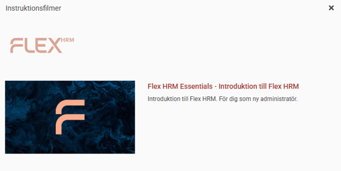
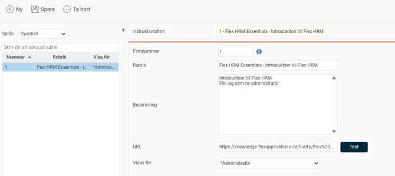
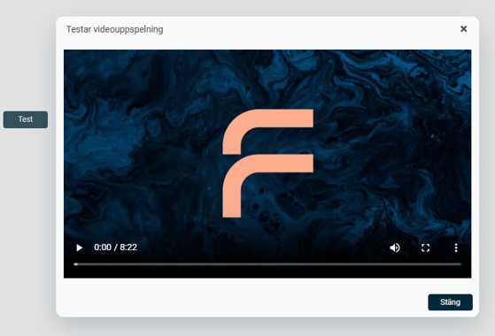
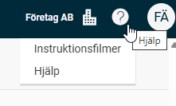
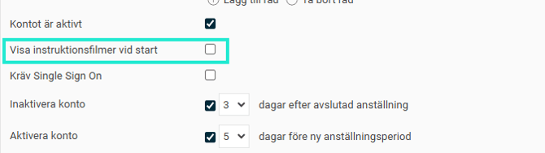
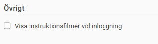

# ⚙️Hur lägger jag upp instruktionsfilmer i Flex HRM?

**Datum:** den 5 november 2025  
**Kategori:** Systemgemensamt  
**Underkategori:** Användare & Behörighet  
**Typ:** config  
**Svårighetsgrad:** intermediate  
**Tags:** användare, roll  
**Bilder:** 6  
**URL:** https://knowledge.flexhrm.com/sv/instruktionsfilmer-flex-hrm-0

---

Du kan enkelt göra instruktionsfilmer tillgängliga för medarbetarna så att de kan se dem direkt i Flex HRM.

Lägg upp filmer
Du hanterar filmerna i inställningarna.
Gå till
Inställningar > Allmänt > Instruktionsfilmer
.
Klicka på
Ny
.
Fyll i fälten:
Språk:
Välj vilket språk filmen har. Om du väljer
Alla
visas filmen oavsett vilket språk användaren har inställt i Flex HRM.
Filmnummer:
Ange ett unikt filmnummer. Numret styr också sorteringsordningen för hur filmerna visas.
Obs!
Filmnummer 0 (noll) är reserverat för rubriktext och beskrivning. Denna visas som rubrik till höger om logotypen för Flex HRM i visningsfönstret, och du kan inte ange någon URL för den.
Rubrik
och
Beskrivning:
Ange filmens rubrik och beskrivning.
URL:
Ange adressen (URL) där filmen finns, exempelvis en länk till Youtube.
Tips!
Adressen till en Youtube-film hittar du genom att klicka på ikonen för
Dela
och kopiera länken.
Visas för:
Välj vilka användare som ska kunna se filmen.
Klicka på
Spara
.

Du kan kontrollera att länken fungerar genom att klicka på
Test
.

Titta på instruktionsfilmer i HRM
Användare i Flex HRM kan se instruktionsfilmerna via
Hjälp
, klicka på
Instruktionsfilmer.

Ställ in att användare ser filmer vid uppstart
Du kan ställa in att instruktionsfilmerna ska visas automatiskt vid start för en användare. Det innebär att rutan med de filmer du har lagt upp visas direkt när användaren loggar in.
Du hittar inställningen
Visa instruktionsfilmer vid start/inloggning
under:
Användarmallar

Användare

