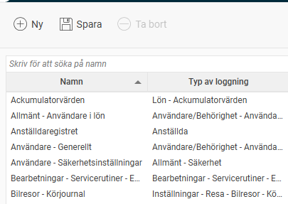
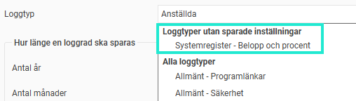

# ⚙️Hur ställer jag in vilka ändringsloggar som ska vara aktiva i Flex HRM?

**Datum:** den 5 november 2025  
**Kategori:** Systemgemensamt  
**Underkategori:** Användare & Behörighet  
**Typ:** config  
**Svårighetsgrad:** intermediate  
**Tags:** användare, roll  
**Bilder:** 3  
**URL:** https://knowledge.flexhrm.com/sv/logginst%C3%A4llningar-flex-hrm-0

---

Ställa in loggning (Logginställningar)
I Flex HRM kan du logga (spåra) ändringar som görs i många av systemets register. I loggen sparas information om tidpunkten för ändringen, vem som ändrat, det gamla värdet, det nya värdet och med mera.
Det är här, under
logginställningar
, som du aktiverar och ställer in
vad
som ska loggas.
Du hittar inställningarna genom att gå till
Allmänt > Loggning > Logginställningar
.
Aktivera en logginställning
Till vänster i vyn ser du de logginställningar som redan finns.

Klicka på en logg för att se hur den är inställd.

Gör så här för att lägga till en ny
Klicka på knappen
Ny
.
Ange ett
Namn
Välj en
Loggtyp
och H
ur länge en loggrad ska sparas.
Tips:
När du klickar i rullgardinsmenyn för
Loggtyp
visas de loggtyper som
ännu inte
har en sparad rad överst i listan. Det gör det enklare för dig att se vilka loggar du inte har lagt till.

Markera kryssrutan
Aktiv
för att starta loggningen för den valda loggtypen.
💡Bra att veta!
Prestanda och lagring
Vissa loggar kan generera stora mängder data (loggposter). Detta ställer höga krav på både databasens diskutrymme och serverns kapacitet.
Tänk därför noga igenom vad som är rimligt att logga och hur länge loggposterna behöver sparas.
Aktiva och sparade loggar
Kontrollera att alla loggar som ni önskar är aktiverade.
En logg kan vara sparad (syns i listan till vänster) men inte aktiverad. Loggen måste vara aktiv för att fungera.
För att exporten av typ
Anställda/användare
med urvalen
Endast ändrade sedan senaste exporten/Endast ändrade fält sedan senaste exporten
ska fungera som tänkt så måste loggen Anställdaregistret vara aktivt.
Relaterade artiklar
Hur fungerar ändringsloggen i Flex HRM?
