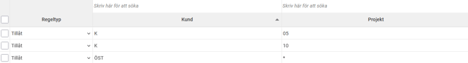
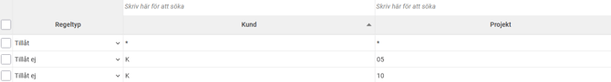
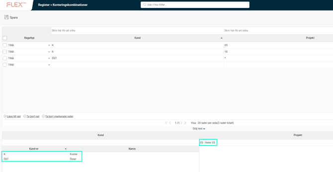

# ⚙️Hur ställer vi in konteringskombinationer?

**Datum:** den 19 september 2025  
**Kategori:** Systemgemensamt  
**Underkategori:** Register  
**Typ:** config  
**Svårighetsgrad:** advanced  
**Tags:** användare, behörighet, roll  
**Bilder:** 3  
**URL:** https://knowledge.flexhrm.com/sv/hur-st%C3%A4ller-vi-in-konteringskombinationer

---

Konteringskombinationer kan användas för att begränsa hur olika konteringar kan kombineras med varandra. Här går vi igenom de inställningar som behöver göras för att använda konteringskombinationer.
Konteringskombinationer i Flex HRM är ett verktyg som hjälper dig att styra hur olika konteringar kan kombineras. Det är användbart när du vill begränsa vilka alternativ som kan väljas tillsammans.
Ett exempel är om ett projekt bara kan kombineras med tre specifika artiklar. I stället för att du ska behöva söka igenom hela artikelregistret i tidrapporten/reseräkningen får du, efter att du valt projektet, endast de tre tillåtna artiklarna som förslag.
För att ställa in konteringskombinationer i systemet, följ stegen nedan:
1. Välj vilka dimensioner som ska användas
Först måste du aktivera funktionen för de konteringsdimensioner du vill använda.
Gå till
Inställningar > Allmänt > Konteringsdimensioner
.
Under fliken
Allmänt
, markera de konteringsdimensioner som ska ingå i konteringskombinationer. Här kan du också välja om
wildcards (*)
ska vara tillåtna, men tänk på att det kan påverka systemets prestanda.
2. Aktivera vyn för konteringskombinationer
För att kunna hantera kombinationerna måste du ha behörighet till vyn.
Gå till
Användare/Behörigheter > Roller
.
Under fliken
Menyer
, aktivera vyn
Konteringskombinationer
för de roller som ska ha åtkomst.
3. Lägg upp tillåtna kombinationer
När vyn är aktiverad kan du börja definiera dina kombinationer.
Under
Register > Konteringskombinationer
kan du lägga in kombinationerna manuellt.
Det går också att lägga in kombinationer via filimport eller via API.
Du kan lägga upp
tillåtna kombinationer
rad för rad. Om du inte använder wildcards måste varje tillåten kombination anges separat.
Du kan även använda kolumnen
Regeltyp
för att välja
"Tillåt ej"
. Detta är användbart om du vill blockera specifika kombinationer, till exempel om du har tillåtit alla kombinationer med ett wildcard, men vill utesluta en enstaka kombination.
Exempel: På bilden nedan har vi ställt in att kund ÖST kan kombineras med alla projekt, medan kund K endast kan kombineras med projekt 05 och 10.
Vid registrering visas endast projekt 05 och 10 när kund K har valts.

Exempel: På bilden nedan har vi ställt in att alla kunder kan kombineras med alla projekt, men kund K tillåts inte tillsammans med projekt 05 och 10. Vid registrering visas alla projekt, utom 05 och 10, när kund K har valts.

4. Testa dina inställningar
Efter att du har lagt upp dina kombinationer är det bra att testa dem för att säkerställa att de fungerar som du förväntar dig.
I vyn
Konteringskombinationer
, klicka på knappen
"Visa test"
längst ner.
Använd testvyn för att kontrollera att dina uppsatta regler ger önskat resultat.

Viktig information:
När funktionen är aktiverad kommer systemet endast att tillåta kombinationer som du har angett.
Vid registrering i systemet kommer endast tillåtna kombinationer att föreslås.
Systemet varnar dig om du försöker spara en otillåten kombination.
Observera att vissa inställningar, som de i konteringsregister och faktureringsinställningar, inte kontrolleras mot dessa regler, vilket i sällsynta fall kan leda till att otillåtna kombinationer ändå dyker upp i exempelvis tidrapporter.
