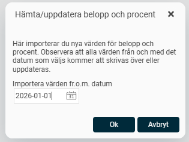

# ⚙️Hur uppdateras fasta värden för belopp och procent vid årsskiftet?

**Datum:** den 23 oktober 2025  
**Kategori:** Systemgemensamt  
**Underkategori:** Register  
**Typ:** config  
**Svårighetsgrad:** intermediate  
**Tags:** Ingen  
**Bilder:** 2  
**URL:** https://knowledge.flexhrm.com/sv/hur-uppdateras-fasta-v%C3%A4rden-f%C3%B6r-belopp-och-procent-vid-%C3%A5rsskiftet

---

Från och med version 2023.10 hämtas belopp och procent automatiskt in till Flex HRM. Möjligheten att hämta värden manuellt finns fortfarande kvar och kan användas vid behov. Värden hämtas allteftersom de finns tillgängliga. Observera att tillgängligheten beror på när respektive lands myndigheter publicerar värden för det nya året.
För att manuellt hämta värden kan du gå in under
Administration > Systemregister > Belopp och procent
och klicka på ikonen ”Hämta/uppdatera belopp och procent”.

Flex HRM föreslår ett fr.o.m. datum för hämtning. Klicka på Ok för att hämta in nya värden.

