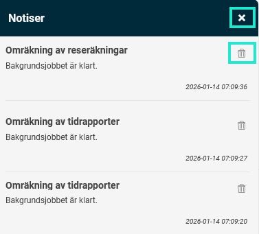

# Hur vet jag att ett jobb jag startat är klart?

**Datum:** den 15 januari 2026  
**Kategori:** Systemgemensamt  
**Underkategori:** Mobil  
**Typ:** howto  
**Svårighetsgrad:** intermediate  
**Tags:** Ingen  
**Bilder:** 2  
**URL:** https://knowledge.flexhrm.com/sv/hur-vet-jag-n%C3%A4r-ett-bakgrundsjobb-%C3%A4r-klart

---

När ett bakgrundsjobb du startat är klart visas det i en notispopup. En klocka visar när det finns notiser att läsa.
I Flex HRM använder vi bakgrundsjobb för att hantera många funktioner. Vi gör detta för att bibehålla systemets prestanda även när du utför tunga processer.
Exempel på funktioner som hanteras som bakgrundsjobb är:
Överföring av reseräkningar eller tidrapporter till lön.
Frisläpp till fakturering.
Omräkning av reseräkningar eller tidrapporter.
Se status via notiser
Du får information om bakgrundsjobb via en notis i Flex HRM. Sådana visas i en popup-ruta.

Om du vill ta bort en enskild notis klickar du på
papperskorgen
.
Om du vill ta bort alla notiser samtidigt klickar du på
krysset
.
Hitta dina notiser
När sidan laddas om eller om du byter vy i Flex HRM försvinner popup-rutan. Du ser då en
klocka
långt upp till höger som informerar dig om att det finns notiser. Om du vill se dina notiser igen klickar du på
klockan
.

Relaterat
Vad är bakgrundsjobb och var hittar jag dem?
