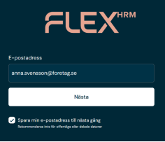
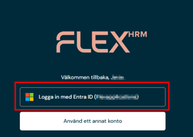
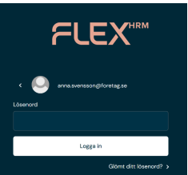
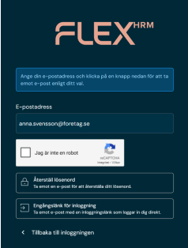
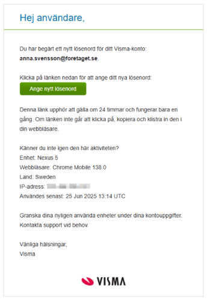
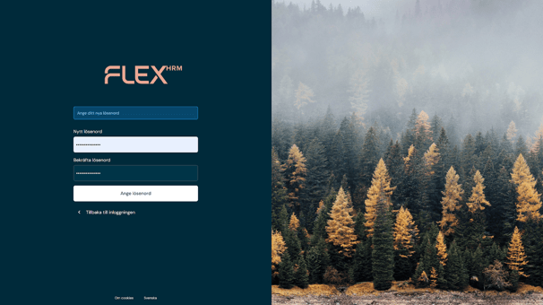
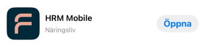
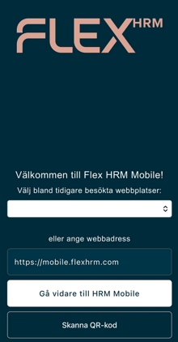
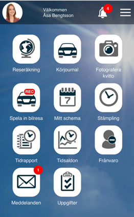

# Inloggning i Flex HRM

**Datum:** den 9 december 2025  
**Kategori:** Systemgemensamt  
**Underkategori:** Mobil  
**Typ:** other  
**Svårighetsgrad:** intermediate  
**Tags:** mobil  
**Bilder:** 9  
**URL:** https://knowledge.flexhrm.com/sv/inloggning-i-flex-hrm

---

Denna artikel beskriver hur du loggar in i Flex HRM och HRM Mobile. Den här guiden hjälper dig steg för steg med din första inloggning till Flex HRM.
Hur loggar jag in i Flex HRM?
Så här loggar du in
Kom igång med mobilappen
Du loggar in i Flex HRM med hjälp av ett
Visma Connect-konto
.
När du anger webbadressen (URL) för Flex HRM eller HRM Mobile skickas du först till inloggningen för Visma Connect.
Om ditt företag använder
SSO (Single Sign-On)
kan du klicka dig vidare utan att ange ett lösenord.
Om ni
inte använder SSO
anger du lösenordet för ditt Visma
Connect-konto. Därefter kan du börja arbeta i Flex HRM.
Här nedan får du en steg för steg guide för hur du loggar in i Flex HRM.
Så här loggar du in i Flex HRM
Ange webbadressen till Flex HRM:
https://web.flexhrm.com/
På inloggningssidan anger du den
e-postadress
företagets administratörer har förberett systemet med. Det är vanligtvis din jobbmail. Du kan välja att
spara din e-postadress till nästa inloggningstillfälle
genom att kryssa i rutan för det.
Tryck sedan på knappen
Nästa
.

Använder ni
SSO
(Single Sign-On) kan du välja att använda det och är sedan inloggad. På bilden här nedan står det
Logga in med Entra ID
, men det kan stå något annat beroende på vilken "
Identity Provider"
ert företag har.

Använder ni
inte
SSO
och du loggar in för första gången -
Klicka på
Glömt
ditt lösenord?

Ange din e-postadress och kryssa i
Jag är inte
en robot
. Välj sedan alternativet
Återställ lösenord
.

Ett e-postmeddelande skickas till den e-postadress du angav.
Gå till din inkorg för e-post och öppna meddelandet. Tryck på den gröna knappen
Ange nytt lösenord
.

Ange och bekräfta ditt nya lösenord. Tryck därefter på knappen
Ange lösenord
.

Du kan nu logga in i Flex HRM
på
https://web.flexhrm.com/
med din e-postadress och det lösenord du satt.
Kom igång med HRM Mobile
Om du använder mobil ladda hem appen
HRM Mobile
i antingen
App store
eller i
Google Play
.

Första gången du använder appen får du frågan vilken
webbadress
(URL)
som ska anges.
Ange URLen till mobilappen
https://mobile.flexhrm.com
I nästa steg anger du din mailadress och klickar på
Nästa
.
Har ditt f
öretag
SSO
(Single Sign-On)
väljer du
att använda det.
Använder ditt företag
inte
SSO
anger du ditt l
ösenord.
Du är sedan inloggad.

