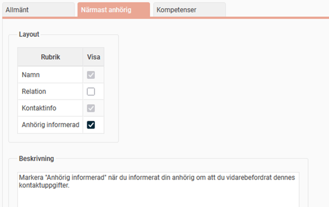
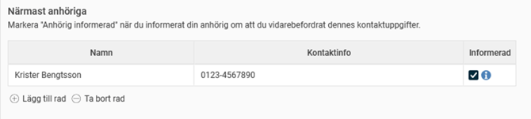
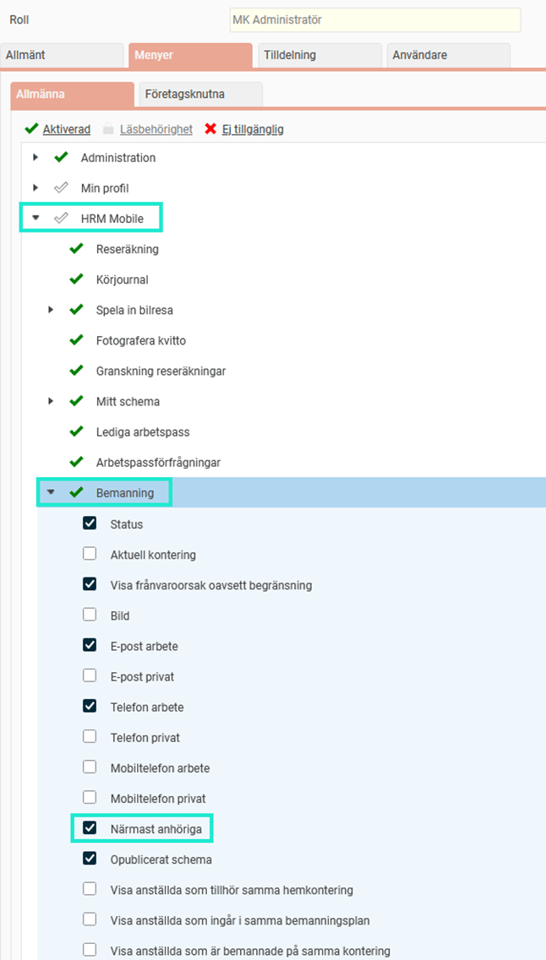
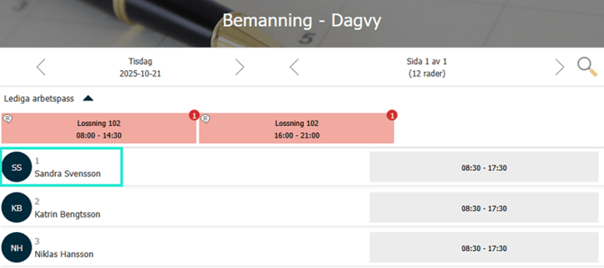
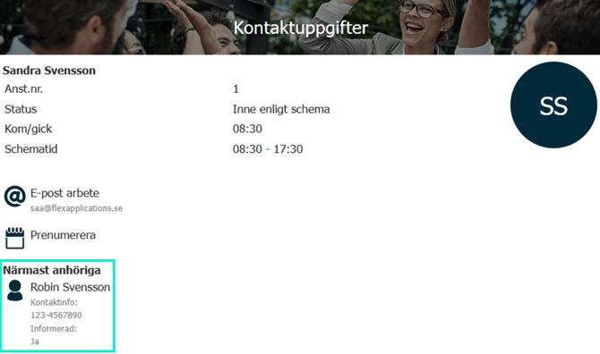
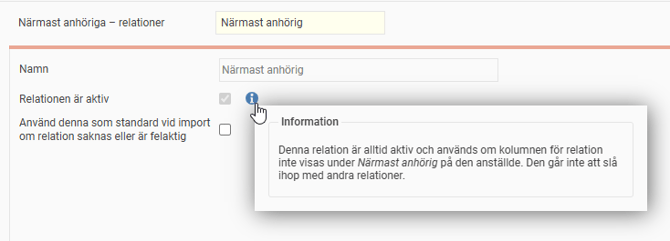

# ⚙️Inställningar för närmast anhöriga

**Datum:** den 22 oktober 2025  
**Kategori:** Systemgemensamt  
**Underkategori:** Användare & Behörighet  
**Typ:** config  
**Svårighetsgrad:** advanced  
**Tags:** behörighet, mobil, roll  
**Bilder:** 7  
**URL:** https://knowledge.flexhrm.com/sv/var-hittar-jag-info-om-narmast-anhorig-0-0

---

I HRM anges Närmast anhöriga under den anställdes personuppgifter.

Denna artikel beskriver vilka inställningar som du som administratör kan ställa in.
Under närmast anhöriga anger anställda den/de personer som arbetsgivaren ska kontakta om det skulle hända den anställde något i sitt arbete.
Närmast anhöriga kan registreras
manuellt
via fil
via API
Anställdaregistret - Inställningar
I menyn
Inställningar > Personal > Anställdaregistret – inställningar
ställer du in inställningar som styr hanteringen av närmast anhörig.
Samma vy når du även direkt via anställdaregistret,
Personal > Anställda > Mer
-
Inställningar
.
Du kan ställa in vilka av fälten
namn
,
relation
,
kontaktinfo
och
anhörig informerad
som ska visas för närmast anhörig, samt en beskrivning.
I exemplet nedan har vi valt att lägga in en beskrivning av
Anhörig
informerad
och att dölja fältet
Relation.

Så här ser det ut när en anställd har lagt in närmast anhörig i HRM:

Vi rekommenderas inte att ange relation på närmast anhörig, med stöd av IMYs utlåtande,
se mer på integritetsskyddsmyndighetens hemsida.
För att underlätta att inte av misstag fylla i det, kryssa ur visningen av relation enligt ovan bild.
Behörigheter
Du kan per roll ställa in om användarna ska få se uppgifter om närmast anhörig och i så fall i vilka vyer de ska visas. I exemplet nedan har vi valt att visa uppgifter om närmast anhörig i bemanningsvyn i HRM Mobile.

I HRM Mobile ser det då ut såhär i Bemanningen:

Närmast anhöriga – relationer
I systemet finns det ett standardregister med relationer som du hittar under
Systemregister > Närmast anhöriga – relationer.
Här finns en relation som heter
Närmst anhörig
som används när relation inte visas under Närmast anhörig på den anställde på grund av att relation är inaktiverad under inställningarna.
I exemplet nedan ser du systemregistret för relationer:

Om du ska importera närmast anhöriga från ett annat system krävs att någon typ av relation anges. Vi rekommenderar då att du har en relation som standard, förslagsvis "Närmast anhörig". Bocka i rutan
Använd denna som standard vid import om relation saknas eller är felaktig.

