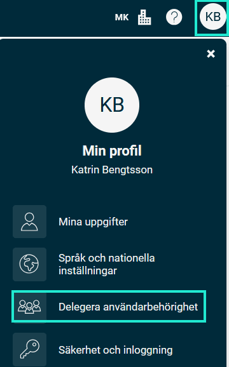
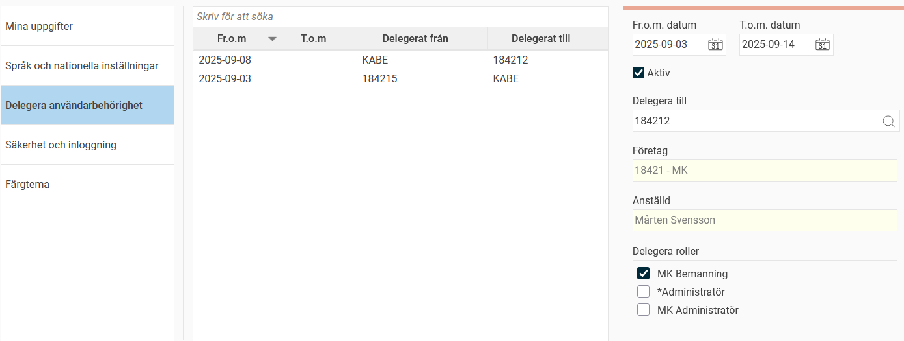

# Kan jag delegera min attestbehörighet tillfälligt till någon annan när jag är ledig?

**Datum:** den 3 september 2025  
**Kategori:** Systemgemensamt  
**Underkategori:** Användare & Behörighet  
**Typ:** faq  
**Svårighetsgrad:** intermediate  
**Tags:** användare, behörighet, roll  
**Bilder:** 2  
**URL:** https://knowledge.flexhrm.com/sv/kan-jag-delegera-min-attestbeh%C3%B6righet-tillf%C3%A4lligt-till-n%C3%A5gon-annan-n%C3%A4r-jag-%C3%A4r-ledig

---

Du kan tillfälligt delegera din attestbehörighet till en kollega när du är ledig. Det är en funktion som ofta används när en chef behöver hjälp att attestera till exempel reseräkningar och tidrapporter under en semester.
Hur du delegerar din behörighet
Du hittar funktionen
Delegera användarbehörighet
under din profilbild.

I vyn för delegering kan du välja vilken roll du vill delegera och till vilken användare. Du kan också ange ett
slutdatum
för att bestämma hur länge delegeringen ska gälla, till exempel under din semester.

När du delegerar en roll tar den valda användaren över din behörighet. Om du är attestant för ett hemkostnadsställe, får den användaren samma behörigheter och kan hantera samma uppgifter för de anställda som ingår i det hemkostnadsstället.
I vyn kan du se både de delegeringar du själv har gjort och de som har tilldelats dig.
