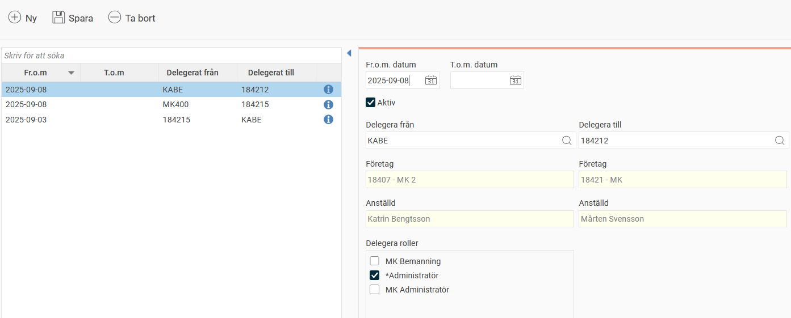

# Kan jag se en översikt över alla delegerade behörigheter?

**Datum:** den 3 september 2025  
**Kategori:** Systemgemensamt  
**Underkategori:** Användare & Behörighet  
**Typ:** faq  
**Svårighetsgrad:** intermediate  
**Tags:** användare, behörighet, roll  
**Bilder:** 1  
**URL:** https://knowledge.flexhrm.com/sv/kan-jag-se-en-%C3%B6versikt-%C3%B6ver-alla-delegerade-beh%C3%B6righeter

---

Du ser en översikt över delegerade behörigheter i vyn
Användare/Behörigheter > Delegerade behörigheter
. Här kan du också redigera och skapa delegeringar.
I listan till vänster ser du aktuella delegeringar. Vill du se historiska delegeringar går det att välja. Du ser datum för delegeringen samt vilken användare som delegerat till vilken användare. Om du håller muspekaren över
infosymbolen
får du också information om vem som senast sparade delegeringen och när det gjordes.

Skapa nya delegeringar
För att skapa en ny delegering väljer du först vilken användare behörigheten ska delegeras
från
och sedan vilken användare du vill delegera
till
. Slutligen väljer du vilka roller du vill delegera.
Vilka roller du kan delegera styrs av inställningarna för tilldelning av roller. Du kan bara delegera de roller som du själv har behörighet att tilldela. Du kan läsa mer om behörighet att tilldela roller i artikeln
Vad är en roll?
Redigera delegeringar
Du kan bara redigera delegeringar som har gjorts av användare som du har tillgång till. Däremot kan du se delegeringar som andra användare har gjort, om de är gjorda till en användare som du har tillgång till.
Observera att behörighetsinställningar kan göra att du inte ser alla delegerade behörigheter.
Relaterat
Vad är en roll?
