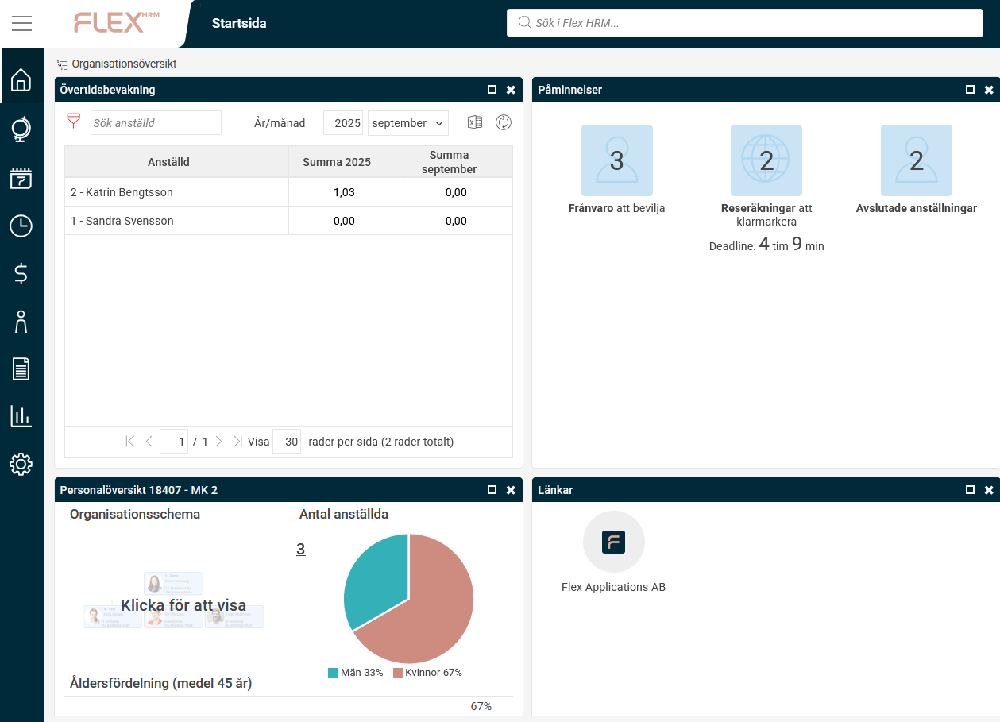
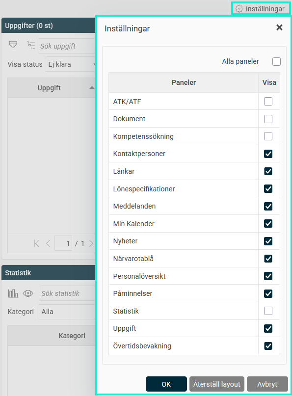
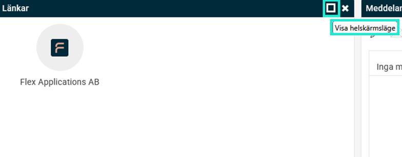

# Kan jag själv anpassa min startsida i Flex HRM?

**Datum:** den 5 september 2025  
**Kategori:** Systemgemensamt  
**Underkategori:** Användare & Behörighet  
**Typ:** faq  
**Svårighetsgrad:** intermediate  
**Tags:** behörighet  
**Bilder:** 3  
**URL:** https://knowledge.flexhrm.com/sv/kan-jag-sj%C3%A4lv-anpassa-min-startsida-i-flex-hrm

---

Du kan själv anpassa din startsida i Flex HRM. Du kan dölja och flytta runt paneler, samt ändra deras storlek.
På startsidan visas de paneler som ditt företag använder och som du har behörighet till.

Dölj paneler
Om du vill dölja en panel klickar du på
krysset
i panelens övre högra hörn.
Du kan också dölja paneler under
Inställningar
. Bocka ur panelerna du inte vill se och klicka på
OK
. Du kan när som helst välja att visa dem igen.

Anpassa utseendet
Du kan också ändra hur panelerna visas.
Flytta paneler
- dra och släpp panelerna för att ändra deras placering.
Ändra storlek
- dra i panelens kant för att ändra dess storlek.
Helskärmsläge
- klicka på
kvadraten
i panelens övre högra hörn för att visa den i helskärmsläge. Klicka sedan på
krysset
för att återgå.

