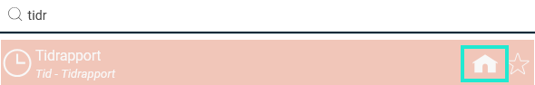
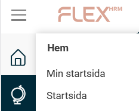

# Kan jag välja en egen startsida i Flex HRM?

**Datum:** den 5 september 2025  
**Kategori:** Systemgemensamt  
**Underkategori:** Mobil  
**Typ:** faq  
**Svårighetsgrad:** intermediate  
**Tags:** Ingen  
**Bilder:** 2  
**URL:** https://knowledge.flexhrm.com/sv/kan-jag-v%C3%A4lja-en-egen-startsida-i-flex-hrm

---

Välj din startsida
Du kan ställa in vilken sida du vill se direkt när du loggar in i Flex HRM. Om du till exempel använder din tidrapport oftast kan du välja den som din startsida.
Börja med att söka efter den sida du vill ha som startsida i sökfältet.
I sökresultatet ser du en liten husikon till höger om sidans namn. Klicka på
husikonen
för att ställa in den som din startsida.

Navigera till din startsida
När du har valt en personlig startsida hittar du den i menyn till vänster.
Välj
Hem > Min startsida
för att komma till din valda sida.
Om du istället väljer
Hem > Startsida
kommer du till den vanliga startsidan för Flex HRM.

