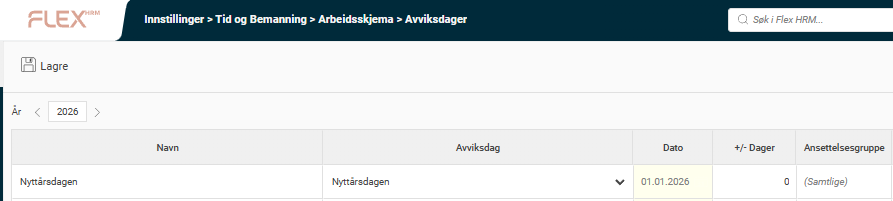
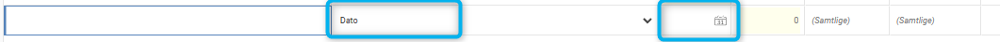
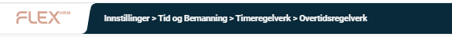
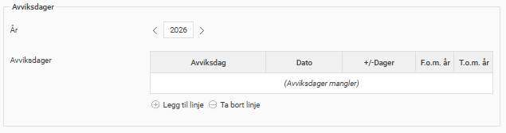

# ⚙️Kontroller avviksdager ved årsskiftet (no)

**Datum:** den 18 november 2025  
**Kategori:** Systemgemensamt  
**Underkategori:** Användare & Behörighet  
**Typ:** config  
**Svårighetsgrad:** advanced  
**Tags:** roll  
**Bilder:** 4  
**URL:** https://knowledge.flexhrm.com/sv/kontrollera-avvikelsedagar-vid-%C3%A5rsskifte-1

---

Denne artikkelen informerer deg om hva du bør være oppmerksom på ved overgangen til et nytt år. Systemet håndterer det meste som gjelder årsskiftet automatisk, så du trenger som regel ikke å gjøre noe selv. Vi anbefaler likevel at du tar en titt på avviksdagene for å forsikre deg om at alt stemmer.
For å kontrollere avviksdager for det nye året, gå til
Administrasjon > Innstillinger > Tid og bemanning > Arbeidsskjema > Avviksdager
. Husk å velge år, for eksempel
2026
.
Dersom du allerede har tatt i bruk faste avviksdager under kolonnen
Avviksdag
, vil disse automatisk oppdateres for alle fremtidige år, og du trenger derfor ikke å gjøre noen manuelle endringer.

De dagene som er lagt inn med en
fast dato,
må derimot registreres på nytt for det nye året dersom de fortsatt skal gjelde.

Vær oppmerksom på at avviksdagene også kan være inkludert i regelverkene for overtid, UB og beredskap. Dersom du benytter disse regelverkene, anbefaler vi at du også kontrollerer dem. Du finner regelverkene under
Administrasjon > Innstillinger > Tid og bemanning > Timeregelverk
.

