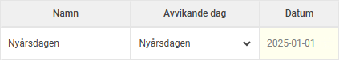
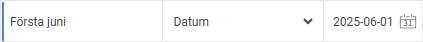

# ⚙️Kontrollera avvikelsedagar vid årsskifte

**Datum:** den 18 november 2025  
**Kategori:** Systemgemensamt  
**Underkategori:** Inställningar  
**Typ:** config  
**Svårighetsgrad:** advanced  
**Tags:** roll  
**Bilder:** 2  
**URL:** https://knowledge.flexhrm.com/sv/kontrollera-avvikelsedagar-vid-%C3%A5rsskifte

---

Kontrollera avvikelsedagarna för det nya året genom att gå in under Administration – Inställningar – Tid och Bemanning – Scheman – Avvikelsedagar. Har du använt någon av de fasta dagarna under kolumnen Avvikande dag kommer dessa automatiskt att gälla för alla år.

De dagar som är inskrivna med ett fast datum kommer däremot att behöva läggas in för det nya året om de ska gälla även nästa år.

Observera att dessa avvikande dagar även kan ställas in i regelverken för övertid, ob och beredskap om du använder HRM Time. Om du använder dessa regelverk ber vi dig även att se över dem. Du hittar dem under Administration – Inställningar – Tid och Bemanning– Tidregelverk.
