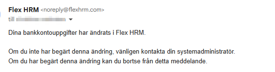

# När skickas e-post ut om ändringar på anställd?

**Datum:** den 21 november 2025  
**Kategori:** Systemgemensamt  
**Underkategori:** Mobil  
**Typ:** other  
**Svårighetsgrad:** advanced  
**Tags:** Ingen  
**Bilder:** 1  
**URL:** https://knowledge.flexhrm.com/sv/andring-utskick-anstalld-flex-hrm-0

---

Denna artikel beskriver när ett utskick via e-post sker till anställd vid ändringar av uppgifter.
Flex HRM skickar automatiskt ut e-postmeddelanden när vissa uppgifter på en anställd ändras eller tas bort.
Ändringar som utlöser e-post
E-post skickas ut vid ändring av följande uppgifter:
Lösenord
Gäller det interna lösenordet i Flex HRM.
Obs!
Gäller inte lösenordet i Visma Connect.
E-postadress
Gäller ändring i Anställdaregistret eller Användarregistret.
Obs!
Detta gäller
inte
e-postadressen för kopplingen till Visma Connect.
Vid en ändring skickas e-post till både den gamla och den nya adressen.
2FA (tvåfaktorsautentisering)
Gäller när 2FA slås av eller på i Flex HRM.
Obs!
Detta gäller inte dig med inloggning via Visma Connect.
Bankuppgifter
Ändring av bankkonto
Ändring av clearingnummer
Ändring av ”Utbetalning till”
Ändring av BIC
Ändring av IBAN
Ändring av norskt bankkonto
Flex HRM skickar
inte
e-post om du lägger till ett helt nytt bankkonto eller om du sparar samma kontouppgifter igen.
Exempel på meddelande om ändring av bankkontouppgifter

Undantag
Ändringar via API
Om ett bankkonto ändras via ett API (Application Programming Interface) skickas
inget
e-postmeddelande.
