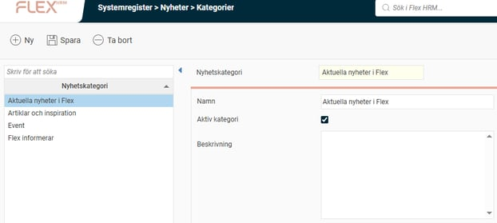
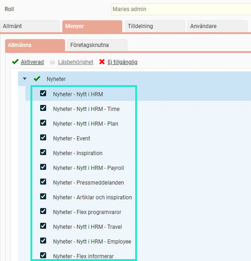

# ⚙️Nyheter - Hur jobbar jag med nyhetsflöden i Flex HRM?

**Datum:** den 29 september 2025  
**Kategori:** Systemgemensamt  
**Underkategori:** Användare & Behörighet  
**Typ:** config  
**Svårighetsgrad:** intermediate  
**Tags:** användare, behörighet, roll  
**Bilder:** 2  
**URL:** https://knowledge.flexhrm.com/sv/nyheter-hur-jobbar-jag-med-nyhetsfl%C3%B6den-i-flex-hrm

---

Artikeln beskriver hur du administrera nyhetspanelen, skapar kategorier, lägger till egna RSS-flöden och styr behörigheten för vilka nyheter dina användare ska se.
Nyheter
I panelen
Nyheter
på startsidan kan du ta del av nyhetsflöden via en så kallad
RSS-läsare
(RSS-läsare är ett verktyg som hjälper dig att samla och läsa nyhetsflöden från olika webbplatser på en och samma plats).
Systemet har stöd för att visa RSS-nyhetsflöden. Det betyder att du kan lägga till både egna, interna flöden och publika nyhetsflöden från andra källor.
Nyheterna visas på startsidan som kort med en sammanfattning i panelen. Ett klick på kortet öppnar en länk till hela nyheten. Observera att för att läsa programnyheter från oss på Flex Applications behöver du vara inloggad på vår kundzon.
Nyheterna
sorteras efter datum.
Hantera nyhetskategorier
Du hanterar kategorierna under
Administration > Systemregister > Nyheter – Kategorier
.

Här ser du en lista över befintliga kategorier. Du kan lägga till nya, ta bort, aktivera och inaktivera kategorier. Det är dessa kategorier som du sedan styr behörigheten till i rollhanteringen. Om du behöver översätta namnen på kategorierna gör du det under
Administration > Systemregister > Översättning
.
Under
Administration > Nyheter > Flöden
hanterar du sedan vilka nyhetsflöden som ska finnas i systemet och i vilken kategori de ska visas.
Hantera nyhetsflöden
Under
Systemregister > Nyheter – Flöden
ser du en lista över befintliga nyhetsflöden. Du kan lägga till nya, ta bort, aktivera och inaktivera flöden.
Tänk på att det behöver vara RSS-adresser som du anger i fältet Flöden för att nyhetsflödet ska fungera.
För varje nyhetsflöde väljer du vilken kategori det ska tillhöra. Behörigheten styrs sedan via kategorin, så att endast användare med tillgång till den valda kategorin kan se flödet.
Om ni använder flera språk i systemet kan du ställa in vilka språk ett nyhetsflöde ska visas för. Du kan också begränsa hur länge artiklar från ett flöde ska sparas och ange ett maximalt antal sparade artiklar.
Behörigheter
Nyhetsflödena är indelade i kategorier som du kan styra behörigheten till. På så sätt väljer du vilka nyheter som ska visas för olika användare.
För att en användare ska se nyheterna behöver hen ha behörighet till både panelen
Nyheter
och de specifika nyhetskategorierna.

