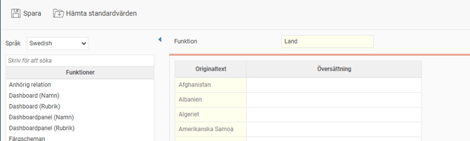
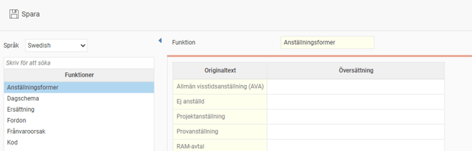
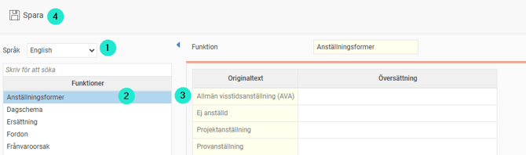

# ⚙️Översättning i Flex HRM

**Datum:** den 7 november 2025  
**Kategori:** Systemgemensamt  
**Underkategori:** Register  
**Typ:** config  
**Svårighetsgrad:** intermediate  
**Tags:** roll  
**Bilder:** 4  
**URL:** https://knowledge.flexhrm.com/sv/oversattning-flex-hrm-0

---

Standardmenyer och innehåll är redan översatt åt dig i Flex HRM. Det finns vissa möjligheter att påverka översättningen i just ditt företag. Här beskriver vi vilka delar som kan översättas och hur du gör egna översättningar.
M
e
d funktionen för över
sättning kan du anpassa texter i systemet. Du kan till exempel öv
e
rsätta granskningsnivåer, roller, länder och valutor.
Obs!
Den här funktionen visas bara om du har tilläggsmodulen Språk i din programversion.
Översätt systemtexter
Gå till
Systemregister > Översättning
. Här översätter du systemgemensamma funktioner.
Tänk på
att det är ett systemregistrer och att översättningen under denna inställning sätts för alla företag i din installation.
Här ser du följande vy:

Gör din översättning
Språk
- V
ä
l
j först
vilket språk du vill översätta till.
Funktion
- H
är väljer du vilken funktion du vill översätta för tillfället.
Originaltext -
Markera den text du vill översätta. Denna text visas då under
Översättning
, där du gör själva översättningen.
Översättnin
g -
H
ä
r
skriver du in önskad öv
e
rsättning av de
n mar
kerade texten i kolumnen
Originaltext
.
Spara.

Översättning för ett specifikt företag
För att översätta delar i ett specifikt företag gå till
Inställningar > Allmänt > Översättning
Här ser du följande vy:

Gör din översättning
Språk
- Välj först vilket språk du vill översätta till.
Funktion
- Här väljer du vilken funktion du vill översätta för tillfället.
Originaltext -
Markera den text du vill översätta. Denna text visas då under
Översättning
, där du gör själva översättningen.
Översättning -
Här skriver du in önskad översättning av den markerade texten i kolumnen
Originaltext
.
Spara.

Vad har jag möjlighet att göra egen översättning på?
Systemgemensamt
Anhörig relation
Dashboard (Namn och rubrik)
Dashboardpanel (Namn och rubrik)
Färgscheman
Granskningsnivå frånvaro
Granskningsnivå lönerevision
Granskningsnivå nyanställning
Granskningsnivå reseräkning
Granskningsnivå tidrapport
Land
Logginställningar
Nyhetskategori
Roller (Beskrivning och namn)
Valuta
Per företag
Anställningsformer
Dagschema
Ersättning
Fordon
Frånvaroorsak
Kod
Kompetenser
Kompetensgrupp
Konteringsdimension
Kost
Logi (Namn och Rubrik för kommentar)
Löneart
Ob Dagtyp
Personalkategorier
Publikt schema
Rastregel
Registreringsregel
Saldo
Tidgrupper
Tidkod
Traktamentsregeluppsättning
Utlägg
Övertidsmarkering
