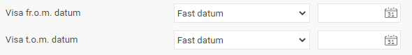
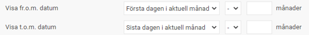
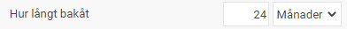

# ⚙️Paneler i Dashboard- Hur fungerar de gemensamma inställningarna för paneler i Dashboard?

**Datum:** den 17 oktober 2025  
**Kategori:** Systemgemensamt  
**Underkategori:** Inställningar  
**Typ:** config  
**Svårighetsgrad:** intermediate  
**Tags:** Ingen  
**Bilder:** 4  
**URL:** https://knowledge.flexhrm.com/sv/paneler-gemensamt-hur-fungerar-de-gemensamma-inst%C3%A4llningar-f%C3%B6r-paneler

---

I artikeln beskrivs de inställningar och funktioner som är gemensamma för samtliga olika typer av Dashboard-paneler.
Du hittar inställningarna för panelerna under
Administration > Systemregister > Dashboard > Paneler
.
Anställningsurval
Alla typer av paneler utgår från anställningstyp
Anställd
, dvs. de tittar
inte
på
Extern
personal, och de utgår även enbart från granskade anställningar. Det finns ett undantag, för panelen
Frisläpp till fakturering
som även tar med Extern personal.
Visa genomsnitt
Summerar alla staplar/punkter i linjen och delar med antalet staplar/punkter.
Finns tillgänglig för typerna Antal anställda, Antal heltidstjänster (FTE), Frisläppt belopp till fakturering, Genomsnittlig anställningstid, Medelålder, Personalomsättning och Sjukfrånvaro.
Maximalt antal att visa
Används för typerna
Anställningsform
,
Avgångsorsak
och
Befattning
Begränsar hur många staplar eller tårtbitar som visas. Visningen utgår från störst antal anställningsformer / avgångsorsaker / befattningar.
Värden som inte visas i egna staplar/tårtbitar klumpas ihop till en stapel/tårtbit som heter
Övriga
. I
Övriga
ingår även stapeln/tårtbiten för
Ingen
(anställda utan anställningsform / avgångsorsak / befattning).
Inkludera tidigare
Används för typerna
Anställningsform
,
Avgångsorsak
och
Befattning
.
Standardinställningar (ej ibockad) tar endast med den senaste anställningsformen / avgångsorsaken / befattningen i datumurvalet d.v.s. enbart en anställningsform per anställd.
Bockas den i, hämtas samtliga anställningsformer för en anställds samtliga anställningsperioder i datumurvalet.
Avrundning
Notera att decimaltal alltid avrundas till två decimaler.
Graf - Stapel/Cirkel
Används för typerna
Anställningsform
,
Avgångsorsak
och
Befattning
.
Utgår från den anställdes anställnings- och avgångsdatum.
Exempel för anställningsform:
Om fälten är enligt nedan betyder det att inget datumurval är gjort och aktuell anställningsform (idag) kommer att hittas.

Med nedan exempel kommer senast aktuell anställningsform under urvalets period, dvs aktuell månad, att hämtas.

Graf - Stapel/Linje
Används för typerna
Antal anställda
,
Antal heltidstjänster (FTE)
,
Frisläppt belopp till fakturering
,
Genomsnittlig anställningstid
,
Medelålder
,
Personalomsättning
och
Sjukfrånvaro
.
Utgår från dagens datum och tittar på alla hela perioder bakåt.
Exempel med 24 år bakåt där dagens datum är lika med 2023-02-10:
Första perioden: 1999-01-01 - 1999-12-31
Sista perioden: 2022-01-01 - 2022-12-31

Exempel med 24 månader bakåt där dagens datum är 2023-02-10:
Första perioden: 2021-02-01 - 2021-02-28
Sista perioden: 2023-01-01 - 2023-01-31

Relaterade artiklar:
Dashboard - Vad är en Dashboard?
Hur går jag tillväga för att presentera Dashboards på Startsidan (Hem)?
Dashboard - Mätare/Värde - Hur mäter och visualiserar jag mina värden?
