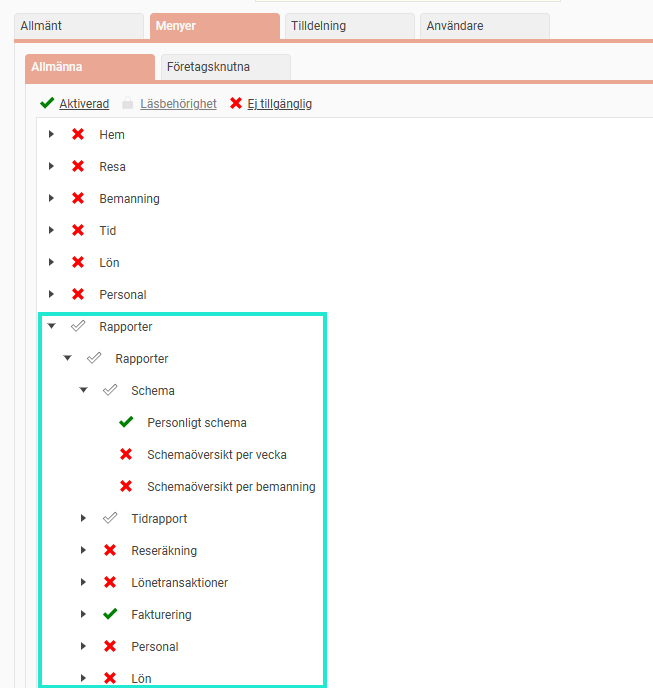

# ⚙️Rapporter - Hur ställer jag in behörigheter till standardrapporter?

**Datum:** den 3 december 2025  
**Kategori:** Systemgemensamt  
**Underkategori:** Användare & Behörighet  
**Typ:** config  
**Svårighetsgrad:** intermediate  
**Tags:** användare, behörighet, roll  
**Bilder:** 2  
**URL:** https://knowledge.flexhrm.com/sv/rapporter-vilka-standardrapporter-finns-0

---

Artikeln ger en kort beskrivning av behörigheter till standardrapporter i Flex HRM.
Du hittar standardrapporterna under menyn
Rapporter

Behörigheten till rapporterna styrs via användarens roller. Nedan beskrivs hur behörighet till rapporterna ställs in.
Behörighetsinställningar
Tillgång till rapporter styrs via en rollbehörighet under
Administration >
Användare/Behörigheter > Roller
, fliken
Menyer
.
Under Rapporter kan du ställa in vilka av rapporterna som en roll ska ha behörighet till.
I nedan exempel ser du att rollen har behörighet till rapporten
Personligt schema
under undermenyn
Schema.
Du ser även att rollen har behörighet till rapporter för
Fakturering
samt vissa rapporter under
Tidrapport
. Övriga rapporter är avstängda.

När rollen ger behörighet till en rapport får användaren möjlighet att själv hämta ut rapporten. De anställda som användaren ser i rapporten är de som hen har behörighet till med rollen.
Exempelvis vi har en roll som heter "Chef", och alla chefer har enligt rollen tillgång till rapporter för sin personal, det betyder att en chef endast ser sin personal när hen tar ut rapporten.
Tänk på att behörighet i vissa fall kan kombineras med olika roller. Till exempel kan en användare ha en roll som ger behörighet till vissa rapporter och vissa anställda, men en annan roll som ger behörighet till andra rapporter.
Observera att
det finns undantag från ovan regel när det gäller rapporten
Personalliggare
.
behörighet till rapporten
Personallista
ger behörighet till många fält. Se mer om rapporten
här
.
Rapportgeneratorn
ska ses som ett administratörsverktyg då användare med tillgång till rapportgeneratorn från den har tillgång till alla anställdas data, oavsett övriga behörigheter i systemet.
Behörighet för rapporter skapade via Rapportgeneratorn har en annan hantering. Läs mer om hur du delar rapporter och rapportinnehåll från
rapportgeneratorn i denna artikel.
Specifika detaljer om olika rapporter kan du hitta under respektive delmodul.
