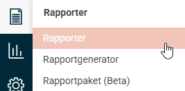
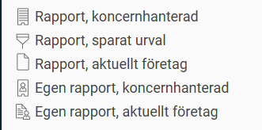
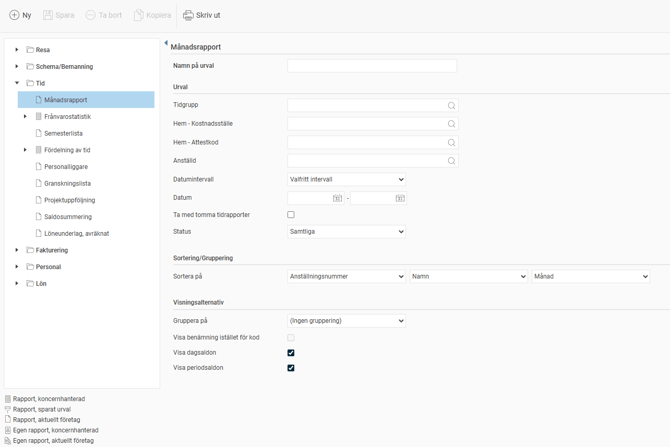
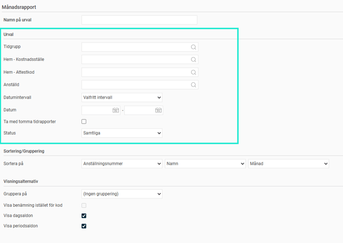
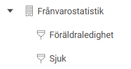
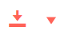
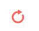
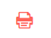

# Rapporter - Vilka standardrapporter finns i Flex HRM?

**Datum:** den 3 december 2025  
**Kategori:** Systemgemensamt  
**Underkategori:** Användare & Behörighet  
**Typ:** other  
**Svårighetsgrad:** intermediate  
**Tags:** användare, behörighet  
**Bilder:** 8  
**URL:** https://knowledge.flexhrm.com/sv/rapporter-vilka-standardrapporter-finns

---

Artikeln ger en kort beskrivning av standardrapporter i Flex HRM.
Rapporter
Du hittar rapporterna under menyn
Rapporter

Under Rapporter hittar du dels ett antal standardrapporter, men även möjlighet att hämta specialbyggda rapporter från Rapportgeneratorn som har blivit delade med dig, så kallad
Egen rapport
.
Olika typer av rapporter har olika ikoner:

Tillgängliga standardrapporter
Nedan ser du en sammanfattning av vilka rapporter som finns.
Observera att rapporterna ofta hör till en specifik modul och innebär att du endast ser de rapporter som du har licens för och som du som användare har behörighet till.
Resa
Reseräkningsspecifikation
Reseräkningssammandrag
R
e
s
da
gsstatistik
Fördelning av reskostnader
Traktamentesstatistik
Bokföringsorder
K
ö
r
journal
Granskningslista
Löneunderlag, preliminärt
Löneunderlag, avräknat
Schema/bemanning
Personligt schema
Schemaöversikt per vecka
S
ch
emaöversikt per bemanning
Tid
Månadsrapport
Frånvarostatistik
Semesterlista
Fördelning av tid
Personalliggare
Granskningslista
Projektuppföljning
Saldosummering
Löneunderlag, avräknat
Fakturering
Fakturaunderlag
Beläggningsgrad
Personal
Personallista
Närmast anhöriga
Anställningsavtal
Lön
Banklista
Bokföringsorder
Fördelning av antal och belopp
Lönespecifikation
Löneunderlag, lönekörning
Semestersaldon
S
jukstatistik
Arbetsgång för rapporter
Arbetsgången är densamma för alla standardrapporter i Flex HRM:
Välj det delsystem och den rapport du vill använda.
Definiera det urval som rapporten ska baseras på.
Sätt Sortering/gruppering och/eller Visningsalternativ
Skriv ut rapporten.
Du ser vilka rapporter som ingår i en kategori genom att klicka på
pilen
framför respektive huvudnivå. Till höger i bilden visas de urvalsmöjligheter som finns för den valda rapporten.

Definiera urval
Här ställer du in vilka data som ska inkluderas i rapporten innan du tar ut den.

Observera
Om du gör ett urval baserat på
hemkonteringar
eller
tidgrupp
inkluderas data för alla anställda som
för tillfället
tillhör den hemkonteringen eller tidgruppen. Det innebär att om en anställd har bytt hemkontering eller tidgrupp så kommer den anställde när rapporten hämtas att höra till den aktuella konteringen/tidgruppen som den anställde tillhör idag, inte den kontering/tidgrupp som den anställde hörde till för datumurvalet.
För att göra mer specifika urval finns det i vissa rapporter möjlighet att välja registrerade konteringar, till exempel i tidrapporten, reseräkningarna och löneberedningen. Då hämtas data baserat på registrerad kontering.
Spara urval
Du kan spara ett urval genom att skriva ett
Namn på urval
högst upp och klicka på
Spara
-knappen i verktygsfältet. Ett sparat urval hittar du sedan under originalrapporten i rapportträdet.
I nedan exempel ser du att det finns två olika rapporturval sparade av standardrapporten Frånvarostatistik.

Skriva ut rapporten
För att skriva ut en rapport klickar du på
skrivarsymbolen
i det övre verktygsfältet. Rapporten öppnas då i en ny flik i din webbläsare.
Nedan följer en beskrivning av de funktioner du hittar i utskriftsfönstret:

Spara rapporten i annat format (Export)
Du kan spara rapporten i ett annat filformat, som till exempel en PDF-fil. Klicka på
pilen till höger
om exportikonen.
Välj det önskade filformatet i listan.

Uppdatera vyn
Klicka på
Uppdatera
-ikonen
för att uppdatera vyn med eventuella ändringar som har gjorts medan du haft fönstret öppet.

Skriv ut
Klicka på
Skriv ut
-ikonen för att skriva ut rapporten. Tänk på att du kan behöva ändra utskriftsinställningarna från
Alla
till det sidintervall du önskar.
Relaterade artiklar
Rapportgenerator - Vad är Rapportgeneratorn?
