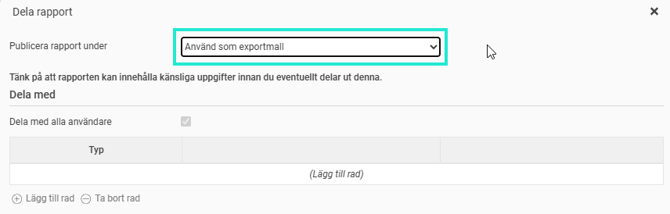
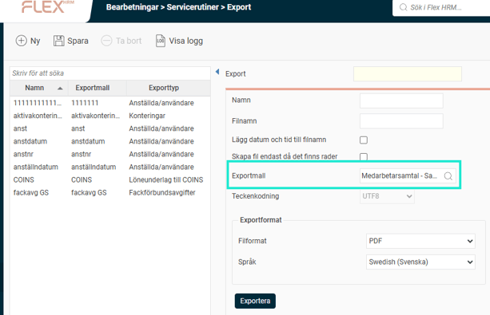

# Rapportgenerator - Hur schemalägger jag uttag av rapporter från rapportgeneratorn?

**Datum:** den 17 oktober 2025  
**Kategori:** Systemgemensamt  
**Underkategori:** Rapporter  
**Typ:** other  
**Svårighetsgrad:** intermediate  
**Tags:** behörighet  
**Bilder:** 2  
**URL:** https://knowledge.flexhrm.com/sv/rapportgeneratorn-hur-schemal%C3%A4gger-man-exporter-fr%C3%A5n-rapportgeneratorn

---

Denna artikel beskriver hur du schemalägger uttag av rapporter från rapportgeneratorn.
Schemalägg export av rapporter
Du kan schemalägga automatiska uttag av rapporter som du har skapat i rapportgeneratorn. Det innebär att du kan få rapporterna skickade till en nätverkssökväg eller en fjärrmapp vid bestämda tidpunkter, på samma sätt som andra exporter i Flex HRM.
Steg 1: Ställ in rapportmallen för export
För att kunna använda en rapport för schemalagd export behöver du först ställa in den som en exportmall. Det gör du under rapportmallens delningsinställningar genom att välja alternativet
Använd som rapportmall
.

När du väljer detta låses de övriga delningsinställningarna.
En rapportmall som används för export kan inte samtidigt publiceras som en vanlig rapport (dock går det att använda den i rapportpaket). Om du behöver använda samma mall för båda syften kan du spara en kopia av den och publicera kopian som en vanlig rapport.
Observera!
När du använder en rapportmall för export får den automatiskt behörighet till samtliga anställda. Om du behöver begränsa uttaget måste du göra detta med hjälp av urval direkt i rapportmallen.
Steg 2: Skapa exporten
När du har ställt in din rapportmall för export hittar du den under
Administration > Bearbetningar > Servicerutiner > Export
. Välj exporttypen
Rapportmall
för att se den.

Här skapar du själva exportrutinen. Dataurvalet ställer du in i rapportgeneratorn, men i exportinställningarna kan du välja:
Filformat (PDF, XLSX eller CSV).
Språk för den exporterade filen (om ni använder flera språk i Flex HRM).
Steg 3: Schemalägg körningen
När du har sparat exporten kan du schemalägga den. Det gör du under
Schemalagda körningar
, på samma sätt som du schemalägger andra exporter i systemet.
Relaterade artiklar:
Rapportgenerator - Vad är Rapportgeneratorn?
Rapportgenerator - Hur kan jag få ut rapporter om medarbetarsamtal från rapportgeneratorn?
