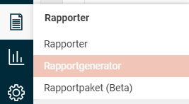
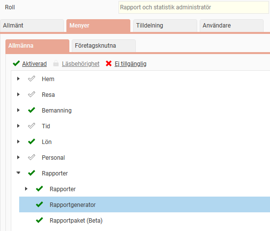
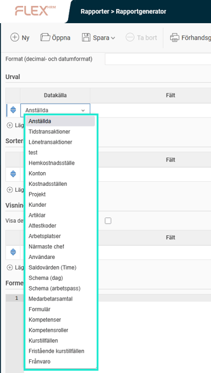
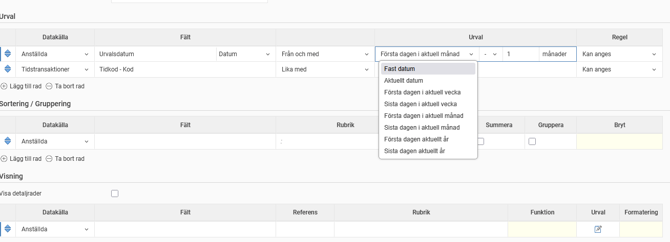
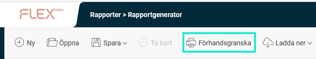
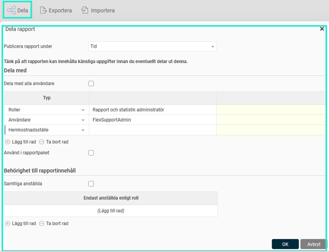
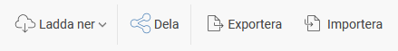

# Rapportgenerator - Vad är Rapportgeneratorn?

**Datum:** den 3 december 2025  
**Kategori:** Systemgemensamt  
**Underkategori:** Användare & Behörighet  
**Typ:** concept  
**Svårighetsgrad:** advanced  
**Tags:** användare, behörighet, roll  
**Bilder:** 7  
**URL:** https://knowledge.flexhrm.com/sv/rapportgeneratorn-vad-%C3%A4r-rapportgeneratorn

---

Artikeln ger en kort beskrivning av rapportgeneratorn i Flex HRM.
Rapportgeneratorn
Du hittar rapportgeneratorn under menyn
Rapporter > Rapportgenerator
.

Skapa egna rapporter med rapportgeneratorn
Med rapportgeneratorn kan du skräddarsy egna rapporter. Eftersom all data i Flex HRM finns i samma databas kan du bygga rapporter med information från olika delar av systemet. Du kan formatera utskrifterna och alla rapporter du skapar i rapportgeneratorn kan exporteras till Excel för vidare bearbetning.
Kombinera data från hela systemet
Med rapportgeneratorn kan du kombinera olika datakällor och få med information från både anställda, tidstransaktioner och lönetransaktioner i en och samma rapport.
Du kan till exempel kombinera data från personregistret med tidrapportrader i HRM Time eller lönetransaktioner i HRM Payroll. Det gör att du kan få ut information om bland annat tidkoder, utläggskoder, lönearter och konteringar.
Behörighet till rapportgeneratorn
Tillgång till rapportgeneratorn styrs via en rollbehörighet under
Administration >
Användare/Behörigheter > Roller
, fliken
Menyer
.
Observera att rapportgeneratorn ska ses som ett administratörsverktyg då användare med tillgång till rapportgeneratorn från den har tillgång till alla anställdas data, oavsett övriga behörigheter i systemet.

Användare som är behöriga till rapportgeneratorn får tillgång till
menyingången
Rapporter > Rapportgenerator
.
Anpassa innehåll och urval
i Rapportgeneratorn väljer du först en huvuddatakälla för din rapport. Därefter kan du anpassa innehållet på flera sätt:
Gör urval, sorteringar, grupperingar och summeringar.
Välj data från både huvuddatakällan och andra datakällor som kan kombineras med den. För varje datakälla finns en lista över de fält som går att visa/ göra urval på.
Gör avancerade datumurval.
Använd separata urval för olika kolumner i rapporten.

Förhandsgranska och formatera
Medan du bygger rapporten kan du förhandsgranska resultatet direkt i rapportgeneratorn.

Du har också möjlighet att:
Formatera innehållet i kolumnerna.
Redigera utskriftsformat som sidorientering, kolumnbredd och radhöjd.
Dela och behörighetsstyr dina rapporter
När du är klar med en rapport kan du publicera den för andra användare. Du placerar den då under en valfri nod bland de övriga rapporterna i systemet. Du kan styra behörigheten på flera nivåer:
Bestäm vilka användare eller roller som ska ha tillgång till rapporten.
Använd rollbehörigheter för att styra vilka anställda en användare kan se data för.
Styr behörigheten baserat på konteringar.
Välj om användaren ska kunna ändra i urvalen eller inte när rapporten körs.

Exportera och skriv ut
Användare med behörighet till rapporten kan sedan välja att:
Skriva ut den som en PDF-fil.
Exportera den till Excel för vidare bearbetning.
Spara den som en textfil.

Hantering för flera bolag och koncerner
Om du har flera företag kan du exportera en färdigbyggd rapport från ett företag till ett annat. Använder du tilläggsmodulen
Koncern
kan du även bygga vissa rapporter som hämtar data från hela koncernen.
Relaterade artiklar:
Rapportgenerator - Hur schemalägger jag uttag av rapporter från rapportgeneratorn?
Rapportgenerator - Hur kan jag få ut rapporter om medarbetarsamtal från rapportgeneratorn?
