# Rapportpaket -Vad är och hur fungerar rapportpaket?

**Datum:** den 9 oktober 2025  
**Kategori:** Systemgemensamt  
**Underkategori:** Användare & Behörighet  
**Typ:** concept  
**Svårighetsgrad:** beginner  
**Tags:** användare, behörighet, roll  
**Bilder:** 16  
**URL:** https://knowledge.flexhrm.com/sv/rapportpaket-vad-%C3%A4r-och-hur-fungerar-rapportpaket

---

Nedan kan du läsa om vad rapportpaket i Flex HRM är. Samt hur du använder dig av dem och dess funktioner.
Generellt
Ett rapportpaket är ett sätt att välja flera rapporter med förinställda urval som ska dras samtidigt i Flex HRM. Det finns möjlighet att sätta upp valfritt antal rapportpaket och alla som har behörighet till modulen kan använda de skapade paketen. Tänk på att om en användare får behörighet till Rapportpaket kan de se och få ut alla rapporter som skapats och delats i rapportgeneratorn.
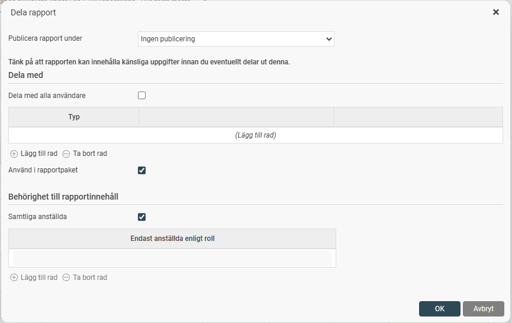
Rapportpaketsfunktionen är under uppbyggnad och kommer utökas med mer funktionalitet men vi hoppas att du har glädje redan av Beta-versionen för att förenkla uttaget av rapporter.
Funktionen finns tillgänglig i Flex HRM fr.o.m. version 2025.109
Behörigheter
Du aktiverar åtkomst till funktionen på den Roll vars användare ska kunna bygga och ta ut rapportpaket.
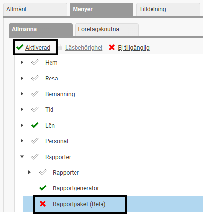
Skapa ett rapportpaket
Under Rapporter > Rapportpaket (Beta) skapar och konfigurerar du de paket ni vill använda genom att lägga till önskade rapporter med urval i respektive paket.
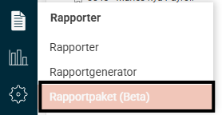
För att skapa ett nytt paket klickar du på knappen Ny.
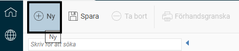
Ge paketet ett namn och klicka på OK.
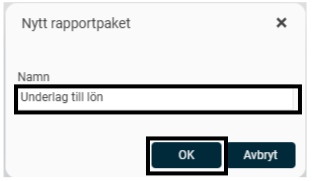
För att lägga till en rapport i paketet klickar du på Lägg till rapport.
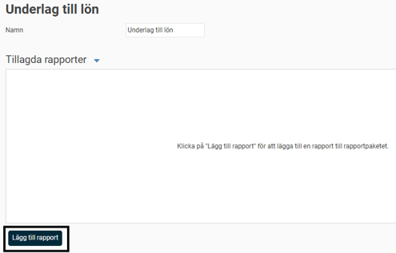
Du kan använda sökfältet för att söka på ett rapportnamn eller en rapportkategori.
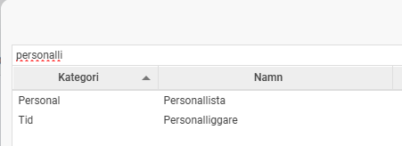
Välj en rapport i listan. Du kan välja alla rapporter som finns tillgängliga under Menyn Rapporter, dvs både standardrapporter och rapporter från Rapportgeneratorn.
Ange ev beskrivning för att förtydliga vad rapporten är inställd att göra och välj i vilket format rapporten ska laddas ned i. Ange även önskat filnamn i avsett fält för detta och om företagets nummer och datum ska inkluderas i filnamnet.
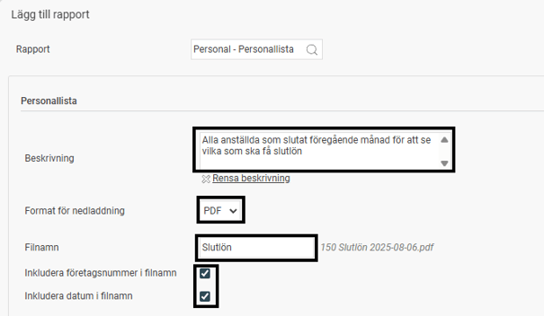
Gör de urval (=filter) du vill ska tillämpas på denna rapport. I exemplet nedan vill vi lägga till en rapport av typen Personallista med urval på alla anställda som slutat föregående månad för att se vilka som ska få slutlön. Vi har valt att visa två kolumner, Anställd och Avgångsdatum.
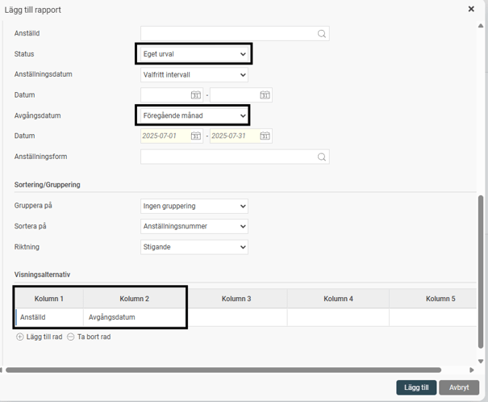
Klicka sen på
Lägg till
längst ner i fönstret för att lägga till rapporten i Rapportpaketet.
Förhandsgranska rapporter i ett rapportpaket
För att visa rapporterna i ett rapportpaket väljer du paketet.
Gör eventuella justeringar av urval (t.ex. om du har rapporter med datumurval som dras varje månad kan du behöva uppdatera datumen).  Du kan se vilka urval som är inställda på varje rapport genom att markera rapporten i listan under Tillagda rapporter.
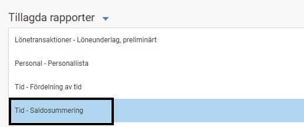
I exemplet nedan visas ett urval med ett specifikt datum som behöver justeras varje månad.
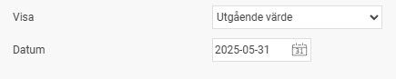
Klicka på Förhandsgranska.
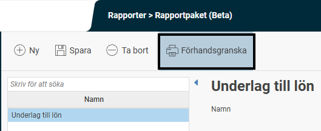
Om du har fyra eller fler rapporter i paketet visas en notis visar hur många rapporter som kommer öppnas, svara Ja för att fortsätta.
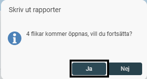
Detta öppnar alla rapporter i paketet i egna flikar i webbläsaren.
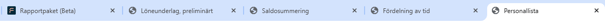
Du kan sen gå in på varje rapportflik och titta på rapporten samt välja i vilket format du vill ladda ner den.
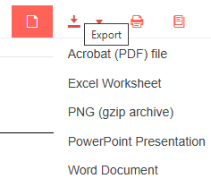
Ladda ner rapporter i ett rapportpaket
För att direkt ladda ner rapporterna i ett rapportpaket väljer du paketet. Gör ev justeringar av urval om detta behövs och klicka sen på
Ladda ner
.
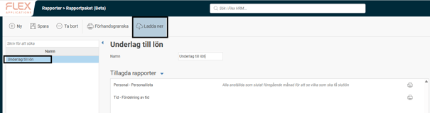
