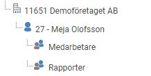
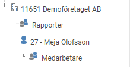
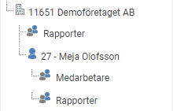
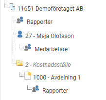
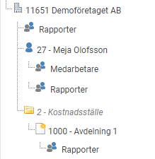
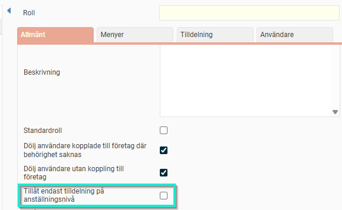

# ⚙️Roller och behörigheter i Flex HRM

**Datum:** den 17 oktober 2025  
**Kategori:** Systemgemensamt  
**Underkategori:** Användare & Behörighet  
**Typ:** config  
**Svårighetsgrad:** intermediate  
**Tags:** användare, behörighet, roll  
**Bilder:** 6  
**URL:** https://knowledge.flexhrm.com/sv/roller-och-beh%C3%B6righeter-i-flex-hrm

---

En generell guide till roller och behörigheter.
Vad
man kan se/redigera avgörs av rollen.
Vilka
man kan se/redigera (till exempel i en rapport) avgörs av var man lägger rollen på användaren. Exempelvis direkt under sitt eget namn eller på företagsnivå.
Exempel på behörighet i rapporter
I exemplen nedan utgår vi från att rollen
Rapporter
ger åtkomst till rapportfunktionalitet, medan rollen
Medarbetare
inte ger denna behörighet. Användaren Meja ska få tillgång till att ta ut rapporter. Beroende på var rollen tilldelas får hon rätt att se fler eller färre anställda i rapporten.
Här har användaren rollen
Rapporter
enbart under sitt eget namn och kan därför bara se sig själv i rapporten:

Här har användaren rollen
Rapporter
för hela företaget men inte under sitt eget namn, vilket innebär att hen kan se samtliga andra anställda i företaget i rapporten, men inte sig själv:

Här har användaren rollen
Rapporter
både på företagsnivå och under sitt eget namn, vilket innebär att hen kan se samtliga anställda i företaget, inklusive sig själv, i rapporten:

Här har användaren rollen
Rapporter
för både ett kostnadsställe och hela företaget men saknar rollen under sitt eget namn, vilket innebär att hen kan se alla andra i företaget i rapporten men inte sig själv, även om hen tillhör det aktuella kostnadsstället:

Här har användaren rollen
Rapporter
både för ett kostnadsställe och för hela företaget samt under sitt eget namn och kan därför se samtliga anställda i företaget, inklusive sig själv, i rapporten:

Ni hittar era roller under
Administration > Användare/Behörigheter > Roller
och ni hittar era användare under
Administration > Användare/Behörigheter > Användare.
💡Om du önskar att en roll endast ska kunna tilldelas på medarbetarnivå kan du begränsa rollen så att den endast kan sättas på individnivå. Detta görs för att undvika att exempelvis medarbetarroller tilldelas på företagsnivå.

Relaterat
Vad är en roll?
