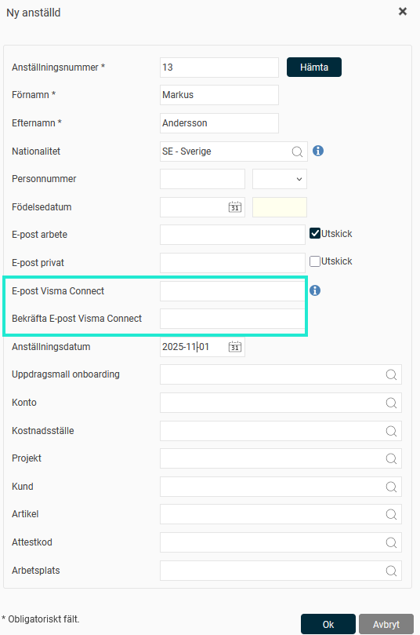
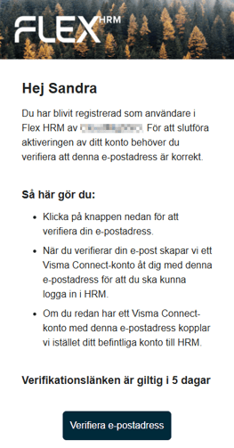

# Skapas Visma Connect-konton automatiskt för nyanställda i Flex HRM?

**Datum:** den 3 december 2025  
**Kategori:** Systemgemensamt  
**Underkategori:** Användare & Behörighet  
**Typ:** other  
**Svårighetsgrad:** advanced  
**Tags:** användare, mobil, säkerhet  
**Bilder:** 2  
**URL:** https://knowledge.flexhrm.com/sv/skapas-visma-connect-konton-automatiskt-f%C3%B6r-nyanst%C3%A4llda-i-flex-hrm

---

Om du använder användarmall kan du ange e-postadressen för kopplingen till Visma Connect redan när du lägger upp den nyanställda.
Inloggning till Flex HRM och HRM Mobile sker via
Visma Connect
. För att en användare ska kunna logga in måste hen vara kopplad till Visma Connect med en e-postadress.
Så skapas Visma Connect-kontot vid nyanställning
När du anställer en ny medarbetare kan du använda en
anställningsmall
kopplad till en
användarmall
. Detta gör att en användare skapas automatiskt. Det kan du göra vid manuell registrering, import eller via API.
Om du använder mallar kan du ange e-postadressen för kopplingen till Visma Connect redan när du lägger upp den nyanställda.

Du behöver inte göra något mer för att den nya användaren ska kopplas till Visma Connect:
Ett mail för verifiering skickas till den angivna e-postadressen (om ni inte har en verifierad domän, se nedan).
Användaren verifierar sig via länken i mailet.
Visma Connect-kontot skapas.

När skickas e-post för verifiering?
Systemet hanterar utskicket utifrån anställningens startdatum:
Startdatum i morgon eller tidigare:
Inbjudan skickas direkt när du sparar anställningen.
Startdatum i övermorgon eller senare:
Inbjudan skickas klockan 09:00 dagen före anställningens första dag.
Vid användning av granskningsflöde i nyanställningsvyn
(kräver licens för HRM Employee): Inbjudan skickas först när anställningen har blivit slutgiltigt godkänd i flödet.
Granskas en framtida anställning skickas inbjudan klockan 09:00 dagen före anställningens första dag även för de anställningar som granskats.
Granskas en anställning med startdatum imorgon eller tidigare skickas inbjudan vid sista granskningssteget.
Den nyanställda har god tid på sig att verifiera kontot. Länken i inbjudan är giltig i totalt fem dagar, räknat från och med dagen den skickas. Genom att verifiera kontot skapar den nyanställda sin inloggning till Flex HRM. Visma Connect är den tjänst som hanterar denna säkra inloggningsprocess.
Om ni har en verifierad domän
Om ni har en verifierad domän (
Allmänt > Säkerhet
) skapas Visma Connect-kontot automatiskt när du anger en e-postadress som tillhör domänen (och eventuell granskning av anställningen gjorts). I det fallet skickas alltså
inte
något e-postmeddelande för verifiering till användaren. Visma Connect-kontot skapas då vid registreringen/granskningen av en nyanställd, oberoende av anställningens startdatum.
