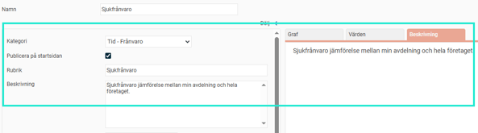
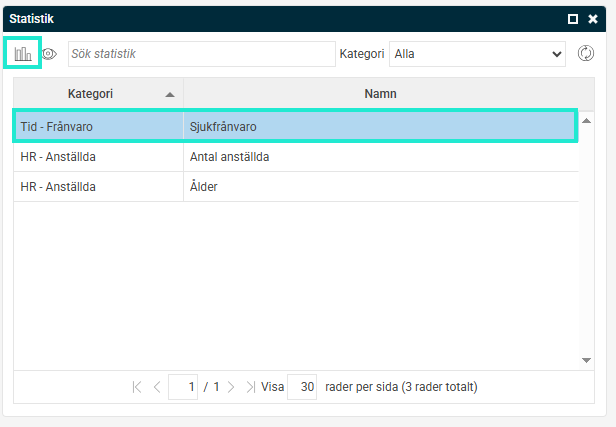
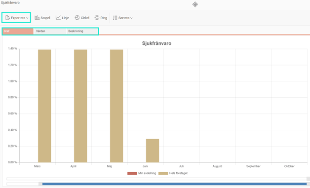
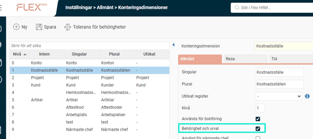
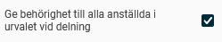
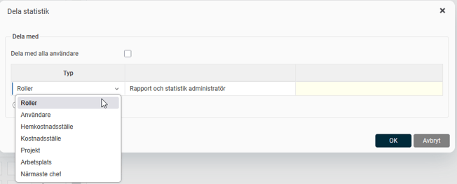
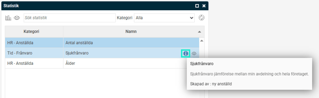
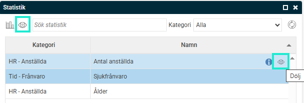
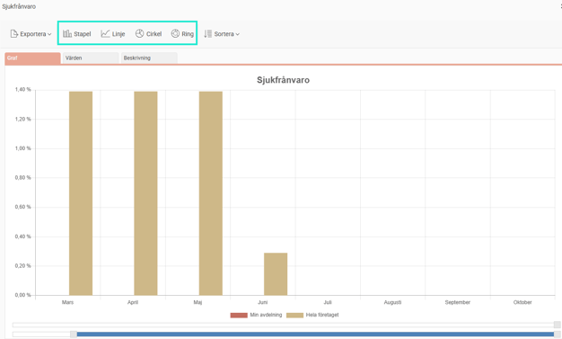
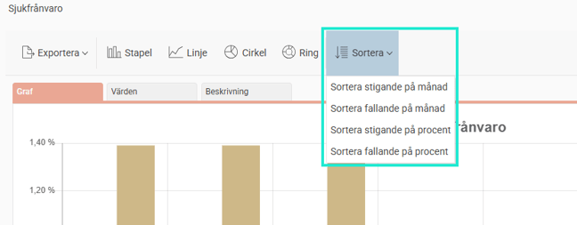

# ⚙️Statistik på startsidan - Hur konfigurerar och ser jag statistik på startsidan?

**Datum:** den 15 oktober 2025  
**Kategori:** Systemgemensamt  
**Underkategori:** Användare & Behörighet  
**Typ:** config  
**Svårighetsgrad:** intermediate  
**Tags:** användare, behörighet, roll  
**Bilder:** 10  
**URL:** https://knowledge.flexhrm.com/sv/statistik-p%C3%A5-startsidan-hur-konfigurerar-och-ser-jag-statistik-p%C3%A5-startsidan

---

Artikeln innehåller information om hur du publicerar statistik på startsidan, delar statistik, urvalsinställningar, samt hur du ser statistiken på startsidan.
Publicera statistik på startsidan
I statistikcentralen finns det möjlighet att publicera statistik i en panel på startsidan. I panelen visas alla statistiker som du publicerat på startsidan samt statistiker som andra användare delat med dig och publicerat på startsidan.
För att publicera statistiken på startsidan markerar du inställningen
Publicera på startsidan
. Du kan också ange en rubrik som visas som rubrik i grafen och en beskrivning som visas under en egen flik.

I panelen på startsidan dubbelklickar du på raden eller väljer statistiken du vill visa och klickar på "tabell"-knappen för att visa den. Statistiken öppnas då i en popup. Du kan exportera statistiken till bild eller till Excel och du kan se värden och beskrivning under respektive flik.

Dela statistik
Delningen av statistik möjliggör att styra till vem du vill dela statistiken. Du kan välja att dela till användare/anställda (anställd visas endast för användare med kopplad anställning i aktuellt företag), roller och till konteringar. De konteringar du delar till är de anställdas hemkonteringar och de konteringsdimensioner som har inställningen
Behörighet och urval
i bockat.

Om inställningen
Ge behörighet till alla anställda i urvalet vid delning
är markerad på ett urval när du delar en statistik från statistikcentralen, innebär det att den du delar till kommer att se frånvaro för alla anställda i det urvalet oavsett vad denne har för behörighet.

Det kan vara användbart om du vill dela en statistik till chefer som inte är behöriga till alla anställda men ändå vill kunna jämföra sin avdelnings frånvaro med totalen för hela företaget.

För att öppna en redan sparad statistik klickar du i statistikcentrelaen på
Öppna
. Du får då upp en lista över sparade statistiker, både de du sparat själv och de som andra delat till dig. Om du öppnar en statistik som någon delat till dig kan du inte spara (skriva över) den utan endast välja alternativet
Spara som
, om du vill skapa en kopia av den.
Statistik på startsidan
Beskrivning
I statistikpanelen på startsidan kan du nu se information om statistik. Du kan se statistikens rubrik, beskrivning samt vem som skapat statistiken.

Visa / Dölj statistik
Du kan välja att dölja en statistik som delats med dig i statistikpanelen på startsidan. Detta kan vara praktiskt om du har många statistiker och det är någon du inte använder så ofta. Du kan vid behov visa även dolda statistiker genom att klicka på ”ögat” i panelens övre menyrad. När du visar dolda statistiker kan du välja att ändra status på statistiken så den inte längre är dold.

Ändra diagramtyp
Det finns möjlighet att ändra diagramtyp när du tagit fram en statistik på startsidan i Flex HRM. Du kan välja mellan samma diagramtyper som är valbara i statistikcentralen, dvs. Stapel, Linje, Cirkel och Ring.

Sortering
Det går att ändra sortering när du visar statistik från startsidan. Du har samma alternativ här som i statistikcentralen och det finns även möjlighet att välja intervall för vilka resultat som ska visas med hjälp av reglagen längst ner i fönstret.

Relaterade artiklar:
Statistikcentral- Vad är statistikcentralen?
Statistikcentralen: Statistiktyper - Vad innebär de olika statistiktyperna i statistikcentralen?
