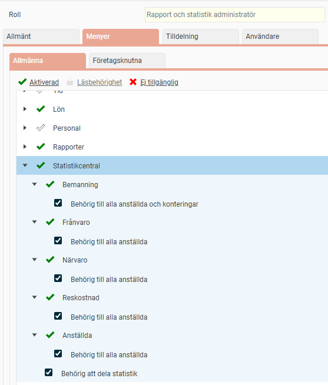
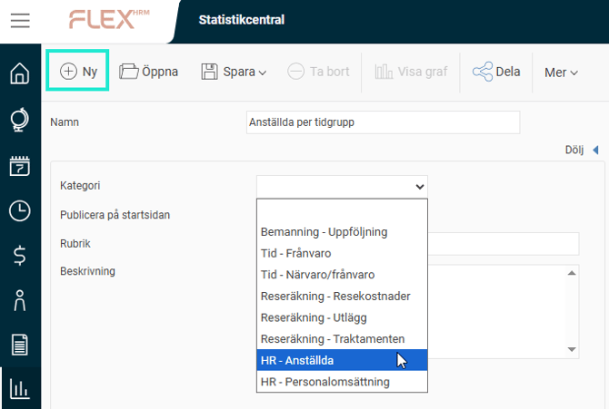
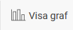
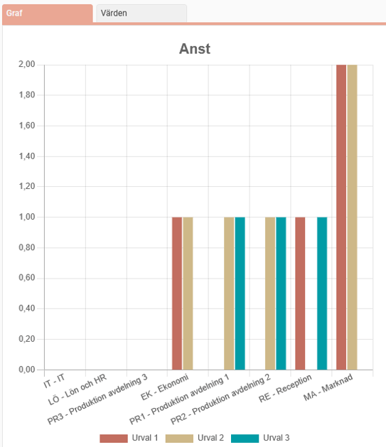
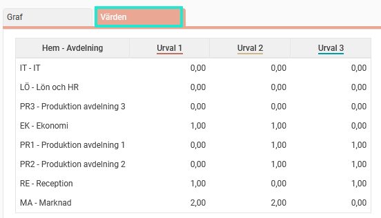
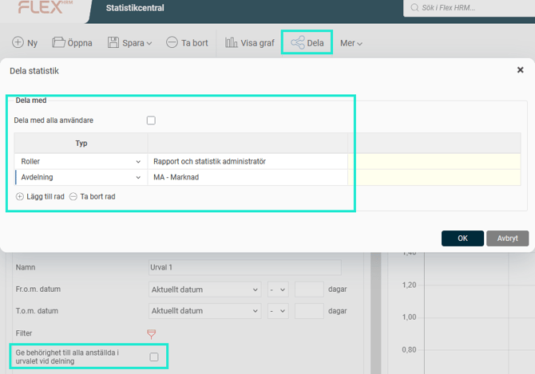
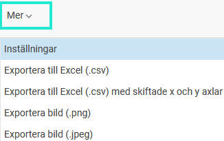
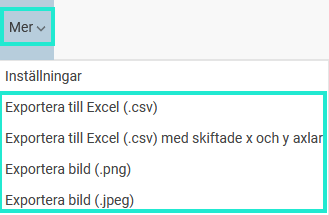

# Statistikcentral- Vad är statistikcentralen?

**Datum:** den 15 oktober 2025  
**Kategori:** Systemgemensamt  
**Underkategori:** Användare & Behörighet  
**Typ:** concept  
**Svårighetsgrad:** beginner  
**Tags:** användare, behörighet, roll  
**Bilder:** 10  
**URL:** https://knowledge.flexhrm.com/sv/statistikcentralen-vad-%C3%A4r-statistikcentralen

---

Artikel beskriver hur modulen Statistikcentralen är ett komplement till befintliga rapporter samt hur du använder den.
Generellt
Principen med statistikcentralen är att den ska fungera som ett komplement till de befintliga rapporter och exporter som går att generera, liksom att ge möjlighet att vända, vrida och jämföra olika typer av värden och enkelt kunna ta fram relevant statistik för uppföljning. Funktionerna kräver att kund har tilläggsmodulen
Statistikcentral
i licenserna.
Man kan dela skapade statistiker med andra användare. Statistikerna kan behörighetsstyras via roller/användare. Jämförande urval kan göras mellan exempelvis avdelningar, kön, ålder mm.
Viktigt att tänka på olika typer av statistiker:
Närvarostatistik
tar med även preliminär närvaro från tidrapporter
kan vid behov hämta tidkoder från Ersättningsfliken
kan EJ få med Ersättningar från Ersättningsfliken
kan ta hänsyn till rapporterade konteringar
Frånvarostatistiker
tar med även preliminär frånvaro från tidrapporter (ej ansökningar)
HR/Anställdastatistiker
anställda måste vara slutgranskade för att räknas som anställd
FTE-statistiken
Antal heltidstjänster
visar under intervallet/grupperingen, summan av de anställdas sysselsättningsgrader per dag. Beräknas (per dag): (summan av de anställdas sysselsättningsgrad)/(antalet anställda). Ex. under en period har en anställd sysselsättningsgraden 100% i 5 dagar och 50% i 5 dagar. Den anställda räknas då som 0.75 av en heltidsanställning för den perioden.
FTE-statistiken tar ej hänsyn till frånvaro (enbart FTE via Dashboard som styrs via tidkodsinställningar för FTE)
Behörighet
Behörighet till statistikcentralen ställs in under
Administration > Användare/Behörigheter > Roller.
Där kan du avgöra vilka roller som ska ha tillgång till Statistikcentralen och om de ska få dela statistik, samt se alla anställda oavsett övriga behörigheter. Ett exempel kan vara att man vill ge chefer behörighet att jämföra sin avdelnings frånvaro med hela företaget. Om inte inställningen Behörig till alla anställda markeras kommer endast frånvaro för anställda som du är behörig till i tidrapporten genereras (även läsbehörig). Motsvarande för bemanning betyder att endast anställda och konteringar användaren är behörig att bemanna kommer att räknas med.

Observera!
Den användare som skapat och delat något genom Statistikcentralen är den enda som kan öppna och revidera modellen som skapats. Detta innebär att om användaren i fråga inte längre är aktiv behöver användaren aktiveras på nytt och loggas in med för att kunna revidera.
Arbeta med statistikcentralen
Statistikcentralen
har en egen huvudikon under ikonen för Rapporter.

Användaren kommer till en vy där denne kan välja att hämta en sparad statistik eller skapa en ny. När du skapar en ny statistik klickar du på ikonen
Ny
.
Välj
därefter
kategori
, alltså vilken typ av statistik du vill ta fram, exempelvis HR - Anställda.

Visa graf
Du kan klick på Visa graf när du har angivit dina urval; då genereras statistiken och en graf visas i den högra delen av bilden.

Vill du istället se statistiken i form av värden klickar du på fliken
Värden
.

Behörighet - Dela
Om du klickar på
Dela
kan du välja att dela en statistik med andra användare. Du får då upp ett fönster där du väljer vilka olika typer, t.ex. roller, konteringar och användare, som du vill dela statistiken med.

Om inställningen
Ge behörighet till alla anställda och projekt i urvalet vid delning
är markerad på ett urval när du delar en statistik, innebär det att den du delar till kommer att se exempelvis frånvaro för alla anställda i det urvalet oavsett vad denne har för behörighet. Det kan vara användbart om du vill dela en statistik till chefer som inte är behöriga till alla anställda men ändå vill kunna jämföra sin avdelnings frånvaro med totalen för hela företaget.
De konteringar du delar till är de anställdas hemkonteringar och de konteringsdimensioner som har inställningen
Behörighet och urval
(
Inställningar > Allmänt > Konteringsdimensioner
) ibockat.

Menyn Mer - Inställningar
Klicka på
Inställningar
under menyn
Mer
för att hantera dina urval. Här kan du flytta de urval du har gjort genom att dra och släppa de blå pilarna. Du kan även radera urval genom att klicka på det röda krysset.

Menyn Mer - Exportera
Under menyn
Mer
kan du exportera data och graf från statistikcentralen. Datan exporteras i CSV-format som går att öppna i t.ex. Excel och grafen som en bild i något av formaten PNG eller JPEG.
Exporterar du till CSV-format får du välja om datan ska exporteras exakt så som den ligger under fliken
Värden
eller om du vill skifta x- och y-axel.
När du exporterar grafen till en bild så kommer PNG-bilden att få en transparent bakgrund, medan JPEG-bilden får en vit bakgrund.

Relaterade artiklar:
Statistiktyper - Vad innebär de olika statistiktyperna i statistikcentralen?
Statistik på startsidan - Hur konfigurerar och ser jag statistik på startsidan?
