# Statistikcentralen: Statistiktyper - Vad innebär de olika statistiktyperna i statistikcentralen?

**Datum:** den 15 oktober 2025  
**Kategori:** Systemgemensamt  
**Underkategori:** Register  
**Typ:** other  
**Svårighetsgrad:** advanced  
**Tags:** behörighet, roll  
**Bilder:** 24  
**URL:** https://knowledge.flexhrm.com/sv/statistikcentralen-statistiktyper-vad-inneb%C3%A4r-de-olika-statistiktyperna-i-statistikcentralen

---

Artikeln ger en beskrivning av de olika statistiktyperna du hittar i statistikcentralen och exempel på hur du kan använda dem.
Statistiktyper
Bemanning - Uppföljning
Med kategorin Bemanning kan du enkelt följa upp dina budgeterade värden för timmar, kostnad och försäljning och jämföra med den schemalagda tiden samt utfallet. Vi har valt att göra det flexibelt. Du bestämmer själv vilka begrepp du vill använda, t.ex. försäljning, antal ärenden eller inkommande ordrar. När du sedan tittar på utfallet kan du välja om du vill visa stapeldiagram eller linjediagram och hur du vill gruppera värdena i diagrammet.
Tid - Frånvaro
Väljer du kategori Tid - Frånvaro kan du göra ett eller flera urval om du vill jämföra. Vi visar med ett exempel:
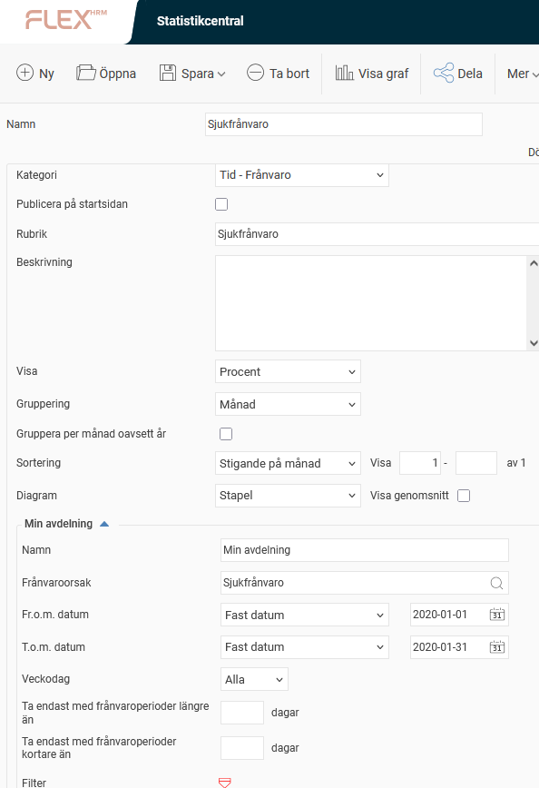
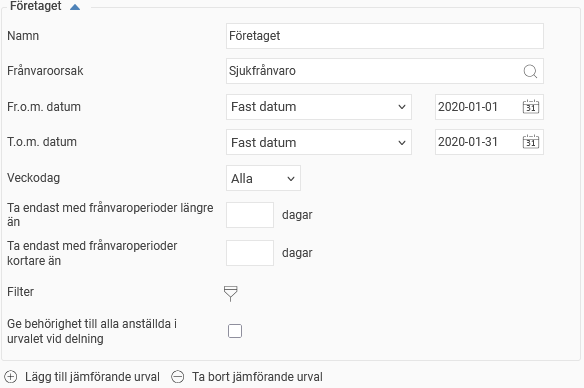
Du vill se sjukfrånvaroprocent för en viss avdelning fördelat per månad under året. Detta vill du jämföra med sjukfrånvaroprocenten för hela företaget.
Du väljer då att visa
procent
(beräknas som frånvarotiden dividerat med schematiden). Du kan även visa antal timmar frånvaro eller antal frånvarotillfällen. Sen väljer du att gruppera per månad och stapeldiagram.
Det första urvalet har ett
filter
på anställda som begränsar det till bara de anställda som tillhör avdelningen du ville titta på. Det andra urvalet har inget filter utan tar med alla anställda i företaget. För att lägga till fler urval att jämföra med klickar du på
Lägg till jämförande urval
.
Sedan klickar du på
Visa graf
, så kommer HRM att beräkna frånvaron samt visa en graf till höger enligt de urval du gjort.
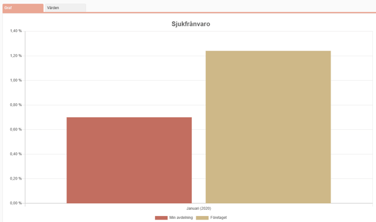
Det finns även möjlighet att spara din statistik, om du till exempel nästa månad vill se hur frånvaron ser ut när ytterligare en månad har passerat och slippa göra alla urval igen. För att spara en statistik ger du den ett namn och klickar sedan på
Spara
. Det finns även möjlighet att
Spara som
, vilket kan vara användbart om du vill utgå från en sparad statistik, göra lite förändringar och sedan spara den som en ny statistik samtidigt som du behåller den tidigare.
Exempel - Gruppering
All statistik kan grupperas på registrerade konteringar och på hemkonteringar. De alternativen hittar du under Gruppering i visningsinställningarna för din statistik.
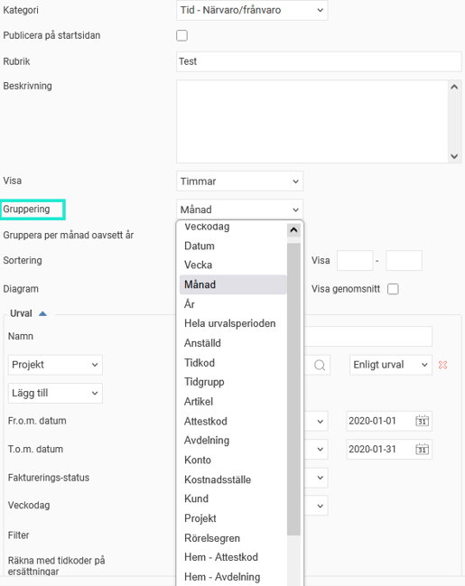
Under grupperingen kan du välja hur grupperingen ska ske för återkommande grupperingsalternativ.
Väljer du att gruppera statistiken per månad eller per vecka kan du välja om du vill gruppera per månad eller vecka oavsett år. Det betyder att om du tar ut statistik för flera år så kommer den att grupperas per månad eller vecka så att samma månad eller vecka under respektive år grupperas ihop.
Väljer du att gruppera per datum kan du nu välja att gruppera per datum oavsett månad och år.
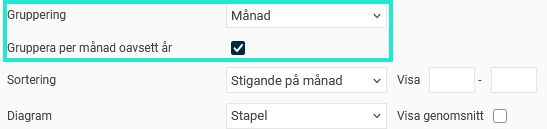
Om du använder ett utökat projektregister och väljer att gruppera på projekt kan du nu välja på vilken undernivå du vill gruppera. Genom att kunna gruppera på valfri undernivå kan du dela upp grupperingen enligt önskemål.
För utökade projekt kan du även välja att endast visa registrerbara projekt.
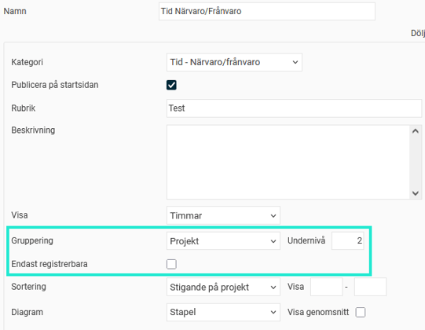
Sortering
Sortering kan göras antingen på den enhet som är vald under visning eller på grupperingsalternativet. Sorteringen kan göras stigande eller fallande. Om du till exempel väljer att ta ut statistik på närvaro och väljer att visa procent av schematid och gruppera per månad kommer du att få följande fyra sorteringsalternativ: stigande på månad, fallande på månad, stigande på timmar och fallande på timmar.
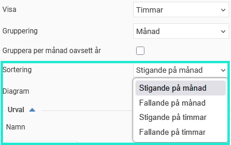
I sorteringen kan du även välja vilka resultat du vill visa. Detta är praktiskt om du får många resultat. Om du till exempel väljer att visa närvarotid per anställd kan du sortera den fallande på timmar och sedan välja att visa 1–10 för att se de tio anställda med högst närvarotid. Här kan du också se hur många resultat det finns totalt.
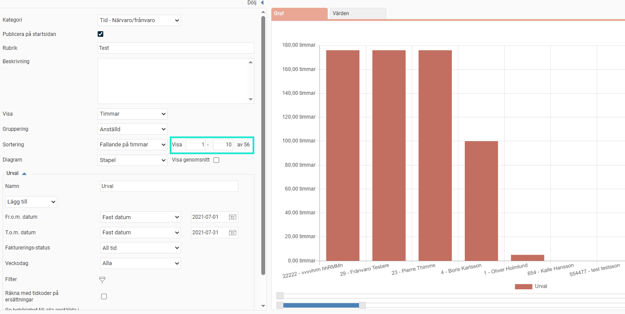
Om du vill kan du justera visningen under grafen, där det nedre reglaget styr vilket intervall du vill visa och det övre reglaget flyttar intervallet.
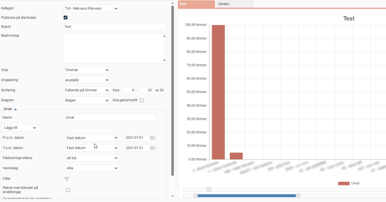
Lång- och korttidsfrånvaro
Det möjlighet att filtrera bort viss frånvaro i rapporter och statistik utifrån frånvarons längd. Det är främst tänkt att användas för att t.ex. kunna filtrera bort långtidsfrånvaro i sjukfrånvarostatistik. Annars kan ju en långtidssjukskrivning på en anställd dra upp sjukfrånvaroprocenten rejält på en avdelning om du egentligen är ute efter att följa upp trender kring "vanlig" kortare frånvaro. Det öppnar även upp möjligheten att följa upp enbart långtidssjukskrivningar och se trender kopplade till dessa i ditt företag.
På följande ställen i Flex HRM har vi lagt till denna filtreringsmöjlighet utifrån frånvarons längd:
Rapporten Frånvarostatistik
Frånvaro i Statistikcentralen
Exporter via exportmall Frånvaro
Dashboard
På dessa ställen har vi lagt till val för
Ta endast med frånvaroperioder längre än... dagar
och
Ta endast med frånvaroperioder kortare än ... dagar
.
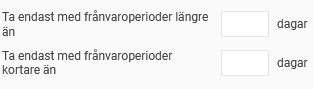
Standard är att dessa val är tomma, vilket innebär att all frånvaro i urvalet tas med, precis som tidigare.
Ställer du in enligt att endast ta med frånvaroperioder längre än
14
dagar innebär det att endast frånvaroperioder längre än 14 dagar tas med. I en frånvaroperiod på t.ex. 30 dagar kommer alla de 30 dagarna att räknas med.

Markerar du inställningen
Ta ej med de första 14 dagarna
till höger innebär det i en frånvaroperiod på 30 dagar, att de 14 första dagarna inte räknas med utan endast de 16 sista dagarna.

Väljer du att endast ta med frånvaroperioder
kortare än 15 dagar
kommer endast dem tas med.

Den sista varianten med inställningen
Ta med längre frånvaro, men endast de första 14 dagarna
markerad, tar den även med längre frånvaroperioder, men då endast de 14 första dagarna  frånvaroperioderna.
Det går även bra att kombinera dessa två inställningar för att t.ex. bara ta med frånvaro längre än 14 dagar, men kortare än 91 dagar, vilket man ibland vill följa upp.
Då Sverige har speciella regler kring vad som ses som sammanhängande sjukperiod vid återinsjuknad tar vi hänsyn till det om företagets basland är Sverige och du gör urval på frånvaroorsak av typen sjukdom. Detta innebär att om en anställd återinsjuknar inom 5 dagar så räknas det som en sammanhängande period, dock räknas dagarna då den anställde jobbar inte som sjukdagar.
Observera att export av frånvaro exporterar enskilda frånvaroposter, så där kontrolleras enbart varje frånvaropost mot eventuellt angiven filtrering på frånvarons längd. Med andra ord exporteras hela frånvaroposten eller så exporteras den inte alls.
Tid – Närvaro / Frånvaro
Med kategorin Närvaro/Frånvaro kan du ta ut statistik för att följa upp övertid, beläggningsgrad, faktureringsbelopp eller tid nedlagd på olika projekt, även här med möjlighet till jämförelser mellan olika avdelningar och/eller tidsintervall.
Under
Visa
väljer du om du vill ta ut antalet rapporterade timmar, andel rapporterad tid i förhållande till schemalagd tid eller andel rapporterad tid av total närvarotid.
Urval på tidkoder och konteringar lägger du till genom att välja önskat alternativ i urvalslistan under
Lägg till
. Om du gör urval på någon tidkod och/eller kontering, kommer endast tid rapporterad på denna/dessa att räknas med. Görs inget urval kommer samtliga tidkoder/konteringar att räknas med. Om du vill ta bort ett urval du lagt till gör du det genom att klicka på det röda krysset efter urvalet.
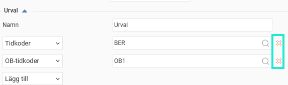
Du kan även göra urval på faktureringsstatus:
All tid
All tid oavsett faktureringsstatus kommer att räknas med.
All fakturerbar tid
All tid som markerats för fakturering kommer att räknas med oavsett om den är frisläppt till fakturering eller ej.
Endast upparbetad tid
Endast tid markerad för fakturering som inte är frisläppt till fakturering kommer att räknas med, dvs. den upparbetade tiden som ännu inte fakturerats.
Endast fakturerad tid
Endast tid markerad för fakturering samt frisläppt till fakturering kommer att räknas med.
Markeras kryssrutan
Räkna med tidkoder på Ersättningsfliken
så kommer även närvarotidkoder rapporterade under fliken
Ersättningar
i tidrapporten att räknas med.
Nedan visas två exempel på hur inställningar och urval kan göras.
Det första exemplet visar hur det kan se ut om du vill se hur mycket övertid det har jobbats på olika avdelningar fördelat per månad.
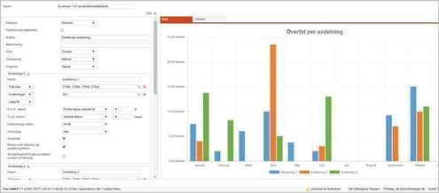
Det andra exemplet visar hur det kan se ut om du vill se hur beläggningsgraden i företaget har förändrats under året.
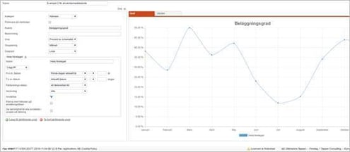
Reseräkning – Resekostnader
När du väljer att ta ut statistik över resekostnader kommer statistikcentralen att kunna räkna med alla typer av kostnader på reseräkningen. Statistiken kan grupperas på veckodag, datum, vecka, månad, år, hela urvalsperioden, kostnadstyp, anställd, kontering samt hemkonteringar som har markerat Behörighet och urval.
Du kan lägga till urval på utlägg, tillägg, milersättning, traktamente, länder och konteringar.
Urval på datum kan göras på fr.o.m.-datum, t.o.m.-datum samt utbetalningsdatum. Om du till exempel gör urval på fr.o.m.-datum 20XX-01-01 till 20XX-01-31 kommer du att få med alla resor som påbörjats i januari 20XX.
Du kan göra urval på veckodag, faktureringsstatus samt på om urvalet ska visa belopp eller faktureringsbelopp. Du kan göra urval på skattepliktigt, skattefritt samt på hur moms ska räknas med i statistiken.
Slutligen kan du filtrera vilka anställdas kostnader som ska tas med i statistiken.
Reseräkning – Utlägg
Statistiken för utlägg är snarlik statistiken för samtliga resekostnader, men för utlägg finns även möjlighet att gruppera på utläggskod och urvalen som kan läggas till är begränsade till urval på utläggskod och konteringar.
Reseräkning – Traktamenten
Även Traktamentsstatistiken är snarlik statistiken för samtliga reskostnader men ger även möjlighet till gruppering per land.
HR – Anställda
En välfungerande hantering av statistisk kring de anställda är en central del i styrningen av en organisation. Det kan röra sig om att mäta antal anställda per avdelning, antal heltidstjänster (FTE), förändring av antal anställda över tid, fördelning i procent mellan män och kvinnor, samt olika nyckeltal för att mäta personalomsättning. För att möta detta behov har vi byggt ut stödet i statistikcentralen (tilläggsmodul) för att kunna ta ut denna typ av statistik.
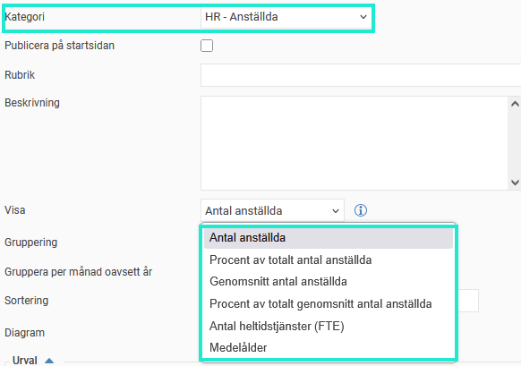
Antal anställda
Visar antalet anställda som under datumintervallet varit anställda minst en dag.
Procent av totalt antal anställda
Visar procent av totalt antal anställda under intervallet. Tillämpas bäst då man anger ett urval i filtret eller grupperar på till exempel avdelning, ålder eller kön.
Genomsnitt antal anställda
Visar genomsnittet av antal anställda under intervallet/grupperingen.
Beräkning: (summan av antal anställda per dag)/(antal dagar).
Procent av totalt genomsnitt antal anställda
Visar procent av genomsnittet av totalt antal anställda. Tillämpas bäst då man anger ett urval i filtret eller grupperar på till exempel avdelning, ålder eller kön.
Antal heltidstjänster (FTE)
Visar antalet tjänster omräknat till heltidstjänster under intervallet, vilket internationellt benämns FTE (Full-Time Equivalent).
Beräkning (per dag): (summan av de anställdas sysselsättningsgrad)/(antalet anställda).
Exempel: Under en period på 30 dagar har en anställd sysselsättningsgraden 100% i 15 dagar och 50% i 15 dagar. Den anställde räknas då som 75% av en heltidsanställning för den perioden.
Medelålder
Visar medelåldern för intervallet/grupperingen. Åldern för respektive anställd beräknas på sista datumet inom intervallet/grupperingen.
HR – Personalomsättning
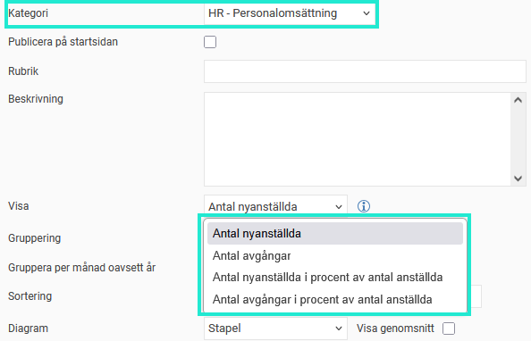
Antal nyanställda
Visar antalet nyanställda under intervallet/grupperingen. En anställd räknas som nyanställd om den har en anställningsperiod inom intervallet/grupperingen som antingen är den första anställningsperioden eller om föregående anställningsperiod inte är direkt angränsande.
Antal avgångar
Visar antalet avgångar under intervallet/grupperingen. En anställd räknas som avgången om den har en anställningsperiod inom intervallet/grupperingen som antingen är den sista anställningsperioden eller om anställningsperioden efter inte är direkt angränsande.
Antal nyanställda i procent av antal anställda
Visar antalet nyanställda i procent av totalt antal anställda under intervallet/grupperingen.
Antal avgångar i procent av antal anställda
Visar antalet avgångar i procent av totalt antal anställda under intervallet/grupperingen.
Du kan gruppera dessa statistikuppgifter för att enkelt få en intressant statistik. Följande kan du gruppera på:
Vecka, Månad, Kvartal, År.
Gruppering på olika tidsintervall kan vara användbart då man vill se hur till exempel antal anställda har förändrats över tid.
Exempel: Antal anställda de senaste fem åren grupperat per år.
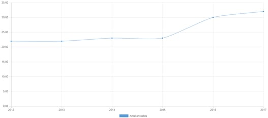
Befattning, Tidgrupp, Personalkategori, Anställningsform
Antal anställda eller antal tjänster per gupp kan vara intressant statistik att hålla koll på. Statistiken baseras på till exempel den sista befattningen den anställde haft i urvalsperioden.
Exempel: Antal heltidstjänster per befattning
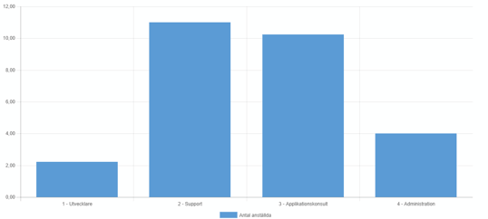
Kön och ålder
Fördelning mellan kön och ålder är intressanta faktorer för att få en lagom blandning inom ett arbetslag. Vid gruppering på ålder kan du själv välja vilka åldersgrupper du vill använda.
Exempel: Antal anställda per åldersgrupp
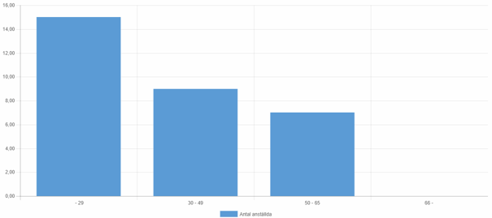
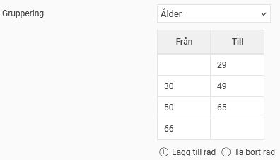
Hemkontering
Gruppering på till exempel avdelning, kostnadsställe eller andra dimensioner som används i ert företag kan göras via hemkontering.
Exempel: Antal anställda per kostnadsställe
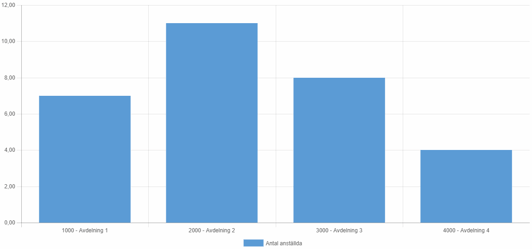
Man kan också välja att visa en linje för genomsnitt i en statistik för att enkelt kunna se snittet. Aktivera detta genom att kryssa i Visa genomsnitt bredvid val för typ av diagram.
Exempel: Antal nyanställda de senaste åren, inklusive genomsnitt.
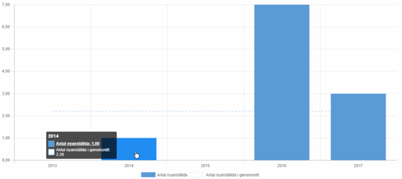
Relaterade artiklar:
Statistikcentral- Vad är statistikcentralen?
Statistik på startsidan - Hur konfigurerar och ser jag statistik på startsidan?
