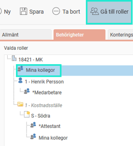
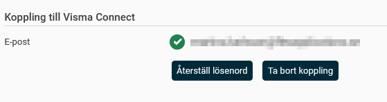
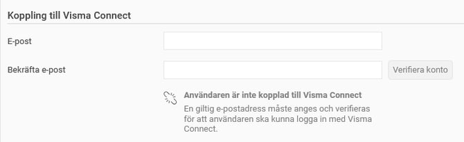
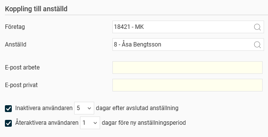
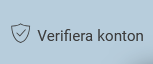

# ⚙️Vad är en användare?

**Datum:** den 30 oktober 2025  
**Kategori:** Systemgemensamt  
**Underkategori:** Användare & Behörighet  
**Typ:** concept  
**Svårighetsgrad:** beginner  
**Tags:** användare, behörighet, mobil, roll, säkerhet  
**Bilder:** 7  
**URL:** https://knowledge.flexhrm.com/sv/vad-%C3%A4r-en-anv%C3%A4ndare

---

En beskrivning av användare, rolltilldelning, koppling till anställd och koppling till Visma Connect.
Roller och behörigheter
Koppling till Visma Connect
Koppling till anställd
Inaktivering och återaktivering av användare utifrån anställningsdatum
Verifiera flera konton samtidigt
Avancerade inställningar
Övriga inställningar på fliken Allmänt
Filter
Din användare är ditt inlogg i Flex HRM. För att kunna logga in och arbeta i systemet måste du vara kopplad till en eller flera
roller
. Rollerna styr vad du kan se och göra i systemet.
Du kan ha flera roller samtidigt för att få rätt behörigheter. En användare kan till exempel ha en roll för att hantera sin egen tidrapport och en annan för att se alla anställda i Närvarotablån, men utan behörighet att se deras tidrapporter.
Roller och behörigheter
Under
Användare/Behörigheter > Användare
, på fliken
Behörigheter
, kan du se och ändra användarens roller.
En roll på
företagsnivå
ger behörighet för alla anställda i företaget.
En roll på
konteringsnivå
ger behörighet för alla anställda som har den specifika konteringen som hemkontering.
På bilden ser du en användare som har rollen *
Medarbetare
för sig själv,
Mina kollegor
och *
Attestant
för alla anställda med hemkostnadsställe
Södra
samt
Mina kollegor
för hela företaget.
För mer information om hur en användares roller fungerar rekommenderar vi artikeln:
Vilken roll gäller när en användare har flera roller?

Tips
Om du vill veta vad en specifik roll innebär kan du markera rollen på användarens behörighet och sedan klicka på knappen
Gå till roller
. Den vy där du hanterar roller öppnas då, och den valda rollen visas direkt.

Överlappande behörigheter vid konteringsbyte
När en anställd byter hemkontering kan det vara bra att låta behörigheterna överlappa under en period. Detta gör att både den gamla och den nya chefen kan hantera den anställdes tidrapporter och reseräkningar under bytet. Detta ställer du in under
Inställningar > Allmänt > Konteringsdimensioner
i fältet
Tolerans för behörigheter
. Där kan du ange hur många dagar före och efter ett byte den nya och gamla chefen ska kunna se den anställde.

Koppling till Visma Connect
Inloggning i Flex HRM och HRM Mobile sker via Visma Connect. För att en användare ska kunna logga in måste hen vara kopplad till Visma Connect med hjälp av en e-postadress.
Om användaren är kopplad till Visma Connect visas e-postadressen samt knapparna
Återställ lösenord
och
Ta bort koppling
.

Klicka på
Återställ lösenord
för att användaren ska få ett e-postmeddelande med möjlighet att återställa sitt lösenord för Visma Connect.
Klicka på
Ta bort koppling
om du till exempel behöver skapa en ny koppling med en annan e-postadress.
Om användaren saknar koppling till Visma Connect visas fält för e-post och information om att koppling saknas.

Du kan ange den e-postadress användaren ska logga in med och klicka på
Verifiera konto
.
Om ni har en verifierad domän (
Allmänt > Säkerhet
) skapas ett konto direkt.
Om ni inte har en verifierad domän skickas ett e-postmeddelande till användaren för att verifiera och skapa kontot.
Koppling till anställd
På fliken
Allmänt
under
Användare/Behörigheter > Användare
kan du koppla användaren till sin anställning. Denna koppling är nödvändig för att användaren bland annat ska kunna se sin egen tidrapport och reseräkning i HRM Mobile, för att stämplingar ska registreras korrekt, och för att påminnelser inställda på att skickas till anställd ska hamna hos rätt användare.
Inaktivering och återaktivering av användare utifrån anställningsdatum
En användare som är kopplad till en anställd kan ställas in för att aktiveras och inaktiveras utifrån den anställdes anställningsdatum.
Exemplet nedan visar en användare kopplad till anställd 8. Användaren är inställd på att i
naktiveras
fem dagar efter avslutad anställning och att
återaktiveras
en dag före ny anställningsperiod.

Det innebär att om anställd 8 slutar den 31 oktober, kommer användaren att vara aktiv fram till och med den 5 november. Detta kan vara bra för att personen ska kunna göra klart sina tidrapporter och reseräkningar efter att anställningen har avslutats. Den 6 november kommer kontot att vara inaktivt, och den anställde kan inte längre logga in.
Kopplingen till Visma Connect tas också bort när kontot inaktiveras utifrån anställningsdatum. Processen för att inaktivera konton utifrån anställningsdatum sker via ett bakgrundsjobb. Det innebär att borttagningen inte sker omedelbart, utan när bakgrundsjobbet körs nästa gång (en gång per dygn).
Om anställd 8 skulle anställas på nytt, kommer kontot att aktiveras en dag innan det nya anställningsdatumet. Det gäller dock
inte
Visma Connect-kontot. Om det har tagits bort från användaren behöver kopplingen göras om manuellt vid en återanställning.
Tips
Har du medarbetare som återkommer med jämna mellanrum? Då kan det vara praktiskt att skapa en separat
användarmall
för dem.
I mallen anger du ett högre antal dagar för inaktivering. Då behåller användaren sin Visma Connect-koppling en längre tid mellan anställningarna, och ni slipper återaktivera den manuellt.
Observera
Om du manuellt inaktiverar en användare direkt i användarregistret, kommer kopplingen till Visma Connect
inte
att tas bort automatiskt.
I dessa fall måste du använda knappen
Ta bort koppling
för att ta bort åtkomsten manuellt.
Verifiera flera konton samtidigt
Knappen
Verifiera konton
kan du använda för att verifiera flera användare samtidigt för Visma Connect. Då slipper du välja en användare i taget.

När du klickar på
Verifiera konton
påverkas alla användare som:
Matchar ditt filter
Har en sparad e-postadress för koppling till Visma Connect
Inte redan är verifierade.
Processen för att skapa konton är densamma som för enskilda användare:
Om ni har en verifierad domän (
Allmänt > Säkerhet
) skapas kontona direkt.
Om ni inte har en verifierad domän skickas e-post till användarna för att verifiera och skapa konton.
Avancerade inställningar > Intern autentisering
Lösenord för Visma Connect hanteras i Visma Connect. För att starta
HRM Timeclock
används användar-id och lösenord från användarregistret.
Övriga inställningar på fliken Allmänt
Under fliken
Allmänt
hittar du flera inställningar som rör användarens funktioner i systemet.
Inställning
Beskrivning
Användaren är aktiverad
Endast aktiva användare kan logga in i systemet.
Användar-id
Användarens unika beteckning i programmet. Används vid stämpling, vid inloggning i HRM Timeclock och visas i loggar för användare som saknar signatur. Programmet tar inte hänsyn till små eller stora bokstäver i användar-id.
Alias användar-id
Här kan du ange ett alias för användaren, till exempel ett alias bestående av endast siffror. Det kan vara användbart vid stämpling om den anställda har bokstäver i sitt användar-id, eftersom vissa terminaler inte stöder inmatning av bokstäver.
Signatur
Användarens signatur, till exempel första bokstaven i förnamnet samt de två första bokstäverna i efternamnet. Denna signatur används när användaren till exempel attesterar en tidrapport eller reseräkning, eller genererar en lönetransaktionsfil.
Kort-/Brick-ID
Det brick-ID som användaren har på sin nyckelbricka eller sitt kort. Brickan/kortet kan användas av den anställda för att stämpla in och ut via stämplingsterminalen.
E-post
Användarens e-postadress. En användare som kopplas till en anställd får också e-postadress från den anställdas personuppgifter.
Visa instruktionsfilmer vid uppstart
Om denna ruta markeras visas ett fönster med instruktionsfilmer när användaren loggar in. Detta kräver att företaget har lagt in instruktionsfilmer under
Inställningar > Allmänt > Instruktionsfilmer
. Där kan du även välja vilka filmer som ska visas för vilka roller i företaget.
Filter
Du kan använda filtret i användarregistret för att snabbt hitta användare. Du kan filtrera baserat på:
Användare som är behöriga till eller kopplade till ett visst företag.
Behöriga/Kopplade till aktuellt företag
innebär det företag du just nu är inloggad i (visas i sidfoten längst ner till höger).
Användare som har en viss roll.
Aktiva eller inaktiva användare.
Status för koppling till Visma Connect (till exempel om de är verifierade eller inte).
Relaterat
Vad är en roll?
Vilken roll gäller när en användare har flera roller?
Roller och behörigheter i Flex HRM
