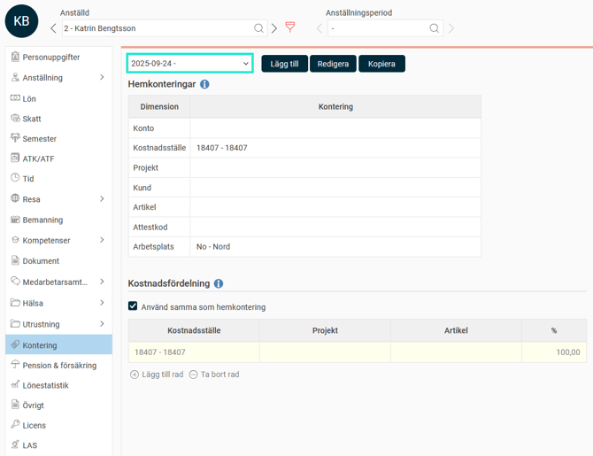
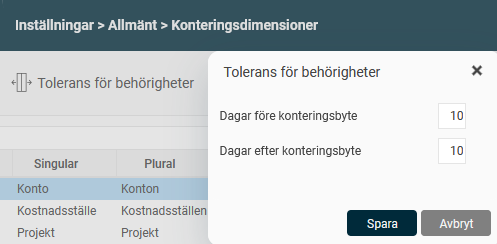

# ⚙️Vad är en hemkontering?

**Datum:** den 22 september 2025  
**Kategori:** Systemgemensamt  
**Underkategori:** Användare & Behörighet  
**Typ:** concept  
**Svårighetsgrad:** beginner  
**Tags:** användare, behörighet  
**Bilder:** 2  
**URL:** https://knowledge.flexhrm.com/sv/vad-%C3%A4r-en-hemkontering

---

Hemkonteringar ställs in i anställdaregistret och kan användas för behörighet, för urval och för att läggas ut i tidrapporter och reseräkningar.
Tilldela hemkontering
Datumstyrda hemkonteringar
Hemkonteringar i tidrapporter och reseräkningar
Tilldela hemkontering
Du kan se och tilldela anställdas
hemkontering
i
A
nställdaregistret,
fliken
Kontering
.
Hemkonteringar kan användas för flera olika ändamål i systemet:
Behörighet:
Styra vilka användare som är behöriga till den anställde.
Rapporter och statistik:
Hemkonteringen kan läggas ut i tidrapporter, reseräkningar och i löneberedningen för att följas upp i rapporter och statistik.
Urval:
Göra urval, till exempel för att ta ut en rapport endast för anställda som tillhör ett specifikt kostnadsställe.
Observera
Ditt företag kan använda andra benämningar för sina hemkonteringar än de vi använder i artikeln.
Datumstyrda hemkonteringar
Du kan ställa in datumintervall för en anställds hemkontering. Om en anställd till exempel ska byta avdelning, kan du lägga in detta i systemet i förväg. Systemet hanterar då bytet automatiskt på rätt datum.
Om du har behörighetsstyrning på konteringsdimensioner, kommer då även attestansvarig chef att få behörighet från rätt datum.

Tolerans för behörigheter
När en anställd byter hemkontering kan det vara bra att låta behörigheterna överlappa under en period. Detta gör att både den gamla och den nya chefen kan hantera den anställdes tidrapporter och reseräkningar under bytet. Detta ställer du in under
Inställningar > Allmänt > Konteringsdimensioner
>
Tolerans för behörigheter
. Där kan du ange hur många dagar före och efter ett byte den nya och gamla chefen ska kunna se den anställde.

Hemkonteringar i tidrapporter och reseräkningar
Hemkonteringar läggs automatiskt in på tidrader och i reseräkningar om inget annat angetts och om inställningen
Lägg hem om blank
är aktiverad för konteringsdimensionen. Du hittar inställningen under
Inställningar > Allmänt > Konteringsdimensioner
.
Reseräkningar
: När du skapar en ny reseräkning hämtas de hemkonteringar som gäller för den dagen reseräkningen skapas till reseräkningens huvuduppgifter. Om du klickar på knappen
Återställ
i huvuduppgifterna, hämtas hemkonteringar för det aktuella datumet. Eftersom utlägg och resor hämtar sin kontering från reseräkningens huvuduppgifter, påverkas de inte av utläggets eller resans specifika datum.
Tidrapportering
: Konteringar hämtas utifrån den dag som rapporteras.
Rapporter och statistik
: Tänk på att när du gör ett urval på hemkontering i rapporter eller statistik, görs urvalet alltid på den kontering som gäller det datum rapporten eller statistiken tas ut.
Behörighet till hemkonteringar i anställdaregistret
Det går att ställa in behörighet till enskilda hemkonteringar. Man kan till exempel vara behörig att ändra en anställds hemkostnadsställe, men endast ha läsbehörighet till hemavdelning. Detta beskrivs i artikeln
Hur fungerar företagsknuten behörighet?
